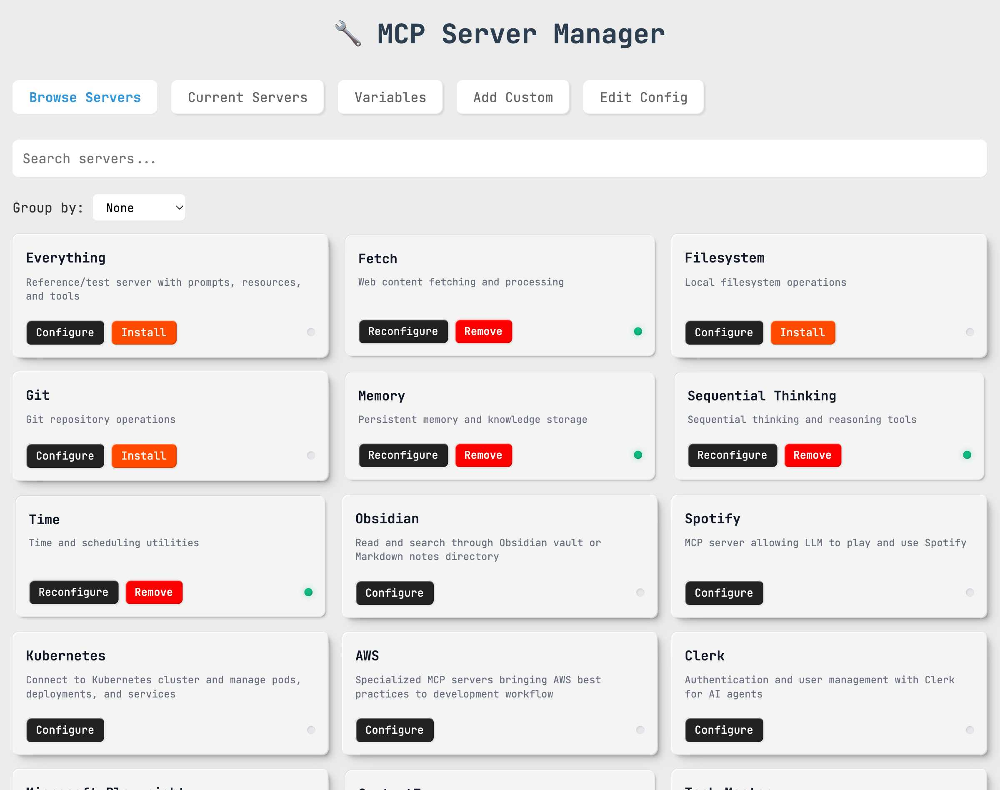
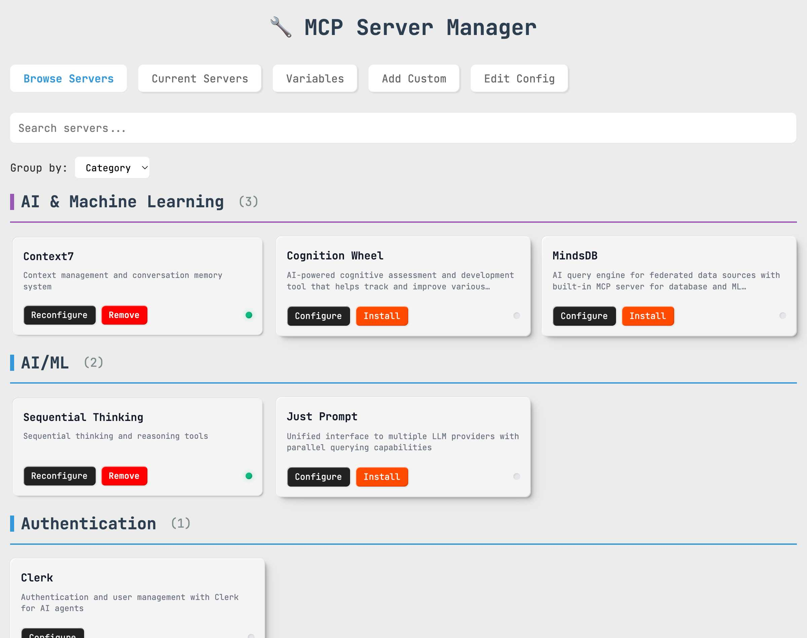
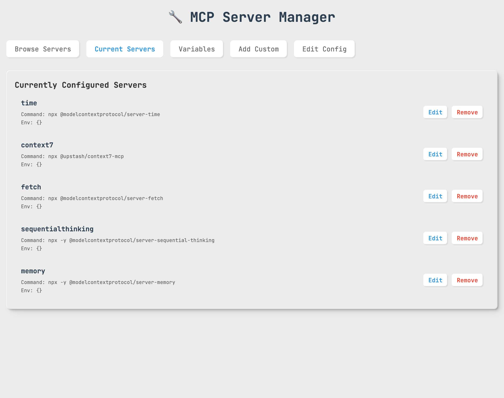
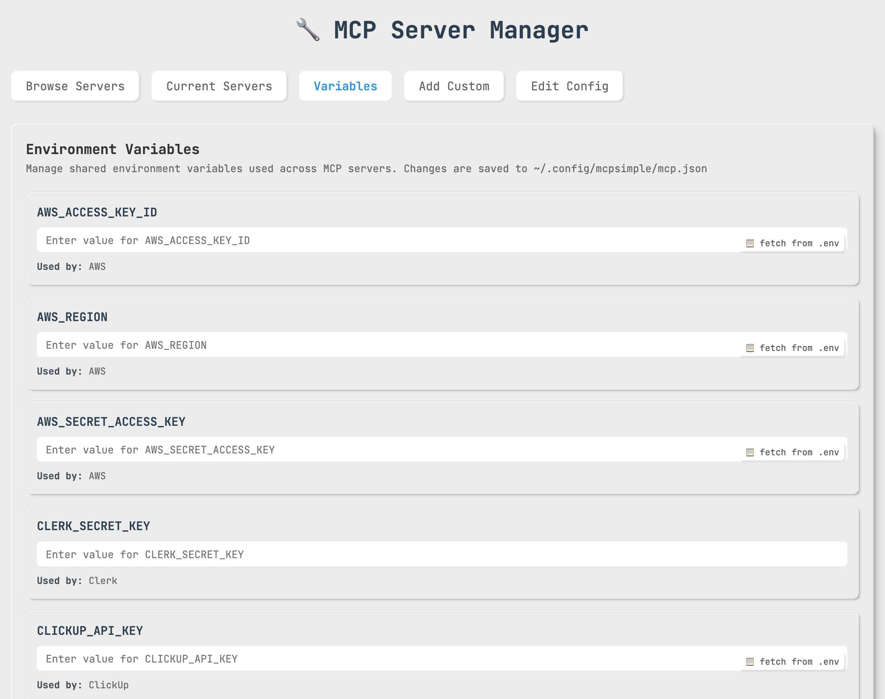
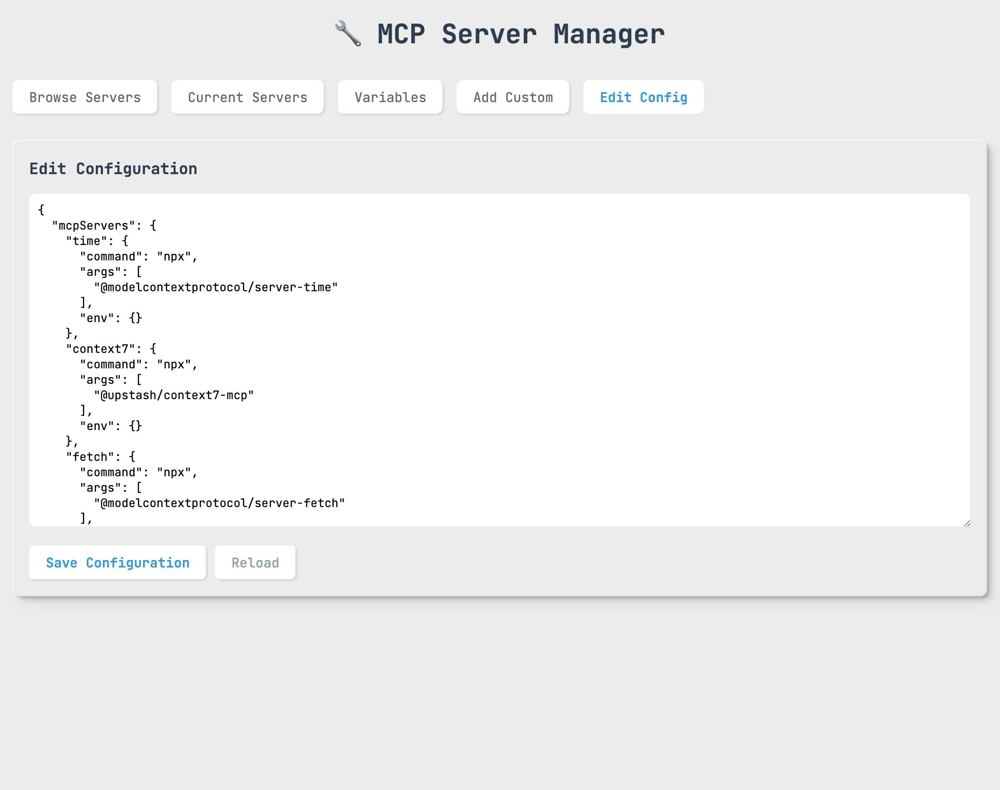
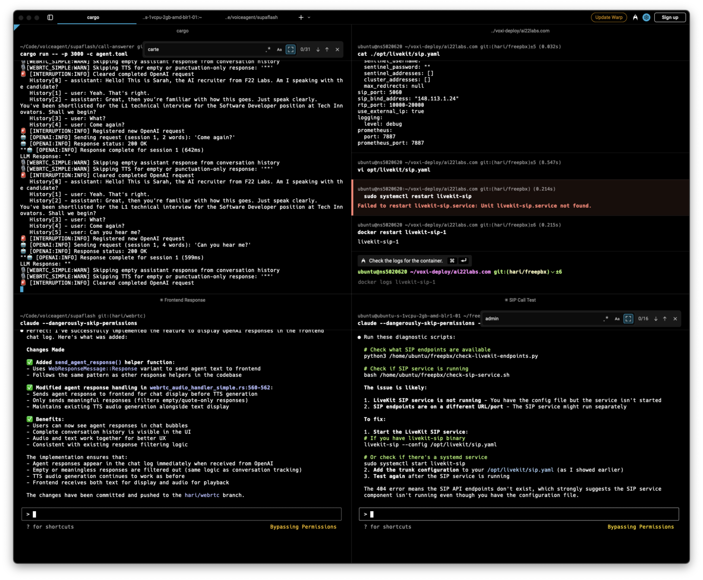

# MCP Manager

Modern web interface and CLI tool for managing MCP (Model Context Protocol) server configurations.

## 🌐 Web Interface Preview

### Modern Design
The web interface features a beautiful modern design with JetBrains Mono font, providing a clean and professional look:



### 📦 Server Browser - Main View
Browse and install from 35+ pre-configured MCP servers with smart categorization and visual status indicators:


### 🏷️ Category Organization
Organize servers by functionality for easier navigation and discovery:



### ⚙️ Server Management
Manage your installed servers with detailed configuration information:



### 🔧 Environment Variables
Centralized environment variable management with .env file integration:



### 📝 Live Configuration Editor
Edit `.mcp.json` files directly in the browser with syntax highlighting:



### Interactive Features

#### 📦 Server Browser
- **One-click Installation**: Simply click on any server card to install instantly
- **Category Organization**: Servers grouped by functionality (AI/ML, Databases, Cloud Services, etc.)  
- **Smart Search**: Real-time filtering by name, description, or category
- **Status Indicators**: Visual dots showing installation status (green = installed, gray = not installed)

#### ⚡ Supafast Installation
Special "S1-S14" servers install with zero configuration:
- **S1-S7**: Core utilities (Everything, Fetch, Filesystem, Git, Memory, Sequential Thinking, Time)
- **S8-S11**: Development tools (Playwright, Context7, Task Master, Xcode Build)
- **S12-S14**: Specialized tools (NixOS, shadcn/ui, Just Prompt)

#### 🔧 Configuration Management
- **Visual Config Editor**: Edit `.mcp.json` directly in browser with syntax highlighting
- **Environment Variables**: Manage variables with .env file integration and "Fetch" buttons
- **Current Servers**: View, edit, and remove installed servers with intuitive controls

#### 🚀 Auto-Update System
- **Mandatory Updates**: Automatic version checking with enforced updates
- **Progress Tracking**: Visual feedback during update process
- **Seamless Experience**: Auto-reload after successful updates

### Try the Live Demo

```bash
# Install globally
npm install -g @oglabs/mcp

# Launch web interface
@oglabs/mcp --web
```

The interface automatically opens at `http://localhost:3333` with full functionality.

## Installation

### Global Installation (Recommended)

```bash
npm install -g @oglabs/mcp
```

### Local Installation

```bash
npm install @oglabs/mcp
```

## Usage

### 🚀 MCP Server Mode (NEW!)

**Tech Stack Detection & MCP Server Recommendations**

Transform your package into an intelligent MCP server that automatically detects project technology stacks and recommends the best MCP servers for your project:

```bash
@oglabs/mcp --server
```

#### 🔧 MCP Server Tools Available

The MCP server provides 4 powerful tools for AI agents:

1. **`detect-tech-stack`** - Analyzes project files to identify technologies
2. **`recommend-mcp-servers`** - Suggests optimal MCP servers based on detected tech stack
3. **`search-mcp-servers`** - Search through 35+ available MCP servers
4. **`get-mcp-server-info`** - Get detailed information about specific servers

#### 📝 Smart Prompts Available

The MCP server also provides intelligent prompts for guided tech stack analysis:

1. **`analyze-tech-stack`** - Comprehensive project analysis with customizable depth
2. **`discover-mcp-servers`** - Technology-specific MCP server discovery
3. **`setup-project-mcp`** - Project setup assistant with team considerations
4. **`quick-tech-assessment`** - Rapid tech stack assessment from minimal info

#### 🧪 Testing with MCP Inspector

```bash
# Start server with MCP Inspector for interactive testing
npm run debug-mcp

# Opens browser at http://localhost:6274
# Provides visual interface to test all MCP tools
```

#### 📦 Adding to Claude Desktop

Add this configuration to your Claude Desktop `mcp.json`:

```json
{
  "mcpServers": {
    "tech-stack-recommender": {
      "command": "npx",
      "args": ["-y", "@oglabs/mcp", "--server"],
      "env": {}
    }
  }
}
```

#### 🎯 MCP Server Use Cases

- **Automatic Tech Stack Analysis**: Detect languages, frameworks, databases from project files
- **Smart MCP Recommendations**: Get personalized server suggestions based on your stack
- **Server Discovery**: Search and explore available MCP servers by technology
- **Project Setup**: Quickly identify what MCP servers would be most useful for any project

### 🌐 Web Interface Mode (Recommended)

Launch the modern web interface for the best experience:

```bash
@oglabs/mcp --web
```

Or if installed locally:

```bash
npx @oglabs/mcp --web
```

The web interface automatically opens in your default browser at `http://localhost:3333` and provides:

### 🖥️ Interactive CLI Mode

For traditional command-line usage:

```bash
@oglabs/mcp
```

Or if installed locally:

```bash
npx @oglabs/mcp
```

#### 🚀 Key Features:
- **⚡ Supafast Installation**: 14 servers (S1-S14) can be installed instantly without configuration
- **🖱️ One-Click Install**: Click directly on server cards to install servers with no required configuration
- **📦 Server Browser**: Search and browse 26+ pre-configured MCP servers by category
- **⚙️ Current Servers**: View, edit, and manage your configured servers
- **➕ Custom Servers**: Add custom MCP server configurations with guided forms
- **📝 Direct Config Editing**: Edit `.mcp.json` files directly in the browser
- **🔍 Advanced Search**: Filter servers by name, category, or description
- **📱 Responsive Design**: Works on desktop, tablet, and mobile devices
- **🎨 Modern UI**: Clean design with JetBrains Mono font throughout

#### 🎯 Supafast Servers (No Setup Required):
- **S1-S7**: Core tools (Everything, Fetch, Filesystem, Git, Memory, Sequential Thinking, Time)
- **S8-S11**: Development tools (Playwright, Context7, Task Master, Xcode Build)  
- **S12-S14**: Specialized tools (NixOS, shadcn/ui, Just Prompt)

#### 🌐 API Endpoints:
- `GET /api/config` - Retrieve current MCP configuration
- `POST /api/config` - Save MCP configuration  
- `GET /api/servers` - Get pre-configured servers database
- `GET /api/variables` - Get saved environment variables
- `POST /api/variables` - Save environment variables
- `GET /api/env-variables` - Get .env file variables
- `GET /api/version-check` - Check for available updates
- `POST /api/auto-update` - Perform automatic update

#### 🎮 Interactive Web Experience:

**1. Server Installation Flow:**
```
Browse Servers → Click Card → Instant Install → Status Updates → Ready to Use
```

**2. Configuration Workflow:**
```
Current Servers Tab → Edit Server → Update Config → Auto-Save → Live Reload
```

**3. Environment Setup:**
```
Variables Tab → Add Variables → Fetch from .env → Auto-Fill → Save
```

**4. Auto-Update Process:**
```
Version Check → Update Available → Mandatory Modal → Progress Bar → Auto-Reload
```

## Features

### 🚀 MCP Server Mode (NEW!)
- 🧠 **Tech Stack Detection**: Automatically analyze project files to identify technologies
- 🎯 **Smart Recommendations**: AI-powered MCP server suggestions based on your stack
- 🔍 **Server Discovery**: Search through 35+ available MCP servers by technology
- 📊 **Confidence Scoring**: Get recommendation confidence levels for better decisions
- 🔧 **4 MCP Tools**: detect-tech-stack, recommend-mcp-servers, search-mcp-servers, get-mcp-server-info
- 📝 **4 Smart Prompts**: Guided analysis, discovery, setup, and assessment prompts
- 🧪 **MCP Inspector Support**: Interactive testing with visual interface
- 📦 **Claude Desktop Ready**: Easy integration with Claude Desktop MCP configuration
- 🚀 **Real-time Analysis**: Instant project analysis and server recommendations

### 🌐 Web Mode (Recommended)
- 🎨 **Modern Design**: Beautiful depth-based UI with soft shadows and JetBrains Mono font
- 📱 **Fully Responsive**: Optimized for desktop, tablet, and mobile devices
- 🖱️ **Interactive Server Cards**: Click any card to install, hover for animations
- ⚡ **Instant Installation**: Supafast servers (S1-S14) install with zero configuration
- 🎯 **Smart Status Indicators**: Color-coded dots showing installation status
- 🔍 **Real-time Search**: Filter 26+ servers by name, category, or description
- 📊 **Visual Dashboard**: Manage installed servers with intuitive controls
- 📝 **Live Config Editor**: Edit `.mcp.json` directly with syntax highlighting
- 🔗 **Environment Integration**: .env file support with convenient fetch buttons
- 🚀 **Auto-Update System**: Mandatory updates with progress tracking
- 🎨 **Smooth Animations**: Card interactions with CSS transitions and transforms

### 🖥️ CLI Mode
- 📋 Interactive menu-driven interface
- ⚡ **Supafast installation** (S1-S14 servers with zero configuration)
- 🔧 35+ pre-configured MCP servers
- ➕ Add custom MCP servers
- ✏️ Edit existing servers
- ❌ Remove servers
- 📄 View current configuration
- 🔍 Search MCP servers
- 🎯 Automatic `.mcp.json` file management

## Pre-configured Servers

MCP Manager comes with 35+ verified pre-configured MCP servers including:

- **🗄️ Databases**: Supabase, PostgreSQL, Redis, SQLite
- **🛠️ Development Tools**: Git, Playwright, Xcode Build, PR Reviewer, NixOS
- **☁️ Cloud Services**: AWS, Google Drive Enhanced, SharePoint
- **📁 File Systems**: Filesystem, Memory, Fetch
- **🤖 AI/ML**: Everything, Sequential Thinking, Context7, Just Prompt, GPT Researcher
- **🎯 Productivity**: Task Master, ClickUp, shadcn/ui
- **🎵 Entertainment**: Spotify
- **🔐 Authentication**: Clerk
- **🚀 Automation**: Skyvern
- **📚 Knowledge**: Obsidian

## Configuration

MCP Manager manages `.mcp.json` files in your current working directory. The configuration format is:

```json
{
  "mcpServers": {
    "serverName": {
      "command": "npx",
      "args": ["-y", "@package/name"],
      "env": {"KEY": "value"}
    }
  }
}
```

## Examples

### 🌐 Web Interface Examples

#### Installing a Supafast Server (Zero Config)
1. Launch web interface: `@oglabs/mcp --web`
2. **Browse Servers** tab → Find any server marked **S1-S14**
3. **Single click** the server card → Instant installation ⚡
4. **Green status dot** appears → Server ready to use

#### Installing a Regular Server (With Config)
1. **Browse Servers** tab → Find desired server (e.g., "Supabase")
2. Click **Configure** button → Configuration modal opens
3. Fill in **required environment variables** (DATABASE_URL, API_KEY, etc.)
4. Click **Install** → Server installs with your configuration
5. **Current Servers** tab → Manage your new server

#### Managing Environment Variables  
1. **Variables** tab → View all saved variables
2. **Fetch from .env** button → Auto-populate from local .env file
3. **Add/Edit variables** → Set API keys, URLs, tokens
4. **Save** → Variables available across all server configurations

#### Live Configuration Editing
1. **Current Servers** tab → See all installed servers
2. **Edit** button → Modify server configuration in-browser
3. **Raw Config** tab → Direct `.mcp.json` editing with syntax highlighting
4. **Save** → Changes applied immediately

#### Auto-Update Experience
1. **Automatic check** on app load → Version comparison with npm
2. **Mandatory update modal** → Cannot be closed if update required
3. **"Update Now"** button → Progress bar shows update status
4. **Auto-reload** → Latest version loads automatically

### 🚀 MCP Server Mode Examples

#### Using with Claude Desktop

1. **Add to Claude Desktop configuration** (`~/.config/claude-desktop/mcp.json`):
```json
{
  "mcpServers": {
    "tech-stack-recommender": {
      "command": "npx", 
      "args": ["-y", "@oglabs/mcp", "--server"],
      "env": {}
    }
  }
}
```

2. **Restart Claude Desktop** to load the new server

3. **Example interactions in Claude:**

```
User: "Analyze my current project and recommend MCP servers"
Claude: [uses detect-tech-stack tool] → [uses recommend-mcp-servers tool]
Result: Personalized recommendations based on your React/Node.js/PostgreSQL stack

User: "Find MCP servers for working with databases" 
Claude: [uses search-mcp-servers with query "database"]
Result: List of database-related MCP servers (PostgreSQL, MongoDB, SQLite, etc.)

User: "What does the postgres MCP server do?"
Claude: [uses get-mcp-server-info with serverKey "postgres"]
Result: Detailed information about PostgreSQL MCP server

User: "Help me analyze my React project thoroughly"
Claude: [uses analyze-tech-stack prompt with comprehensive depth]
Result: Structured tech stack analysis with MCP recommendations

User: "I need MCP servers for Python development"
Claude: [uses discover-mcp-servers prompt with technology "Python"]
Result: Curated list of Python-specific MCP servers with setup instructions
```

#### Testing with MCP Inspector

1. **Start the inspector:**
```bash
npm run debug-mcp
```

2. **Open browser** at `http://localhost:6274`

3. **Test tools and prompts interactively:**

   **Tools:**
   - **detect-tech-stack**: See what technologies are detected in your project
   - **recommend-mcp-servers**: Get server recommendations with confidence scores  
   - **search-mcp-servers**: Try queries like "ai", "database", "github"
   - **get-mcp-server-info**: Explore details of specific servers

   **Prompts:**
   - **analyze-tech-stack**: Get structured prompts for comprehensive project analysis
   - **discover-mcp-servers**: Find prompts for technology-specific server discovery
   - **setup-project-mcp**: Get guided project setup prompts with team considerations
   - **quick-tech-assessment**: Rapid assessment prompts for minimal project info

#### Direct MCP Server Usage

```bash
# Start server (connects via stdio)
@oglabs/mcp --server

# Alternative: Use npm script
npm run mcp-server
```

#### Example Tech Stack Detection Output

```json
{
  "techStack": {
    "languages": ["JavaScript/TypeScript"],
    "frameworks": ["React", "Express.js"], 
    "databases": ["PostgreSQL"],
    "tools": ["Environment Variables"],
    "packageManagers": ["npm"],
    "deployment": ["Docker"]
  },
  "recommendations": [
    {
      "name": "PostgreSQL MCP Server",
      "reason": "Recommended for PostgreSQL",
      "confidence": 0.9,
      "installCommand": "npx -y @modelcontextprotocol/server-postgres"
    }
  ]
}
```

#### Example Prompt Usage

**1. Comprehensive Tech Stack Analysis:**
```
Prompt: analyze-tech-stack
Parameters: {
  "projectPath": ".",
  "analysisDepth": "comprehensive", 
  "includeRecommendations": true
}
Result: Detailed structured analysis with MCP server recommendations
```

**2. Technology-Specific Discovery:**
```
Prompt: discover-mcp-servers
Parameters: {
  "technology": "React",
  "projectType": "web",
  "includeSetup": true
}
Result: Curated React-specific MCP servers with setup instructions
```

**3. Project Setup Guidance:**
```
Prompt: setup-project-mcp
Parameters: {
  "projectDescription": "E-commerce platform with React frontend and Node.js backend",
  "teamSize": "small",
  "experience": "intermediate",
  "priorities": ["productivity", "testing", "deployment"]
}
Result: Phased MCP server implementation plan with team considerations
```

**4. Quick Assessment:**
```
Prompt: quick-tech-assessment
Parameters: {
  "indicators": "package.json, Dockerfile, .github/workflows, cypress.json",
  "purpose": "mcp-recommendations"
}
Result: Rapid tech stack inference with immediate MCP opportunities
```

### 🖥️ CLI Mode Examples

#### Adding a Pre-configured Server
1. Run `@oglabs/mcp`
2. Select "Add a pre-configured MCP server"
3. Choose from the list (e.g., "PostgreSQL")
4. Follow the prompts for any required configuration

#### Adding a Custom Server
1. Run `@oglabs/mcp`
2. Select "Add a custom MCP server"
3. Enter the server name, command, and arguments
4. Optionally add environment variables

#### Removing a Server
1. Run `@oglabs/mcp`
2. Select "Remove an MCP server"
3. Choose the server to remove

## 🖥️ CLI Interface

For users who prefer command-line interfaces, MCP Manager provides a comprehensive CLI experience:



The CLI offers:
- **Interactive Menu**: Navigate through options with keyboard
- **Server Management**: Add, remove, and configure servers
- **Search Functionality**: Find servers by name or category
- **Configuration Editing**: Modify settings through prompts
- **Cross-Platform**: Works on Windows, macOS, and Linux

## Available Scripts

### 📦 Package Scripts

```bash
# MCP Server Mode
npm run mcp-server          # Start MCP server directly
npm run debug-mcp           # Start MCP server with inspector

# Star Data Management  
npm run fetch-stars         # Fetch GitHub stars for all servers
npm run update-stale-stars  # Update servers with stale star data
npm run update-stars-7d     # Update stars older than 7 days
npm run update-stars-14d    # Update stars older than 14 days
```

### 🚀 Quick Start Commands

```bash
# Install globally and use
npm install -g @oglabs/mcp

# Different modes
@oglabs/mcp                 # CLI mode
@oglabs/mcp --web           # Web interface  
@oglabs/mcp --server        # MCP server mode

# Local development
npx @oglabs/mcp --server    # Local MCP server
npx @oglabs/mcp --web       # Local web interface
```

## Development

```bash
# Clone the repository
git clone https://github.com/kmhari/mcp-simple.git
cd mcp-simple

# Install dependencies
npm install

# Available development commands
node mcp-manager.js         # CLI mode
node mcp-manager.js --web   # Web mode  
node mcp-manager.js --server # MCP server mode
npm run debug-mcp           # MCP server with inspector
```

### 🧪 Testing MCP Server Development

```bash
# Start MCP Inspector for development
npm run debug-mcp

# In another terminal, test specific tools
echo '{"tool": "detect-tech-stack", "projectPath": "."}' | node mcp-server.js
```

## License

MIT

## Contributing

Contributions are welcome! Please feel free to submit a Pull Request.

## Author

Hari ([@kmhari](https://github.com/kmhari))