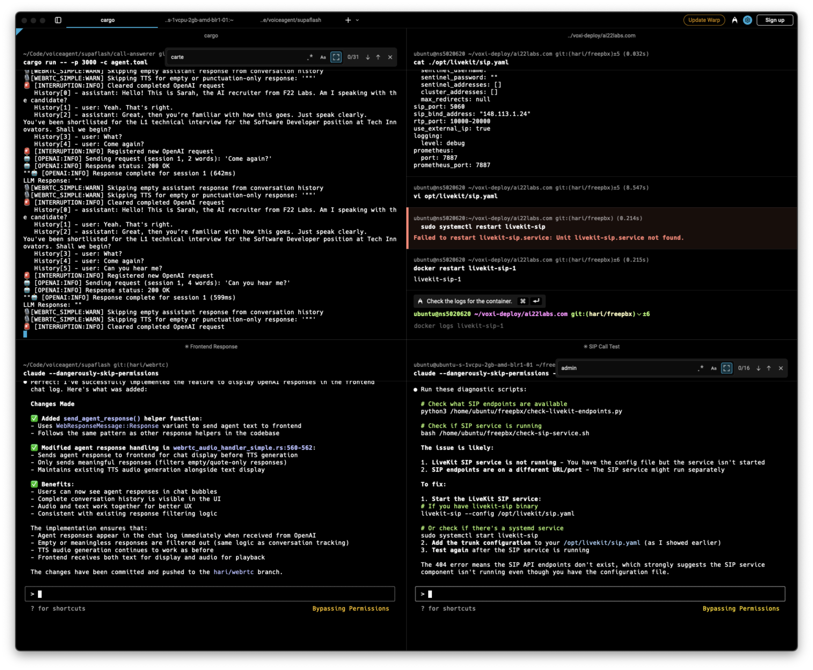

# MCP Manager

Interactive CLI tool for managing MCP (Model Context Protocol) server configurations.



## Installation

### Global Installation (Recommended)

```bash
npm install -g @oglabs/mcp
```

### Local Installation

```bash
npm install @oglabs/mcp
```

## Usage

### Interactive CLI Mode

After global installation, you can run the tool from anywhere:

```bash
@oglabs/mcp
```

Or if installed locally:

```bash
npx @oglabs/mcp
```

### Web Interface Mode

Launch the web interface for a modern, visual experience:

```bash
@oglabs/mcp --web
```

Or if installed locally:

```bash
npx @oglabs/mcp --web
```

The web interface automatically opens in your default browser at `http://localhost:3333` and provides:

#### 🚀 Key Features:
- **⚡ Supafast Installation**: 14 servers (S1-S14) can be installed instantly without configuration
- **📦 Server Browser**: Search and browse 26+ pre-configured MCP servers by category
- **⚙️ Current Servers**: View, edit, and manage your configured servers
- **➕ Custom Servers**: Add custom MCP server configurations with guided forms
- **📝 Direct Config Editing**: Edit `.mcp.json` files directly in the browser
- **🔍 Advanced Search**: Filter servers by name, category, or description
- **📱 Responsive Design**: Works on desktop, tablet, and mobile devices

#### 🎯 Supafast Servers (No Setup Required):
- **S1-S7**: Core tools (Everything, Fetch, Filesystem, Git, Memory, Sequential Thinking, Time)
- **S8-S11**: Development tools (Playwright, Context7, Task Master, Xcode Build)  
- **S12-S14**: Specialized tools (NixOS, shadcn/ui, Just Prompt)

#### 🌐 API Endpoints:
- `GET /api/config` - Retrieve current MCP configuration
- `POST /api/config` - Save MCP configuration
- `GET /api/servers` - Get pre-configured servers database

## Features

### 🖥️ CLI Mode
- 📋 Interactive menu-driven interface
- ⚡ **Supafast installation** (S1-S14 servers with zero configuration)
- 🔧 26+ pre-configured MCP servers
- ➕ Add custom MCP servers
- ✏️ Edit existing servers
- ❌ Remove servers
- 📄 View current configuration
- 🔍 Search MCP servers
- 🎯 Automatic `.mcp.json` file management

### 🌐 Web Mode
- 🎨 Modern, responsive web interface
- 📱 Mobile-friendly design
- 🚀 One-click server installation
- 📊 Visual server management dashboard
- 🔍 Advanced search and filtering
- 📝 In-browser configuration editing
- 🌙 Dark/light theme support

## Pre-configured Servers

MCP Manager comes with 26+ verified pre-configured MCP servers including:

- **🗄️ Databases**: Supabase, PostgreSQL, Redis, SQLite
- **🛠️ Development Tools**: Git, Playwright, Xcode Build, PR Reviewer, NixOS
- **☁️ Cloud Services**: AWS, Google Drive Enhanced, SharePoint
- **📁 File Systems**: Filesystem, Memory, Fetch
- **🤖 AI/ML**: Everything, Sequential Thinking, Context7, Just Prompt, GPT Researcher
- **🎯 Productivity**: Task Master, ClickUp, shadcn/ui
- **🎵 Entertainment**: Spotify
- **🔐 Authentication**: Clerk
- **🚀 Automation**: Skyvern
- **📚 Knowledge**: Obsidian

## Configuration

MCP Manager manages `.mcp.json` files in your current working directory. The configuration format is:

```json
{
  "mcpServers": {
    "serverName": {
      "command": "npx",
      "args": ["-y", "@package/name"],
      "env": {"KEY": "value"}
    }
  }
}
```

## Examples

### Adding a Pre-configured Server

1. Run `@oglabs/mcp`
2. Select "Add a pre-configured MCP server"
3. Choose from the list (e.g., "PostgreSQL")
4. Follow the prompts for any required configuration

### Adding a Custom Server

1. Run `@oglabs/mcp`
2. Select "Add a custom MCP server"
3. Enter the server name, command, and arguments
4. Optionally add environment variables

### Removing a Server

1. Run `@oglabs/mcp`
2. Select "Remove an MCP server"
3. Choose the server to remove

## Development

```bash
# Clone the repository
git clone https://github.com/kmhari/mcp-simple.git
cd mcp-simple

# Install dependencies (if any)
npm install

# Run locally
node @oglabs/mcp.js
```

## License

MIT

## Contributing

Contributions are welcome! Please feel free to submit a Pull Request.

## Author

Hari ([@kmhari](https://github.com/kmhari))