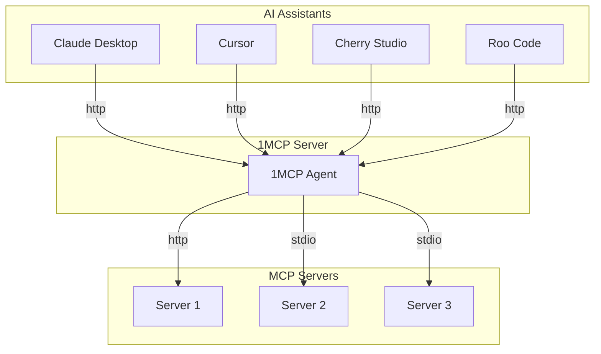
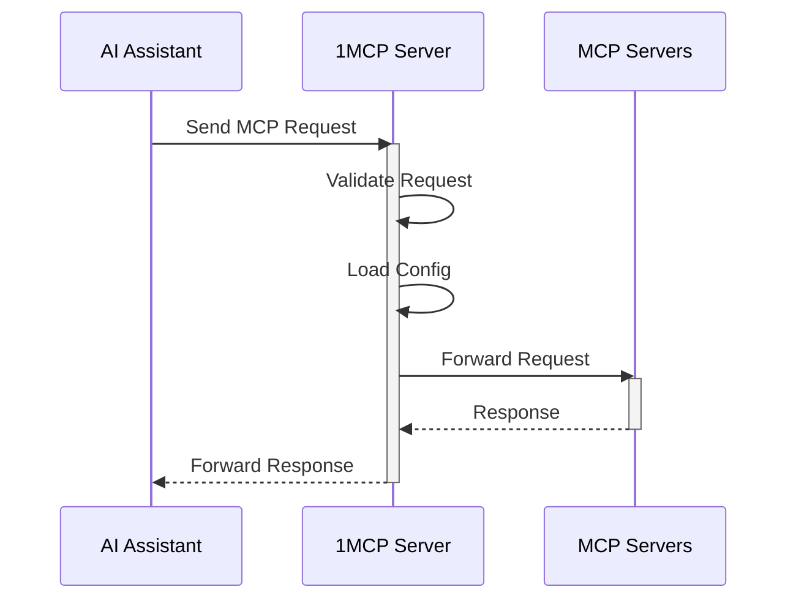

# 1MCP - One MCP Server for All

A unified Model Context Protocol server implementation that aggregates multiple MCP servers into one.

[](https://www.npmjs.com/package/@1mcp/agent)
[](https://www.npmjs.com/package/@1mcp/agent)
[](https://smithery.ai/server/@1mcp-app/agent)

## Overview

1MCP (One MCP) is designed to simplify the way you work with AI assistants. Instead of configuring multiple MCP servers for different clients (Claude Desktop, Cherry Studio, Cursor, Roo Code, Claude, etc.), 1MCP provides a single, unified server that:

- Aggregates multiple MCP servers into one unified interface
- Reduces system resource usage by eliminating redundant server instances
- Simplifies configuration management across different AI assistants
- Provides a standardized way for AI models to interact with external tools and resources
- Supports dynamic configuration reloading without server restart
- Handles graceful shutdown and resource cleanup

## Quick Start

To enable Cursor to use existing MCP servers already configured in Claude Desktop, follow these steps:

1. Run the 1MCP server with the Claude Desktop config file:

```bash
npx -y @1mcp/agent --config ~/Library/Application\ Support/Claude/claude_desktop_config.json
```

2. Add the 1MCP server to your Cursor config file (`~/.cursor/mcp.json`):

```json
{
  "mcpServers": {
    "1mcp": {
      "type": "http",
      "url": "http://localhost:3050/sse"
    }
  }
}
```

3. Enjoy it!

## Usage

You can run the server directly using `npx`:

```bash
# Basic usage (starts server with SSE transport)
npx -y @1mcp/agent

# Use existing Claude Desktop config
npx -y @1mcp/agent --config ~/Library/Application\ Support/Claude/claude_desktop_config.json

# Use stdio transport instead of SSE
npx -y @1mcp/agent --transport stdio

# Show all available options
npx -y @1mcp/agent --help
```

Available options:

- `--transport, -t`: Choose transport type ("stdio" or "http", default: "http")
- `--config, -c`: Use a specific config file
- `--port, -P`: Change HTTP port (default: 3050)
- `--host, -H`: Change HTTP host (default: localhost)
- `--tags, -g`: Filter servers by tags (see Tags section below)
- `--pagination, -p`: Enable pagination for client/server lists (boolean, default: false)
- `--auth`: Enable authentication (OAuth 2.1) (boolean, default: false)
- `--session-ttl`: Session expiry time in minutes (number, default: 1440)
- `--session-storage-path`: Custom session storage directory path (string, default: undefined)
- `--help, -h`: Show help

Example with environment variables:

```bash
# Using environment variables
ONE_MCP_PORT=3051 ONE_MCP_TAGS=network,filesystem npx -y @1mcp/agent

# Or in your shell configuration
export ONE_MCP_PORT=3051
export ONE_MCP_TAGS=network,filesystem
npx -y @1mcp/agent
```

## Docker

You can also run 1MCP using Docker:

```bash
# Pull the latest image
docker pull ghcr.io/1mcp-app/agent:latest

# Run with HTTP transport (default)
docker run -p 3050:3050 ghcr.io/1mcp-app/agent

# Run with a custom config file
docker run -p 3050:3050 -v /path/to/config.json:/config.json ghcr.io/1mcp-app/agent --config /config.json

# Run with stdio transport
docker run -i ghcr.io/1mcp-app/agent --transport stdio
```

Available image tags:

- `latest`: Latest stable release
- `vX.Y.Z`: Specific version (e.g. `v1.0.0`)
- `sha-<commit>`: Specific commit

### Environment Variables

You can configure 1MCP using environment variables prefixed with `ONE_MCP_`:

- `ONE_MCP_TRANSPORT`: Transport type ("stdio" or "http", default: "http")
- `ONE_MCP_PORT`: HTTP port (default: 3050)
- `ONE_MCP_HOST`: HTTP host (default: "localhost")
- `ONE_MCP_CONFIG`: Path to config file
- `ONE_MCP_TAGS`: Comma-separated list of tags to filter servers
- `ONE_MCP_PAGINATION`: Enable pagination for client/server lists (boolean, default: false)
- `ONE_MCP_AUTH`: Enable authentication (OAuth 2.1) (boolean, default: false)
- `ONE_MCP_SESSION_TTL`: Session expiry time in minutes (number, default: 1440)
- `ONE_MCP_SESSION_STORAGE_PATH`: Custom session storage directory path (string, default: undefined)

Example with environment variables:

```bash
docker run -p 3051:3051 \
  -e ONE_MCP_PORT=3051 \
  -e ONE_MCP_TAGS=network,filesystem \
  ghcr.io/1mcp-app/agent
```

### Understanding Tags

Tags help you control which MCP servers are available to different clients. Think of tags as labels that describe what each server can do.

#### How to Use Tags

1. **In your server config**: Add tags to each server to describe its capabilities

```json
{
  "mcpServers": {
    "web-server": {
      "command": "uvx",
      "args": ["mcp-server-fetch"],
      "tags": ["network", "web"],
      "disabled": false
    },
    "file-server": {
      "command": "npx",
      "args": ["-y", "@modelcontextprotocol/server-filesystem", "~/Downloads"],
      "tags": ["filesystem"],
      "disabled": false
    }
  }
}
```

2. **When starting 1MCP in stdio mode**: You can filter servers by tags

```bash
# Only start servers with the "network" tag
npx -y @1mcp/agent --transport stdio --tags "network"

# Start servers with either "network" or "filesystem" tags
npx -y @1mcp/agent --transport stdio --tags "network,filesystem"
```

3. **When using SSE transport**: Clients can request servers with specific tags

```json
{
  "mcpServers": {
    "1mcp": {
      "type": "http",
      "url": "http://localhost:3050/sse?tags=network" // Only connect to network-capable servers
    }
  }
}
```

Example tags:

- `network`: For servers that make web requests
- `filesystem`: For servers that handle file operations
- `memory`: For servers that provide memory/storage
- `shell`: For servers that run shell commands
- `db`: For servers that handle database operations

## Configuration

### Global Configuration

The server automatically manages configuration in a global location:

- macOS/Linux: `~/.config/1mcp/mcp.json`
- Windows: `%APPDATA%/1mcp/mcp.json`

### Configuration File Format

```json
{
  "mcpServers": {
    "mcp-server-fetch": {
      "command": "uvx",
      "args": ["mcp-server-fetch"],
      "disabled": false
    },
    "server-memory": {
      "command": "npx",
      "args": ["-y", "@modelcontextprotocol/server-memory"],
      "disabled": false
    }
  }
}
```

## How It Works

### System Architecture



### Request Flow



## Development

Install dependencies:

```bash
pnpm install
```

Build the server:

```bash
pnpm build
```

For development with auto-rebuild:

```bash
pnpm watch
```

Run the server:

```bash
pnpm dev
```

### Debugging

Using the [MCP Inspector](https://github.com/modelcontextprotocol/inspector), which is available as a package script:

```bash
pnpm inspector
```

The Inspector will provide a URL to access debugging tools in your browser.

## Debugging & Source Maps

This project uses [source-map-support](https://www.npmjs.com/package/source-map-support) to enhance stack traces. When you run the server, stack traces will reference the original TypeScript source files instead of the compiled JavaScript. This makes debugging much easier, as error locations and line numbers will match your source code.

No extra setup is required—this is enabled by default. If you see a stack trace, it will point to `.ts` files and the correct line numbers. 🗺️
