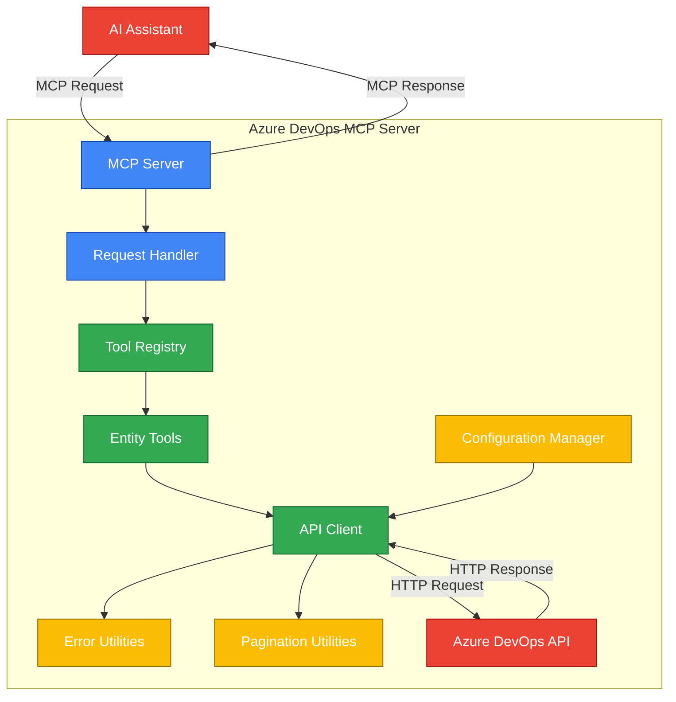
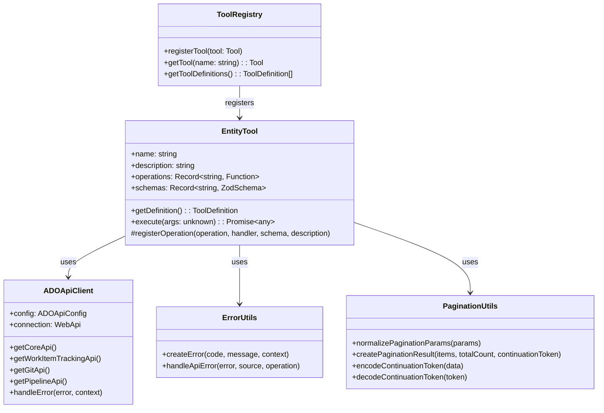
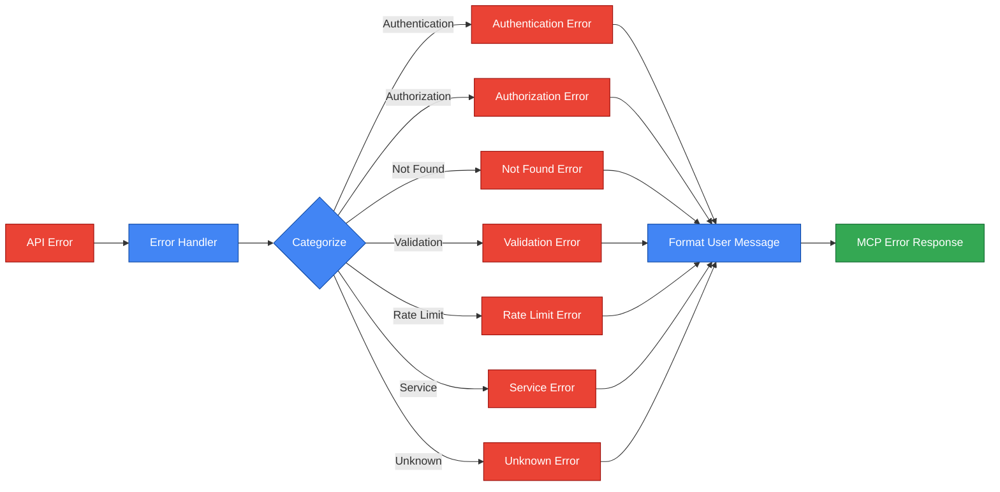
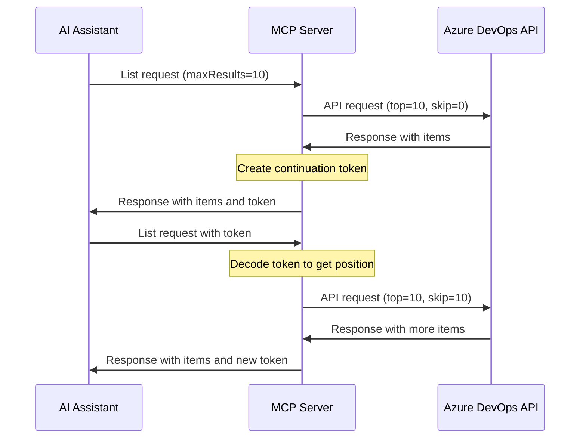

# Azure DevOps MCP Server

<p align="center">
  
</p>

This MCP (Model Context Protocol) server provides tools for interacting with Azure DevOps services through AI assistants.

## Architecture

The server follows an entity-based architecture that groups operations by resource type rather than exposing many atomic tools. This approach provides several benefits:

1. **Intuitive organization**: Tools are organized by the entities they operate on (projects, repositories, work items, etc.)
2. **Reduced tool count**: Instead of dozens of individual tools, we have a handful of entity tools with multiple operations
3. **Consistent interface**: All entity tools follow the same pattern for operations and parameters
4. **Better error handling**: Each entity tool can handle errors specific to its domain
5. **Easier discovery**: Users can easily discover available operations for each entity

### Architecture Diagram



### Component Structure



### Key Components

- **Entity Tools**: Each tool represents a major Azure DevOps entity (projects, repositories, work items, etc.) and provides multiple operations (list, get, create, etc.)
- **Tool Registry**: Manages the registration and execution of entity tools
- **API Client**: Handles communication with the Azure DevOps REST API
- **Error Utilities**: Provides standardized error handling with detailed context and user-friendly messages
- **Pagination Utilities**: Implements cursor-based pagination for list operations
- **Configuration Manager**: Loads and validates configuration from environment variables or config file

## Recent Improvements

### 1. Enhanced Error Handling

The server now includes a comprehensive error handling system that provides:

- **Categorized errors**: Errors are categorized by type (authentication, authorization, validation, etc.)
- **Contextual information**: Errors include the source, operation, and other relevant context
- **User-friendly messages**: Error messages are designed to be helpful and actionable
- **Troubleshooting tips**: Where applicable, errors include suggestions for resolving the issue



### 2. Cursor-based Pagination

All list operations now support cursor-based pagination with:

- **Continuation tokens**: Encoded tokens for resuming pagination
- **Customizable page size**: Control the number of results per page
- **Consistent interface**: Same pagination parameters across all list operations
- **Efficient resource usage**: Only fetch the data you need



### 3. Improved Documentation

Each tool and operation now includes:

- **Detailed descriptions**: Clear explanations of what each tool and operation does
- **Parameter documentation**: Comprehensive documentation for all parameters
- **Usage examples**: Real-world examples of how to use each operation
- **Type information**: Clear type definitions for all inputs and outputs

## Available Entity Tools

### Projects Tool

Manages Azure DevOps projects.

Operations:
- `list`: List all projects in the organization with pagination support
- `get`: Get detailed information about a specific project

### Repositories Tool

Manages Git repositories.

Operations:
- `list`: List all Git repositories in a project with pagination support
- `get`: Get detailed information about a specific Git repository
- `listBranches`: List all branches in a Git repository with pagination support

### Work Items Tool

Manages work items (bugs, tasks, user stories, etc.).

Operations:
- `get`: Get detailed information about a specific work item
- `create`: Create a new work item in a project

### Pull Requests Tool

Manages pull requests in repositories.

Operations:
- `list`: List pull requests in a repository with filtering and pagination support
- `get`: Get detailed information about a specific pull request

### Pipelines Tool

Manages CI/CD pipelines.

Operations:
- `list`: List all pipelines in a project with pagination support
- `get`: Get detailed information about a specific pipeline

## Usage Examples

### List Projects with Pagination

```json
{
  "operation": "list",
  "listParams": {
    "maxResults": 10,
    "continuationToken": "optional-token-from-previous-request"
  }
}
```

### Get Project Details

```json
{
  "operation": "get",
  "getParams": {
    "projectId": "my-project",
    "includeCapabilities": true
  }
}
```

### List Repositories in a Project

```json
{
  "operation": "list",
  "listParams": {
    "projectId": "my-project",
    "maxResults": 20
  }
}
```

### List Branches in a Repository

```json
{
  "operation": "listBranches",
  "listBranchesParams": {
    "projectId": "my-project",
    "repositoryId": "my-repo",
    "maxResults": 15
  }
}
```

### Get Work Item Details

```json
{
  "operation": "get",
  "getParams": {
    "id": 123,
    "expand": "Relations"
  }
}
```

### Create a Work Item

```json
{
  "operation": "create",
  "createParams": {
    "projectId": "my-project",
    "type": "Task",
    "title": "Implement new feature",
    "description": "This task involves implementing the new feature XYZ",
    "assignedTo": "user@example.com"
  }
}
```

### List Pull Requests with Filtering

```json
{
  "operation": "list",
  "listParams": {
    "projectId": "my-project",
    "repositoryId": "my-repo",
    "status": "Active",
    "maxResults": 10
  }
}
```

## Configuration

The server can be configured using environment variables or a configuration file.

### Environment Variables

- `ADO_ORGANIZATION`: Azure DevOps organization name (required)
- `ADO_PROJECT`: Default project name (optional)
- `ADO_PAT`: Personal Access Token for authentication (required)
- `ADO_API_URL`: Base URL for the API (optional, defaults to https://dev.azure.com)
- `ADO_API_VERSION`: API version (optional, defaults to 7.0)
- `ADO_API_MAX_RETRIES`: Maximum number of retries for API calls (optional, defaults to 3)
- `ADO_API_DELAY_MS`: Delay between retries in milliseconds (optional, defaults to 1000)
- `ADO_API_BACKOFF_FACTOR`: Backoff factor for retries (optional, defaults to 2)

### Configuration File

Alternatively, you can create a `config/azuredevops.json` file with the following structure:

```json
{
  "organization": "your-organization",
  "project": "your-project",
  "credentials": {
    "pat": "your-personal-access-token"
  },
  "api": {
    "baseUrl": "https://dev.azure.com",
    "version": "7.0",
    "retry": {
      "maxRetries": 3,
      "delayMs": 1000,
      "backoffFactor": 2
    }
  }
}
```

## Development

### Building the Server

```bash
npm run build
```

### Running the Server

```bash
node build/index.js
```

### Docker

```bash
docker build -t azure-devops-mcp:local .
docker run -i --rm -e ADO_ORGANIZATION=your-org -e ADO_PAT=your-pat azure-devops-mcp:local

## License

MIT License © 2025 Aaron Bockelie <aaronsb@gmail.com>
