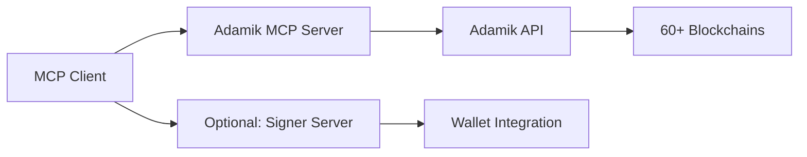

# 🚀 Adamik MCP Server

[](https://www.npmjs.com/package/@adamik/mcp-server)
[](https://www.npmjs.com/package/@adamik/mcp-server)
[](https://smithery.ai/server/@AdamikHQ/adamik-mcp-server)
[](https://github.com/AdamikHQ/adamik-mcp-server/stargazers)

<p align="center">
  
</p>

<h2 align="center">🌐 Control 60+ Blockchains with Natural Language</h2>

<p align="center">
  <strong>The most powerful blockchain MCP server for Claude, ChatGPT, and any MCP client</strong><br/>
  Turn complex blockchain operations into simple conversations
</p>

<p align="center">
  <a href="#-quick-start">🚀 Quick Start</a> •
  <a href="#-features">✨ Features</a> •
  <a href="#-examples">💡 Examples</a> •
  <a href="#-installation">📦 Installation</a> •
  <a href="https://adamik.io/">🌐 Website</a>
</p>

---

## ✨ Features

<table>
<tr>
<td width="50%">

### 🔗 **60+ Blockchain Networks**

- Ethereum, Bitcoin, Solana, Cosmos
- Polygon, Arbitrum, Optimism, Base
- Starknet, Aptos, Tron, and many more

### 💰 **Complete Account Management**

- Real-time balance checking
- Transaction history analysis
- Multi-chain portfolio overview
- Staking rewards tracking

</td>
<td width="50%">

### 🔄 **Advanced Operations**

- Native & token transfers
- Cross-chain swaps & bridges ⭐ _Premium_
- Staking & unstaking

### 🛠 **Developer Friendly**

- Type-safe schemas
- Comprehensive error handling
- Enterprise-grade infrastructure
- Easy integration with [signer server](https://github.com/AdamikHQ/signer-mcp-server)

</td>
</tr>
</table>

---

## 💡 What You Can Do

```bash
# Just ask in natural language:
"Check my ETH balance on Ethereum"
"Send 0.1 ETH to 0x123"
"Stake 100 ATOM with the best validator"
"Convert 1000 USDC to ETH on Optimism"  # Premium feature
"Show my transaction history on Polygon"
```

**No complex setup. No wallet management hassles. Just natural conversations with blockchains.**

---

## 🚀 Quick Start

### 1️⃣ Get Your Free API Key

Visit [adamik.io](https://dashboard.adamik.io/) → Sign up → Copy your API key (takes 30 seconds)

### 2️⃣ Install & Configure

```bash
# Install instantly
npx @adamik/mcp-server

# Add to Claude Desktop config
{
  "mcpServers": {
    "adamik": {
      "command": "npx",
      "args": ["@adamik/mcp-server"],
      "env": {
        "ADAMIK_API_KEY": "your-api-key-here"
      }
    }
  }
}
```

### 3️⃣ Start Using

Open Claude Desktop and ask: _"What's my Optimism/Tron/Solana balance?"_

That's it! 🎉

---

## 🎯 Supported MCP Clients

<table>
<tr>
<td align="center">
<br/>
<strong>Claude Desktop</strong><br/>
<em>Premium Required</em>
</td>
<td align="center">
🖥️<br/>
<strong>FastAgent</strong><br/>
<em>Developer Friendly</em>
</td>
<td align="center">
🔧<br/>
<strong>Your App</strong><br/>
<em>MCP Compatible</em>
</td>
</tr>
</table>

---

## 📦 Installation Options

### Option 1: NPX (Recommended)

```bash
npx @adamik/mcp-server
```

### Option 2: Global Install

```bash
npm install -g @adamik/mcp-server
adamik-mcp-server
```

### Option 3: Local Development

```bash
git clone https://github.com/AdamikHQ/adamik-mcp-server.git
cd adamik-mcp-server
pnpm install && pnpm build
node build/index.js
```

---

## 🔧 Configuration Examples

<details>
<summary><strong>Claude Desktop (JSON)</strong></summary>

```json
{
  "mcpServers": {
    "adamik": {
      "command": "npx",
      "args": ["@adamik/mcp-server"],
      "env": {
        "ADAMIK_API_KEY": "your-api-key"
      }
    }
  }
}
```

</details>

<details>
<summary><strong>FastAgent (YAML)</strong></summary>

```yaml
mcp:
  servers:
    adamik:
      command: "npx"
      args: ["@adamik/mcp-server"]
      env:
        ADAMIK_API_KEY: "your-api-key"
```

</details>

<details>
<summary><strong>Environment Variables</strong></summary>

```env
ADAMIK_API_KEY=your-api-key-here
ADAMIK_API_BASE_URL=https://api.adamik.io/api  # Optional
```

</details>

---

## 🏗️ Architecture



---

## 🤝 Contributing

We love contributions! Here's how to get started:

1. **Fork** this repository
2. **Create** a feature branch: `git checkout -b feature/amazing-feature`
3. **Commit** your changes: `git commit -m 'Add amazing feature'`
4. **Push** to the branch: `git push origin feature/amazing-feature`
5. **Open** a Pull Request

### Development Setup

```bash
git clone https://github.com/AdamikHQ/adamik-mcp-server.git
cd adamik-mcp-server
pnpm instal
pnpm build

```

**Testing your changes:**
Update your MCP client config to point to the local build:

```json
{
  "command": "node",
  "args": ["/path/to/your/adamik-mcp-server/build/index.js"],
  "env": { "ADAMIK_API_KEY": "your-api-key" }
}
```

---

## 📚 Related Projects

- 🔐 **[Adamik Signer Server](https://github.com/AdamikHQ/signer-mcp-server)** - Transaction signing & wallet management
- 🌐 **[Adamik API](https://adamik.io/)** - Multi-chain blockchain infrastructure

---

## 🆘 Support

- 📖 **Documentation**: [docs.adamik.io](https://docs.adamik.io/)
- 💬 **Issues**: [GitHub Issues](https://github.com/AdamikHQ/adamik-mcp-server/issues)
- 📧 **Contact**: [contact@adamik.io](mailto:contact@adamik.io)
- 💬 **Telegram**: [Adamik MCP Community](https://t.me/+5yRlc7EYTxw5ZGE0)
- 🐦 **Twitter**: [@Adamik_io](https://x.com/adamik_io)

---

<p align="center">
  <strong>⭐ Star this repo if you find it useful!</strong><br/>
  <em>Developed by the <a href="https://adamik.io">Adamik</a> team</em>
</p>
