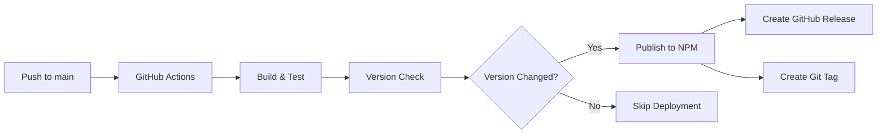

# AIM Guard MCP

[](https://www.npmjs.com/package/aim-guard-mcp)
[](https://smithery.ai/server/@AIM-Intelligence/aim-mcp)

🛡️ **AIM MCP Server :: Guard and Protect your MCPs & AI Agents**

A Model Context Protocol (MCP) server that provides AI-powered security analysis and safety instruction tools. This server helps protect AI agents by providing security guidelines, content analysis, and cautionary instructions when interacting with various MCPs and external services.

## Features

- 🛡️ **AI Safety Guard**: Provides contextual security instructions and precautions for AI Agents before MCP interactions
- 🔍 **Text Guard Analysis**: Analyze text content for harmful or inappropriate content using AIM Intelligence API
- 🔒 **Security Prompt Enhancement**: Add security instructions to user prompts for safer AI interactions
- ⚡ **Fast & Lightweight**: Built with TypeScript and Zod validation
- 🔧 **Easy Integration**: Works with any MCP-compatible AI assistant
- 🔗 **API Integration**: Connects to AIM Intelligence API for advanced content analysis

## Installation

### NPX (Recommended)

```bash
npx aim-guard-mcp
```

### Global Installation

```bash
npm install -g aim-guard-mcp
aim-guard-mcp
```

### Local Installation

```bash
npm install aim-guard-mcp
```

## Usage

### As MCP Server

Add to your MCP client configuration:

```json
{
  "servers": {
    "aim-guard": {
      "type": "stdio",
      "command": "npx",
      "args": ["aim-guard-mcp"]
    }
  }
}
```

### Testing the Tools

#### Test AI Safety Guard

```bash
# Get safety instructions for database operations
{
  "name": "ai-safety-guard",
  "arguments": {
    "mcp_type": "database",
    "operation_type": "query",
    "sensitivity_level": "confidential"
  }
}
```

#### Test Text Guard

```bash
# This will analyze the text for harmful content
{
  "name": "aim-text-guard",
  "arguments": {
    "text": "This is a sample text to analyze for safety."
  }
}
```

#### Test Security Prompt Enhancement

```bash
# Enhance a user prompt with security instructions
{
  "name": "aim-security-prompt-tool",
  "arguments": {
    "user_prompt": "Please help me with this task",
    "security_level": "strict"
  }
}
```

### Available Tools

#### 1. `ai-safety-guard`

Provides contextual security instructions and precautions for AI Agents before they interact with other MCPs.

```json
{
  "name": "ai-safety-guard",
  "arguments": {
    "mcp_type": "email|slack|database|file|web|general", // Type of MCP being called
    "operation_type": "read|write|execute|delete|send|query", // Operation being performed
    "sensitivity_level": "public|internal|confidential|restricted" // Data sensitivity level
  }
}
```

**Features**:

- Context-aware security guidelines based on MCP type
- Operation-specific warnings and precautions
- Sensitivity-level protocols and restrictions
- Comprehensive checklists for safe MCP interactions
- Red flag detection and abort recommendations

#### 2. `aim-text-guard`

Analyze text content for harmful or inappropriate content using AIM Intelligence API.

```json
{
  "name": "aim-text-guard",
  "arguments": {
    "text": "Text content to analyze for harmful content"
  }
}
```

**Features**:

- Real-time content analysis
- Harmful content detection
- Detailed analysis results in JSON format
- Error handling with informative messages
- Timestamp tracking for analysis requests

#### 3. `aim-security-prompt-tool`

Enhance user prompts with security instructions for safer AI interactions.

```json
{
  "name": "aim-security-prompt-tool",
  "arguments": {
    "user_prompt": "Original user prompt to enhance",
    "security_level": "basic|standard|strict" // Optional, defaults to 'standard'
  }
}
```

**Features**:

- Multi-level security enhancement (basic, standard, strict)
- Comprehensive threat analysis instructions
- Social engineering protection guidelines
- Security policy compliance checks
- Sanitization and validation requirements

## Security Features

### 🛡️ AI Agent Protection

- **MCP Interaction Safety**: Contextual guidelines for different MCP types
- **Operation Validation**: Specific precautions for read/write/execute operations
- **Data Sensitivity Handling**: Protocols based on data classification levels

### 🔍 Content Analysis

- **Real-time Threat Detection**: Analyze content for harmful patterns
- **API-powered Analysis**: Advanced AI-driven content safety assessment
- **Comprehensive Reporting**: Detailed security analysis results

### 🔒 Prompt Security

- **Security-Enhanced Prompts**: Add protective instructions to user prompts
- **Configurable Security Levels**: Basic to strict security protocols
- **Threat Prevention**: Proactive security measures in AI interactions

## Development

```bash
# Clone the repository
git clone https://github.com/AIM-Intelligence/AIM-MCP.git
cd AIM-MCP

# Install dependencies
pnpm install

# Build the project
pnpm run build

# Run in development mode
pnpm run dev

# Run tests
pnpm test
```

## Deployment

This project uses automated CI/CD pipeline for seamless deployment to NPM.

### Automatic Deployment

When you push to the `main` branch, GitHub Actions will automatically:

1. **Build and Test**: Compile TypeScript and run tests
2. **Version Check**: Compare current version with published version
3. **Publish to NPM**: Automatically publish if version has changed
4. **Create Release**: Generate GitHub release with version tag

### Manual Version Management

```bash
# Bump patch version (1.0.0 -> 1.0.1)
pnpm run release:patch

# Bump minor version (1.0.0 -> 1.1.0)
pnpm run release:minor

# Bump major version (1.0.0 -> 2.0.0)
pnpm run release:major
```

### Setting up NPM Token

To enable automatic deployment, add your NPM token to GitHub Secrets:

1. Go to [npmjs.com](https://www.npmjs.com) and create an automation token
2. In your GitHub repository, go to Settings > Secrets and variables > Actions
3. Add a new secret named `NPM_TOKEN` with your NPM token value

### Deployment Workflow



## Contributing

1. Fork the repository
2. Create your feature branch (`git checkout -b feature/amazing-feature`)
3. Commit your changes (`git commit -m 'Add some amazing feature'`)
4. Push to the branch (`git push origin feature/amazing-feature`)
5. Open a Pull Request

## License

This project is licensed under the ISC License - see the [LICENSE](LICENSE) file for details.

## Support

- 📧 Email: support@aim-intelligence.com
- 🐛 Issues: [GitHub Issues](https://github.com/AIM-Intelligence/AIM-MCP/issues)
- 📖 Documentation: [GitHub Wiki](https://github.com/AIM-Intelligence/AIM-MCP/wiki)

---

Made with ❤️ by [AIM Intelligence](https://github.com/AIM-Intelligence)
