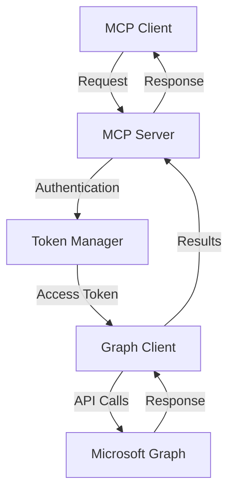

# CISA M365 MCP Server

[](https://smithery.ai/server/cisa-m365)
A Model Context Protocol (MCP) server implementing CISA Binding Operational Directive 25-01 security controls for Microsoft 365 (Azure AD/Entra ID).

## Table of Contents

- [Overview](#overview)
- [Security Controls](#security-controls)
- [Architecture](#architecture)
- [Prerequisites](#prerequisites)
- [Installation](#installation)
- [Configuration](#configuration)
- [Usage](#usage)
- [API Reference](#api-reference)
- [Error Handling](#error-handling)
- [Testing](#testing)
- [Security Considerations](#security-considerations)
- [Contributing](#contributing)
- [License](#license)

## Overview

This MCP server provides tools for configuring and managing Microsoft 365 security settings in accordance with BOD 25-01 requirements. It integrates with Microsoft Graph API to enforce security controls, monitor compliance, and provide detailed reporting.

### Key Features

- Legacy authentication controls
- Risk-based access controls
- Multi-factor authentication management
- Application registration and consent controls
- Password policy management
- Privileged role management
- Cloud-only account enforcement
- PAM system integration
- Comprehensive compliance reporting
- Token-based authentication
- Type-safe argument validation
- Detailed error handling and logging

## Security Controls

### MS.AAD.1.1v1
**Due Date: 06/20/2025**

Block legacy authentication:
- Disables legacy authentication protocols
- Reduces attack surface
- Improves security posture

Implementation details:
```typescript
await graphClient
  .api('/policies/authenticationMethodsPolicy')
  .patch({
    allowLegacyAuthentication: false,
    blockLegacyAuthenticationMethods: true,
  });
```

### MS.AAD.2.1v1 & MS.AAD.2.3v1
**Due Date: 06/20/2025**

Block high-risk users and sign-ins:
- Blocks users detected as high risk
- Blocks sign-ins detected as high risk
- Leverages Microsoft's threat intelligence

Implementation details:
```typescript
await graphClient
  .api('/policies/identitySecurityDefaultsEnforcementPolicy')
  .patch({
    blockHighRiskUsers: true,
    riskLevelForBlocking: 'high',
  });
```

### MS.AAD.3.1v1, MS.AAD.3.2v1, MS.AAD.3.3v1
**Due Date: 06/20/2025**

MFA configuration:
- Enforces phishing-resistant MFA
- Configures alternative MFA methods
- Shows login context in Microsoft Authenticator

Implementation details:
```typescript
await graphClient
  .api('/policies/authenticationMethodsPolicy')
  .patch({
    policies: {
      fido2: {
        isEnabled: true,
        isSelfServiceRegistrationAllowed: true,
      },
      windowsHelloForBusiness: {
        isEnabled: true,
        isSelfServiceRegistrationAllowed: true,
      },
    },
  });
```

### MS.AAD.5.1v1, MS.AAD.5.2v1, MS.AAD.5.3v1, MS.AAD.5.4v1
**Due Date: 06/20/2025**

Application controls:
- Restricts app registration to admins
- Restricts app consent to admins
- Configures admin consent workflow
- Blocks group owner consent

Implementation details:
```typescript
await graphClient
  .api('/policies/applicationRegistrationManagement')
  .patch({
    restrictAppRegistration: true,
    restrictNonAdminUsers: true,
  });
```

### MS.AAD.6.1v1
**Due Date: 06/20/2025**

Password policy:
- Disables password expiration
- Follows modern security best practices

Implementation details:
```typescript
await graphClient
  .api('/policies/passwordPolicy')
  .patch({
    passwordExpirationPolicy: {
      passwordExpirationDays: 0,
      neverExpire: true,
    },
  });
```

### MS.AAD.7.1v1 through MS.AAD.7.8v1
**Due Date: 06/20/2025**

Privileged role management:
- Limits Global Administrator count
- Enforces granular roles
- Requires cloud-only accounts
- Enforces PAM system usage
- Configures approval workflows
- Sets up alerting

Implementation details:
```typescript
await graphClient
  .api('/policies/roleManagementPolicies')
  .patch({
    enforceGranularRoles: true,
    blockGlobalAdminForGeneralUse: true,
    requireApprovalForGlobalAdmin: true,
  });
```

## Architecture

### Components

1. **Server Class**
   - Handles MCP protocol implementation
   - Manages tool registration and execution
   - Implements error handling and logging

2. **Authentication**
   - Token-based authentication with Microsoft Graph API
   - Automatic token refresh
   - Secure credential management

3. **Graph Client**
   - Wrapper around Microsoft Graph API
   - Type-safe request/response handling
   - Retry logic and error handling

4. **Tools**
   - Legacy authentication control
   - Risk-based access management
   - MFA configuration
   - Application control
   - Password policy management
   - Role management
   - Alert configuration
   - Policy status reporting

### Data Flow



## Prerequisites

- Node.js 18.x or higher
- Microsoft 365 tenant with admin access
- Azure AD application with required permissions:
  - Policy.ReadWrite.All
  - RoleManagement.ReadWrite.All
  - User.Read.All
  - Application.ReadWrite.All

## Installation

### Installing via Smithery

To install CISA M365 MCP Server automatically via [Smithery](https://smithery.ai/server/cisa-m365):

```bash
npx -y @smithery/cli install cisa-m365
```

You can also directly copy the MCP settings and definitions from [Smithery Protocol Directory](https://smithery.ai/server/cisa-m365) and add the MCP server to your Claude or LLM setup that supports MCP protocol.

1. Clone the repository:
```bash
git clone https://github.com/DynamicEndpoints/BOD-25-01-CSA-MCP.git
cd cisa-m365
```

2. Install dependencies:
```bash
npm install
```

3. Build the server:
```bash
npm run build
```

## Configuration

1. Create Azure AD application:
   - Navigate to Azure Portal > Azure Active Directory
   - Register a new application
   - Add required API permissions
   - Create a client secret

2. Configure environment variables:
```bash
cp .env.example .env
```

Edit `.env` file:
```env
TENANT_ID=your-tenant-id
CLIENT_ID=your-client-id
CLIENT_SECRET=your-client-secret
```

3. Configure MCP settings:

```json
{
  "mcpServers": {
    "cisa-m365": {
      "command": "node",
      "args": ["path/to/cisa-m365/build/index.js"],
      "env": {
        "TENANT_ID": "your-tenant-id",
        "CLIENT_ID": "your-client-id",
        "CLIENT_SECRET": "your-client-secret"
      }
    }
  }
}
```

## Usage

### Available Tools

#### block_legacy_auth
Block legacy authentication methods.

```json
{}
```

#### block_high_risk_users
Block users detected as high risk.

```json
{}
```

#### enforce_phishing_resistant_mfa
Enforce phishing-resistant MFA for all users.

```json
{}
```

#### configure_global_admins
Configure Global Administrator role assignments.

```json
{
  "userIds": ["user1-id", "user2-id"]
}
```

#### get_policy_status
Get current status of all security policies.

```json
{}
```

### Example Usage

```typescript
// Block legacy authentication
const result = await client.callTool('block_legacy_auth', {});

// Get policy status
const status = await client.callTool('get_policy_status', {});
```

## API Reference

### Policy Settings API

```typescript
interface PolicySettings {
  legacyAuthentication: {
    blocked: boolean;
    compliant: boolean;
  };
  highRiskUsers: {
    blocked: boolean;
    compliant: boolean;
  };
  mfa: {
    phishingResistant: boolean;
    alternativeEnabled: boolean;
    compliant: boolean;
  };
  applications: {
    registrationRestricted: boolean;
    consentRestricted: boolean;
    compliant: boolean;
  };
  passwords: {
    expirationDisabled: boolean;
    compliant: boolean;
  };
  roles: {
    globalAdminCount: number;
    granularRolesEnforced: boolean;
    pamEnforced: boolean;
    compliant: boolean;
  };
}
```

## Error Handling

The server implements comprehensive error handling:

1. **Authentication Errors**
   - Token acquisition failures
   - Permission issues
   - Tenant configuration problems

2. **API Errors**
   - Graph API request failures
   - Rate limiting
   - Service unavailability

3. **Validation Errors**
   - Invalid arguments
   - Missing required parameters
   - Type mismatches

4. **Runtime Errors**
   - Network issues
   - Timeout problems
   - Resource constraints

Example error response:
```json
{
  "error": {
    "code": "InvalidParams",
    "message": "Invalid role assignment arguments",
    "details": {
      "parameter": "userIds",
      "constraint": "Must have between 2 and 8 users",
      "received": "1 user"
    }
  }
}
```

## Testing

1. Run unit tests:
```bash
npm test
```

2. Run integration tests:
```bash
npm run test:integration
```

3. Run compliance tests:
```bash
npm run test:compliance
```

## Security Considerations

1. **Authentication**
   - Use secure token storage
   - Implement token rotation
   - Monitor for suspicious activity

2. **API Access**
   - Follow least privilege principle
   - Regular permission audits
   - Monitor API usage

3. **Data Protection**
   - No sensitive data logging
   - Secure configuration storage
   - Regular security scans

4. **Compliance**
   - Regular compliance checks
   - Automated policy verification
   - Audit logging

## Contributing

1. Fork the repository
2. Create a feature branch
3. Make your changes
4. Run tests
5. Submit a pull request

Guidelines:
- Follow existing code style
- Add tests for new features
- Update documentation
- Keep commits atomic

## License

MIT
