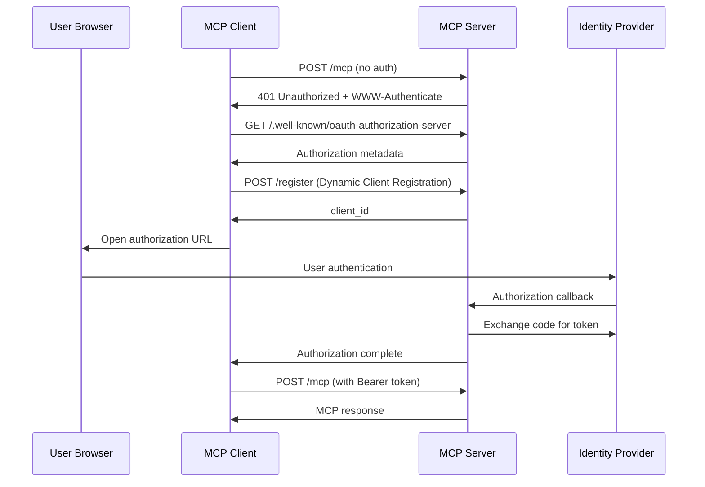

# RISKEN MCP Server


The RISKEN MCP Server is a [Model Context Protocol (MCP)](https://modelcontextprotocol.io/introduction) server that provides seamless integration with RISKEN APIs, enabling advanced automation and interaction capabilities for developers and tools.

## Use Cases

By connecting the RISKEN MCP server to your everyday AI tools, you can perform various operations such as:

- Checking active alerts in RISKEN and monitoring their status.
- Searching, analyzing, and reviewing findings including their explanations and remediation steps.
- Archiving resolved findings to maintain a clean and organized security posture.

## Prerequisites

1. To run the server in a container, you will need to have [Docker](https://www.docker.com/) installed.
2. Once Docker is installed, you will also need to ensure Docker is running.
3. You will also need to have a [RISKEN Access Token](https://docs.security-hub.jp/en/risken/access_token/).

## Local MCP Server

Please add the following MCP server configuration to your MCP Client ([Claude Desktop](https://claude.ai/download) or [Cursor](https://www.cursor.com/)) settings.

```json
{
  "mcpServers": {
    "risken": {
      "command": "docker",
      "args": [
        "run",
        "-i",
        "--rm",
        "-e",
        "RISKEN_ACCESS_TOKEN",
        "-e",
        "RISKEN_URL",
        "ghcr.io/ca-risken/risken-mcp-server",
        "stdio"
      ],
      "env": {
        "RISKEN_URL": "http://localhost:8000",
        "RISKEN_ACCESS_TOKEN": "your_access_token"
      }
    }
  }
}
```

## Remote MCP Server

RISKEN MCP Server supports Streamable HTTP.

### on Local

```bash
docker run -it --rm \
  -e RISKEN_URL=http://localhost:8000 \
  -e RISKEN_ACCESS_TOKEN=xxxxxx \
  -p 8080:8080 \
  ghcr.io/ca-risken/risken-mcp-server http
```

### on Cloud Run

You can deploy the server on Google Cloud Run with Terraform.

1. Visit [terraform/examples/googlecloud](terraform/examples/googlecloud) and deploy the server on Google Cloud Run with Terraform.

2. Add the following MCP server configuration to your MCP Client ([Claude Desktop](https://claude.ai/download) or [Cursor](https://www.cursor.com/)) settings.

**Note:** Since most MCP clients only allow stdio connections, it is currently necessary to use [mcp-remote](https://github.com/geelen/mcp-remote) as a proxy to connect to remote MCP servers.

#### Claude Desktop, Cursor ...

```json
{
  "mcpServers": {
    "risken": {
      "command": "npx",
      "args": [
        "mcp-remote",
        "http://localhost:8080/mcp",
        "--header",
        "RISKEN-ACCESS-TOKEN:${RISKEN_ACCESS_TOKEN}"
      ],
      "env": {
        "RISKEN_ACCESS_TOKEN": "xxxxxx"
      }
    }
  }
}
```

## Third-Party Authorization (OAuth2.1)

RISKEN MCP Server supports Third-Party Authorization (OAuth2.1) that enables secure authentication through external Identity Providers (IdP).

### Overview

The OAuth2.1 implementation follows the [MCP Authorization specification](https://modelcontextprotocol.io/specification/2025-03-26/basic/authorization#2-10-third-party-authorization-flow) with Third-Party Authorization Flow, where:

1. **MCP Client** initiates OAuth flow with MCP Server
2. **MCP Server** acts as authorization server and redirects user to IdP
3. **IdP** authenticates user and returns to MCP Server
4. **MCP Server** issues access token for MCP Client
5. **MCP Client** uses access token for subsequent MCP requests


### OAuth Flow



### Configuration

#### MCP Server Configuration

The following environment variables are required for OAuth2.1 support:

| Variable | Required | Description | Example |
|----------|----------|-------------|---------|
| `MCP_SERVER_URL` | ✅ | Public URL of MCP server | `http://localhost:8080` |
| `AUTHZ_METADATA_ENDPOINT` | ✅ | IdP's OAuth metadata endpoint | `https://your-idp.com/.well-known/oauth-authorization-server` |
| `CLIENT_ID` | ✅ | OAuth client ID for IdP | `your-client-id` |
| `CLIENT_SECRET` | ✅ | OAuth client secret for IdP | `your-client-secret` |
| `JWT_SIGNING_KEY` | ✅ | Signing key for session JWT tokens | `your-256-bit-secret` |

#### Identity Provider Requirements

Your IdP must support the following OAuth features:

| Feature | Requirement | Description |
|---------|-------------|-------------|
| **Authorization Code Flow** | ✅ **REQUIRED** | Standard OAuth authorization code grant |
| **JWKS Endpoint** | ✅ **REQUIRED** | JSON Web Key Set for JWT validation |
| **Metadata Discovery** | ✅ **REQUIRED** | RFC 8414 Authorization Server Metadata |
| **PKCE (S256)** | 🟡 **OPTIONAL** | Enhanced security, but not required for IdP |

**Note**: PKCE is **REQUIRED** between MCP Client and MCP Server (per MCP specification), but the MCP Server can use traditional OAuth 2.0 with the IdP.

## Tools

### Project

- **get_project** - Get RISKEN project.

### Finding

- **search_finding** - Search RISKEN findings.
  - `finding_id` - Search by finding ID.
  - `alert_id` - Search by alert ID.
  - `data_source` - Search by data source.
  - `resource_name` - Search by resource name.
  - `from_score` - Search by minimum score.
    - `0.0` ~ `0.3` - Low
    - `0.3` ~ `0.6` - Medium
    - `0.6` ~ `0.8` - High
    - `0.8` ~ `1.0` - Critical
  - `status` - Search by status.
    - `0` - All
    - `1` - Active (default)
    - `2` - Pending
  - `offset` - Search by offset.
  - `limit` - Search by limit.

- **archive_finding** - Archive RISKEN finding.
  - `finding_id` - Archive by finding ID.
  - `note` - Note.

### Alert

- **search_alert** - Search RISKEN alert.
  - `status` - Search by status.
    - `1` - Active
    - `2` - Pending
    - `3` - Deactive (already closed)

## Resources

### Finding Contents

- **Get Finding Contents** Retrieves the content of a specific finding.
  - **Template**: `finding://{project_id}/{finding_id}`
  - **Parameters**:
    - `project_id`: The ID of the project.
    - `finding_id`: The ID of the finding.

## License

This project is licensed under the MIT License. See the [LICENSE](LICENSE) file for details.
