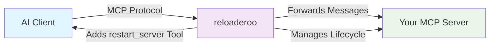

[](https://badge.fury.io/js/reloaderoo)
[](https://opensource.org/licenses/MIT)
[](https://nodejs.org/)

> **Hot-reload your MCP servers without restarting your AI coding assistant**

A transparent development proxy for the Model Context Protocol (MCP) that enables seamless hot-reloading of MCP servers during development. Works excellently with VSCode MCP, well with Claude Code, and supports other MCP-enabled clients.

## 🎯 Why reloaderoo?

When developing MCP servers, you typically need to restart your entire AI coding session every time you make changes to your server code. This breaks your development flow and loses context.

**reloaderoo solves this by:**
- 🔄 **Hot-reloading** your MCP server without disconnecting the client
- 🔧 **Preserving session state** between server restarts  
- 🛠️ **Adding a `restart_server` tool** that your AI agent can call
- 🌊 **Transparent forwarding** of all MCP protocol messages
- 📡 **Full protocol support** (tools, resources, prompts, completion, ping)

## 🚀 Quick Start

### Installation

```bash
# Install globally for easy access
npm install -g reloaderoo

# Or install locally in your project
npm install --save-dev reloaderoo
```

### Basic Usage

Instead of connecting your AI client directly to your MCP server:

```bash
# ❌ Traditional approach (requires client restart on changes)
# Client connects to: node my-mcp-server.js
```

Connect through reloaderoo:

```bash
# ✅ With reloaderoo (hot-reload without client restart)
reloaderoo -- node my-mcp-server.js
```

Now your client connects to the proxy, and the proxy manages your server's lifecycle!

## 🔌 Client Compatibility

| MCP Client | Status | Tools | Prompts | Resources | Hot-Reload | Notes |
|------------|--------|-------|---------|-----------|------------|-------|
| **VSCode** | ✅ **Excellent** | ✅ Full | ✅ Full | ✅ Full | ✅ **Auto-detect** | Detects tool addition/removal + updates |
| **Claude Code** | ✅ **Good** | ✅ Full | ✅ Full | ❌ Not supported | ⚠️ **Manual refresh** | Tool updates work, no auto-detection |
| **Cursor** | ✅ **Excellent** | ✅ Full | ❓ Untested | ❓ Untested | ✅ **Auto-detect** | Detects tool addition/removal + updates |
| **Windsurf** | ✅ **Good** | ✅ Full | ❓ Untested | ❓ Untested | ⚠️ **Manual refresh** | Tool updates work, no auto-detection |

### 🎯 **Recommended Clients**

**Best Experience**: **VSCode** & **Cursor** - Full protocol support with automatic capability detection  
**Good Experience**: **Claude Code** & **Windsurf** - Works well, may need manual refresh for new tools  

## 🛠️ Development Workflow

### 1. **Start Development Session**

Configure your AI client (VSCode recommended, Claude Code also works well) to connect to:
```bash
reloaderoo -- node my-mcp-server.js --log-level debug
```

### 2. **Develop Your MCP Server**

Work on your server code as usual:
```javascript
// my-mcp-server.js
export const server = new Server({
  name: "my-awesome-server",
  version: "1.0.0"
});

// Add new tools, modify existing ones, etc.
server.addTool("new_feature", /* ... */);
```

### 3. **Test Changes Instantly**

Ask your AI agent to restart the server:
```
"Please restart the MCP server to load my changes"
```

The agent will call the `restart_server` tool automatically. Your new capabilities are immediately available!

### 4. **Continue Development**

Your AI session continues with the updated server capabilities. No connection loss, no context reset.

## 📋 Command Line Options

```bash
reloaderoo [options] -- <command> [args...]

Options:
  -w, --working-dir <directory>    Working directory for the server process
  -l, --log-level <level>          Log level (debug, info, warning, error)
  -m, --max-restarts <number>      Maximum restart attempts (default: 3)
  -d, --restart-delay <ms>         Delay between restarts (default: 1000ms)
  -t, --restart-timeout <ms>       Restart timeout (default: 30000ms)
  --no-auto-restart               Disable automatic restart on crashes
  --dry-run                       Validate configuration without starting
  
Commands:
  info                            Show system information and diagnostics
```

## 🏗️ How It Works



### **The Magic Behind the Scenes:**

1. **Transparent Forwarding**: All MCP messages pass through seamlessly
2. **Capability Augmentation**: Adds `restart_server` tool to your server's capabilities  
3. **Process Management**: Spawns, monitors, and restarts your server process
4. **Session Persistence**: Client connection remains active during server restarts
5. **Protocol Compliance**: Full MCP v2025-03-26 support with intelligent fallbacks

## 🔧 Configuration

### Environment Variables

```bash
# Configure via environment variables
export MCPDEV_PROXY_LOG_LEVEL=debug
export MCPDEV_PROXY_RESTART_LIMIT=5
export MCPDEV_PROXY_AUTO_RESTART=true
export MCPDEV_PROXY_TIMEOUT=30000
```

### Configuration File Support
```javascript
// reloaderoo.config.js
export default {
  childCommand: "node",
  childArgs: ["server.js"],
  logLevel: "debug",
  maxRestarts: 5,
  autoRestart: true
};
```

## 🎨 Integration Examples

### **Claude Code Integration**
Add to your project's `claude_desktop_config.json`:
```json
{
  "mcpServers": {
    "my-dev-server": {
      "command": "reloaderoo",
      "args": ["--log-level", "info", "--", "node", "my-server.js"]
    }
  }
}
```

### **Package.json Scripts**
```json
{
  "scripts": {
    "dev": "reloaderoo -- npm run server:dev",
    "mcp:proxy": "reloaderoo -- node dist/server.js",
    "mcp:debug": "reloaderoo --log-level debug -- node server.js"
  }
}
```

## 🚨 Troubleshooting

### **Client Compatibility Issues**

**Universal configuration (all clients):**
```json
{
  "mcpServers": {
    "MyServer": {
      "command": "node",
      "args": [
        "/path/to/reloaderoo.js",
        "--working-dir",
        "/path/to/accessible/directory",
        "--",
        "node",
        "/path/to/my-server.js"
      ]
    }
  }
}
```

**Claude Code not detecting new tools:**
- Tools will work after restart, but auto-detection may not occur
- Manually restart conversation or refresh client to see new tools
- Existing tool updates are detected automatically

**VSCode best experience:**
- Automatic tool detection and updates
- Full protocol support (tools, prompts, resources)
- Real-time capability changes

### **Common Issues**

**Server won't start:**
```bash
# Check if your server runs independently first
node my-server.js

# Then try with dry-run to validate configuration
reloaderoo -- node my-server.js --dry-run
```

**Connection problems:**
```bash
# Enable debug logging
reloaderoo --log-level debug -- node my-server.js

# Check system info
reloaderoo info --verbose
```

**Restart failures:**
```bash
# Increase restart timeout
reloaderoo -- node my-server.js --restart-timeout 60000

# Check restart limits  
reloaderoo -- node my-server.js --max-restarts 5
```

### **Debug Mode**
```bash
# Get detailed information about what's happening
reloaderoo -- node my-server.js --debug

# View system diagnostics
reloaderoo info --verbose
```

## 📚 API Reference

### **The `restart_server` Tool**

Your AI agent can call this tool to restart your server:

```typescript
interface RestartServerParams {
  force?: boolean;  // Force restart even if server appears healthy
  config?: {
    environment?: Record<string, string>;    // Update environment variables
    childArgs?: string[];                    // Update command arguments  
    workingDirectory?: string;               // Update working directory
  };
}
```

Example usage in conversation:
```
"Please restart the MCP server to load my latest changes"
"Force restart the server even if it seems to be working"  
"Restart the server with debug logging enabled"
```

## 🔧 Client-Specific Setup

### **VSCode (Recommended)**
```json
// settings.json or workspace config
{
  "mcpServers": {
    "my-dev-server": {
      "command": "reloaderoo",
      "args": ["--", "node", "my-server.js"]
    }
  }
}
```
✅ **Auto-detection**: New tools appear automatically after restart  
✅ **Full protocol**: Tools, prompts, resources all supported  
✅ **Real-time updates**: Changes to existing tools detected immediately

### **Claude Code**
```json
// claude_desktop_config.json  
{
  "mcpServers": {
    "my-dev-server": {
      "command": "reloaderoo",
      "args": ["--", "node", "my-server.js"]
    }
  }
}
```
✅ **Tools & Prompts**: Full support for tools and prompts  
⚠️ **Manual refresh**: May need to restart conversation for new tools  
❌ **Resources**: Not supported by Claude Code (client limitation)

### **Cursor & Windsurf (Issues)**
⚠️ **Known Issues**: Both clients experiencing identical server startup errors  
🔍 **Investigation**: Compatibility problems under investigation (may be shared architecture)  
📋 **Workaround**: Use VSCode or Claude Code for now

## 🤝 Contributing

We welcome contributions! Please see [CONTRIBUTING.md](CONTRIBUTING.md) for guidelines.

### **Development Setup**
```bash
git clone https://github.com/your-org/reloaderoo.git
cd reloaderoo
npm install
npm run build
npm test
```

### **Running Tests**
```bash
npm run test          # Unit tests
npm run test:e2e      # End-to-end tests with MCP Inspector
npm run test:coverage # Test coverage report
```

## 📄 License

MIT License - see [LICENSE](LICENSE) file for details.

## 🔗 Related Projects

- **[XcodeBuildMCP](https://github.com/cameroncooke/XcodeBuildMCP)** - MCP server for Xcode development workflow automation
- **[Model Context Protocol](https://modelcontextprotocol.io)** - Official MCP specification and tools
- **[Claude Code](https://www.anthropic.com/claude-code)** - AI coding assistant with MCP support