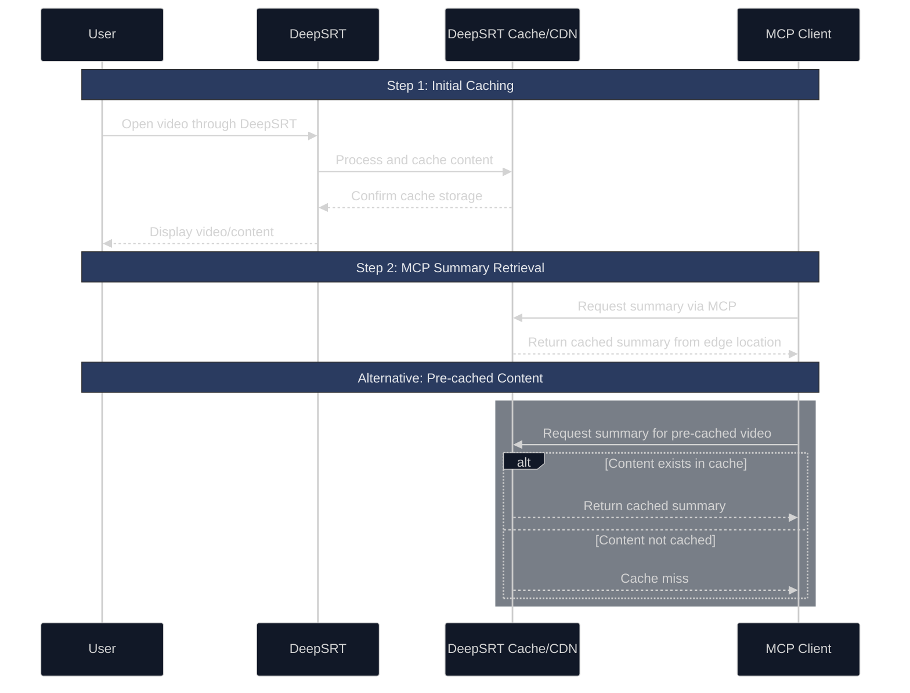

# DeepSRT MCP Server

A Model Context Protocol (MCP) server that provides YouTube video summarization functionality through integration with DeepSRT's API.

## Features

- Generate summaries for YouTube videos
- Support for both narrative and bullet-point summary modes
- Multi-language support (default: zh-tw)
- Seamless integration with MCP-enabled environments

## How it Works

1. **Content Caching**
   - Videos must first be opened through DeepSRT to ensure content is cached in the service
   - This initial viewing triggers the caching process in the DeepSRT service

2. **MCP Summary Retrieval**
   - When requesting summaries through MCP, the content is served from DeepSRT's CDN edge locations
   - This ensures fast and efficient delivery of summaries

3. **Pre-cached Content**
   - Some videos may already be cached in the system from previous user requests
   - While you might be able to fetch summaries for these pre-cached videos, availability is not guaranteed
   - For best results, ensure videos are first opened through DeepSRT



## Installation

### Installing for Claude Desktop

1. First, build the server:
```bash
npm install
npm run build
```

2. Add the server configuration to your Claude Desktop config file:

- On macOS: `~/Library/Application Support/Claude/claude_desktop_config.json`
- On Windows: `%APPDATA%/Claude/claude_desktop_config.json`

```json
{
  "mcpServers": {
    "deepsrt-mcp": {
      "command": "node",
      "args": [
        "/path/to/deepsrt-mcp/build/index.js"
      ]
    }
  }
}
```

### Installing for Cline

Just ask Cline to install in the chat:

>"Hey, install this MCP server for me from https://github.com/DeepSRT/deepsrt-mcp"

Cline will auto install `deepsrt-mcp` for you and update your `cline_mcp_settings.json`.

## Usage

The server provides the following tool:

### get_summary

Gets a summary for a YouTube video.

**Parameters:**
- `videoId` (required): YouTube video ID
- `lang` (optional): Language code (e.g., zh-tw) - defaults to zh-tw
- `mode` (optional): Summary mode ("narrative" or "bullet") - defaults to narrative

### Example Usage

Using Claude Desktop:
```typescript
// The MCP tool will fetch the video summary
const result = await mcp.use_tool("deepsrt-mcp", "get_summary", {
  videoId: "dQw4w9WgXcQ",
  lang: "zh-tw",
  mode: "narrative"
});
```

Using Cline:
```typescript
const result = await mcp.use_tool("deepsrt", "get_summary", {
  videoId: "dQw4w9WgXcQ",
  lang: "zh-tw",
  mode: "bullet"
});
```

## Development

Install dependencies:
```bash
npm install
```

Start development server:
```bash
npm run dev
```

Build for production:
```bash
npm run build
```

## Demo

- https://www.threads.net/@pahud/post/DGmIR7gOG5M
- https://www.threads.net/@pahud/post/DGoGiMDuWa9


## FAQ

Q: I am getting `404` error, why?

A: This is because the video summary is not cached in the CDN edge location, you need to open this video using DeepSRT chrome extension to have it cached in the CDN network before you can get that summary using MCP.

You can verify the cache status using cURL like this

```sh
curl -s 'https://worker.deepsrt.com/transcript' \
-i --data '{"arg":"v=VafNvIcOs5w","action":"summarize","lang":"zh-tw","mode":"narrative"}' | grep -i "^cache-status"
cache-status: HIT
```

If you see `cache-status: HIT` the content is cached in the CDN edge location and your MCP server shoud not get `404`.
