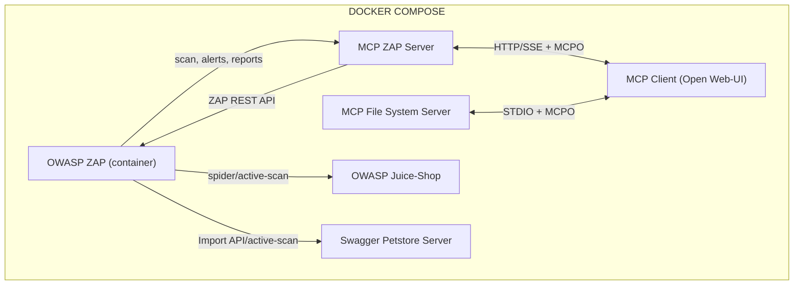

[//]: # (![MCP-ZAP Logo]&#40;./brand.png&#41;)

>**IMPORTANT** This project is a work in progress and is not yet production-ready. It is intended for educational purposes and to demonstrate the capabilities of the Model Context Protocol (MCP) with OWASP ZAP.

>**NOTE** This project is not affiliated with or endorsed by OWASP or the OWASP ZAP project. It is an independent implementation of the Model Context Protocol (MCP) for use with OWASP ZAP.

# MCP ZAP Server

A Spring Boot application exposing OWASP ZAP as an MCP (Model Context Protocol) server. It lets any MCP‑compatible AI agent (e.g., Claude Desktop, Cursor) orchestrate ZAP actions—spider, active scan, import OpenAPI specs, and generate reports.


### Demo on Cursor
<a href="https://www.youtube.com/watch?v=9_9VqsL0lNw" target="_blank" rel="noopener noreferrer">

</a>

## Table of Contents
- [Features](#features)
- [Architecture](#architecture)
- [Prerequisites](#prerequisites)
- [Quick Start](#quick-start)
  - [Set Up Custom OpenAI / Ollama API Connection](#set-up-custom-openai--ollama-api-connection)
  - [Set Up MCP Servers Connection](#set-up-mcp-servers-connection)
- [Services Overview](#services-overview)
- [Manual build](#manual-build)
- [Usage with Claude Desktop, Cursor, Windsurf or any MCP-compatible AI agent](#usage-with-claude-desktop-cursor-windsurf-or-any-mcp-compatible-ai-agent)
  - [STDIO mode](#stdio-mode)
  - [SSE mode](#sse-mode)
- [Prompt Examples](#prompt-examples)


## Features
- **MCP ZAP server**: Exposes ZAP actions as MCP tools. Eliminates manual CLI calls and brittle scripts.
- **OpenAPI integration**: Import remote OpenAPI specs into ZAP and kick off active scans
- **Report generation**: Generate HTML/JSON reports and fetch contents programmatically
- **Dockerized**: Runs ZAP and the MCP server in containers, orchestrated via docker-compose
- **Secure**: Configure API keys for both ZAP (ZAP_API_KEY) and the MCP server (MCP_API_KEY)

## Architecture

## Prerequisites

- LLM support Tool calling (e.g. gpt-4o, Claude 3, Llama 3, mistral, phi3)
- Docker ≥ 20.10
- Docker Compose ≥ 1.29
- Java 21+ (only if you want to build the Spring Boot MCP server outside Docker)

## Quick Start

```bash
git clone https://github.com/dtkmn/mcp-zap-server.git
cd mcp-zap-server
export LOCAL_ZAP_WORKPLACE_FOLDER=$(pwd)/zap-workplace # or any other folder you want to use as ZAP's workspace
docker-compose up -d
```


Open http://localhost:3000 in your browser, and you should see the Open Web-UI interface.

### Set Up Custom OpenAI / Ollama API Connection


### Set Up MCP Servers Connection


Once it is done, you can check the [Prompt Examples](#prompt-examples) section to see how to use the MCP ZAP server with your AI agent.

### To view logs for all services, run:
```bash
   docker-compose logs -f
```
### To view logs for a specific service, run:
```bash
   docker-compose logs -f <service_name>
```
### Services Overview

#### `zap`
- **Image:** zaproxy/zap-stable
- **Purpose:** Runs the OWASP ZAP daemon on port 8090.
- **Configuration:**
    - Disables the API key.
    - Accepts requests from all addresses.
    - Maps the host directory `${LOCAL_ZAP_WORKPLACE_FOLDER}` to the container path `/zap/wrk`.

#### `open-webui`
- **Image:** ghcr.io/open-webui/open-webui
- **Purpose:** Provides a web interface for managing ZAP and the MCP server.
- **Configuration:**
    - Exposes port 3000.
    - Uses a named volume to persist backend data.

#### `mcpo`
- **Image:** ghcr.io/open-webui/mcpo:main
- **Purpose:** Expose any MCP tool as an OpenAPI-compatible HTTP server. Required by open-webui only. https://github.com/open-webui/mcpo
- **Configuration:**
    - Runs on port 8000.
    - Connects to the MCP server using SSE via the URL `http://mcp-server:7456/sse`.

#### `mcp-server`
- **Image:** mcp-zap-server:latest
- **Purpose:** This repo. Acts as the MCP server exposing ZAP actions.
- **Configuration:**
    - Depends on the `zap` service.
    - Exposes port 7456 for HTTP SSE connections.
    - Maps the host directory `${LOCAL_ZAP_WORKPLACE_FOLDER}` to `/tmp` to allow file access.

#### `mcpo-filesystem`
- **Image:** ghcr.io/open-webui/mcpo:main
- **Purpose:** Exposes the MCP File System Server as an OpenAPI-compatible HTTP endpoint.
- **Configuration:**
  - Depends on `open-webui`
  - Exposes port 8001.

#### `juice-shop`
- **Image:** bkimminich/juice-shop
- **Purpose:** Provides a deliberately insecure web application for testing ZAP’s scanning capabilities.
- **Configuration:**
  - Runs on port 3001.

#### `petstore`
- **Image:** swaggerapi/petstore3:unstable
- **Purpose:** Runs the Swagger Petstore sample API to demonstrate OpenAPI import and scanning.
- **Configuration:**
  - Runs on port 3002.

    
### Stopping the Services

To stop and remove all the containers, run:
```bash
docker-compose down
```

## Manual build

```bash
./gradlew clean build
```

### Usage with Claude Desktop, Cursor, Windsurf or any MCP-compatible AI agent

#### STDIO mode

```json
{
  "mcpServers": {
    "zap-mcp-server": {
        "command": "java",
        "args": [
          "-Dspring.ai.mcp.server.stdio=true",
          "-Dspring.main.web-application-type=none",
          "-Dlogging.pattern.console=",
          "-jar",
          "/PROJECT_PATH/mcp-zap-server/build/libs/mcp-zap-server-0.1.0-SNAPSHOT.jar"
        ]
    }
  }
}
```

#### SSE mode

```json
{
  "mcpServers": {
    "zap-mcp-server": {
      "protocol": "mcp",
      "transport": "http",
      "url": "http://localhost:7456/sse"
    }
  }
}
```


## Prompt Examples

### Asking for the tools available


### Start the spider scan with provided URL


### Check the alerts found from the spider scan


