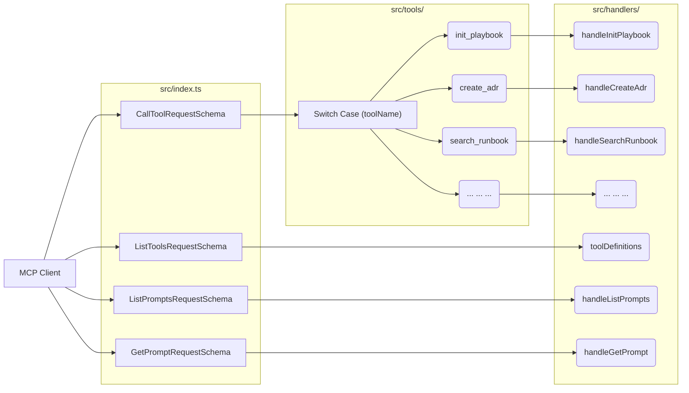
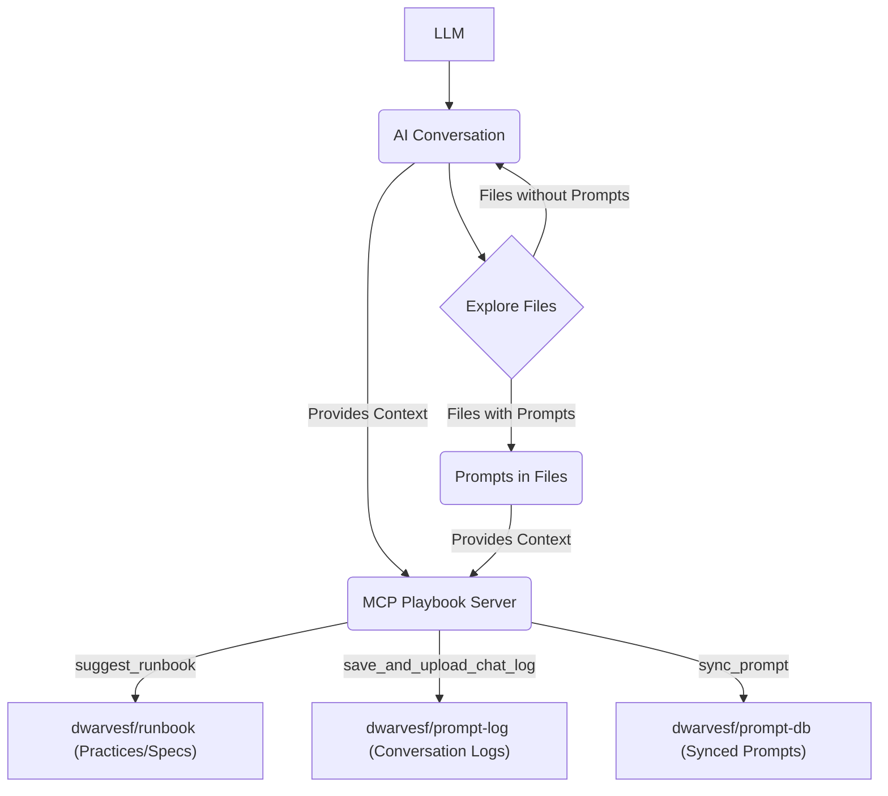

# MCP Playbook Server

A Model Context Protocol (MCP) server for managing project documentation and saving conversation logs within a user-specified target project directory.

## Usage with Claude Desktop or MCP clients

To use this MCP server with Claude Desktop, you would add a configuration entry to your Claude Desktop settings. The exact `command` and `args` will depend on how you choose to run the server (e.g., directly via `node` or using Docker).

First, ensure that you add this prompt to your cursor rules, cline rules, or windsurf rules:

```
ALWAYS run the `init_playbook` tool before starting to get instructions on how things should be done and documented.
```

Then, add the following configuration to your MCP client:

```json
{
  "mcpServers": {
    "mcp-playbook": {
      "command": "npx",
      "args": ["-y", "@dwarvesf/mcp-playbook@latest"],
      "env": {
        "GITHUB_PERSONAL_ACCESS_TOKEN": "your_github_token_here"
      }
    }
  }
}
```

Consult the Claude Desktop documentation for detailed instructions on configuring MCP servers.

## How the MCP works behind the scenes

The MCP Playbook server operates by receiving tool call requests from an MCP client (like Claude Desktop). These requests are processed in the `src/index.ts` file, which acts as the server's entry point.



1.  **Tool Call Request:** An MCP client sends a `CallToolRequest` to the server, specifying the `toolName` and any necessary `arguments`.
2.  **Request Handling:** The `src/index.ts` file has a request handler set up for `CallToolRequest` using `server.setRequestHandler(CallToolRequestSchema, async (request: CallToolRequest) => { ... })`.
3.  **Tool Routing (Switch Case):** Inside the request handler, a `switch` statement on the `toolName` routes the request to the appropriate handler function.
4.  **Handler Execution:** Each case in the `switch` statement calls a dedicated handler function (e.g., `handleCreateSpec`, `handleSearchRunbook`, `handleSyncPrompt`) located in the `src/handlers.ts` file. These handlers contain the specific logic for each tool.
5.  **Result:** The handler function performs the requested action and returns a result. This result is then sent back to the MCP client.

This flow ensures that each tool call is directed to the correct logic for execution, allowing the server to perform various documentation and utility tasks.

## Available Tools

| Tool Name                  | Description                                                                                                                                                                                                                                                                                                                                                                    |
| :------------------------- | :----------------------------------------------------------------------------------------------------------------------------------------------------------------------------------------------------------------------------------------------------------------------------------------------------------------------------------------------------------------------------- |
| `init_playbook`            | Provides an instruction to the LLM about the purpose of the mcp-playbook server, which is to facilitate local project documentation and enable partial replication of documentation and chat logs for an AI-powered playbook.                                                                                                                                                  |
| `create_spec`              | Creates or overwrites a new specification file (e.g., PRD, RFC, architectural planning) in the docs/specs/ directory of the target project. Specification files will be named following a `spec-name.md` convention with sequence numbering.                                                                                                                                   |
| `create_adr`               | Creates or overwrites a new Architectural Decision Record (ADR) file in the docs/adr/ directory of the target project. ADR files will be named following an `adr-name.md` convention with sequence numbering.                                                                                                                                                                  |
| `create_changelog`         | Creates a new, detailed, and user-facing changelog entry file in the docs/changelog/ directory of the target project. Each changelog entry will be a separate file named following a `changelog-entry.md` convention with sequence numbering.                                                                                                                                  |
| `distill_project_runbook`  | Creates or updates the central `docs/runbook.md` file within the target project. The LLM is responsible for analyzing existing project documents (ADRs, specs, etc.) and the current `docs/runbook.md` (if it exists), then synthesizing this information into a comprehensive runbook. The tool saves this LLM-generated content, overwriting the previous `docs/runbook.md`. |
| `save_and_upload_chat_log` | Captures the current conversation history, saves it as a markdown file in the .chat/ directory of the target project, and uploads it to the dwarvesf/prompt-log GitHub repository. Requires a user ID for organization.                                                                                                                                                        |
| `search_runbook`           | Fuzzy search for keywords in the `dwarvesf/runbook` GitHub repository. If keyword has spaces, searches exact phrase OR individual words. Returns top 5 matches with full content & total count.                                                                                                                                                                                |
| `search_prompts`           | Fuzzy search for keywords in the `dwarvesf/prompt-db` GitHub repository (excluding the `.synced_prompts/` folder).                                                                                                                                                                                                                                                             |
| `suggest_runbook`          | Creates or updates a Pull Request in the dwarvesf/runbook repository with a new runbook entry.                                                                                                                                                                                                                                                                                 |
| `sync_prompt`              | Syncs an LLM prompt to the dwarvesf/prompt-db GitHub repository.                                                                                                                                                                                                                                                                                                               |
| `think`                    | Use the tool to think about something. It will not obtain new information or make any changes to the repository, but just log the thought. Use it when complex reasoning or brainstorming is needed.                                                                                                                                                                           |

## Overview

This `mcp-playbook` server is a self-contained Node.js/TypeScript application that provides a set of tools accessible via the Model Context Protocol (MCP). Its primary functions are to help LLMs structure documentation within a designated project directory and to save/upload conversation histories. Unlike tools that might rely on external `commander` or `github` environments, this server implements file system operations and GitHub API interactions directly using Node.js's built-in modules (`fs`, `path`, `https`) and libraries like `node-fetch`.

The server operates on a `target_project_dir` specified by the LLM, managing files and directories within that location. It does _not_ store documentation or chat logs within its own repository structure.

### Data Flow and Interaction

The interaction between the AI conversation, file exploration, the LLM, the `mcp-playbook` server, and the GitHub repositories can be visualized as follows:



This diagram illustrates how the AI conversation and the prompts found during file exploration provide context to the MCP Playbook server. The server then executes the `suggest_runbook`, `save_and_upload_chat_log`, and `sync_prompt` tools to interact with the respective GitHub repositories.

## Tool Details

### `init_playbook`

Provides an instruction to the LLM about the purpose of the mcp-playbook server, which is to facilitate local project documentation and enable partial replication of documentation and chat logs for an AI-powered playbook.

**Parameters:**
None.

**Returns:**
A JSON object containing the instruction.

```json
{
  "instruction": "string" // Instruction for the LLM regarding the purpose of the mcp-playbook.
}
```

### `create_spec`

Creates or overwrites a new specification file (e.g., PRD, RFC, architectural planning) in the `docs/specs/` directory of the target project. Specification files will be named following a `spec-name.md` convention with sequence numbering (e.g., `0001-initial-design.md`).

**Parameters:**

- `target_project_dir` (string, required): The absolute or relative path to the root of the target project directory.
- `spec_name` (string, required): The name of the specification file (without sequence numbers and the `.md` extension). Basic sanitization is applied.
- `content` (string, required): The markdown content of the specification.

**Returns:**
A JSON object indicating success or failure, including the path if successful.

```json
{
  "status": "success" | "error",
  "path": "string" | undefined, // Path to the created file if successful
  "message": "string" // Description of the result or error
}
```

### `create_adr`

Creates or overwrites a new Architectural Decision Record (ADR) file in the `docs/adr/` directory of the target project. ADR files will be named following an `adr-name.md` convention with sequence numbering (e.g., `0001-use-react.md`).

**Parameters:**

- `target_project_dir` (string, required): The absolute path to the root of the target project directory. Using an absolute path is highly recommended for reliability.
- `adr_name` (string, required): The name of the ADR file (without sequence numbers and the `.md` extension). Basic sanitization is applied.
- `content` (string, required): The markdown content of the ADR.

**Returns:**
A JSON object indicating success or failure, including the path if successful.

```json
{
  "status": "success" | "error",
  "path": "string" | undefined, // Path to the created file if successful
  "message": "string" // Description of the result or error
}
```

### `create_changelog`

Creates a new, detailed, and user-facing changelog entry file in the `docs/changelog/` directory of the target project. Each changelog entry will be a separate file named following a `changelog-entry.md` convention with sequence numbering (e.g., `0001-added-new-feature.md`). Entries should provide comprehensive information about changes, including how to use new features or any impact on existing functionality, rather than being brief summaries.

**Parameters:**

- `target_project_dir` (string, required): The absolute path to the root of the target project directory. Using an absolute path is highly recommended for reliability.
- `entry_content` (string, required): The markdown content of the new changelog entry.
- `changelog_name` (string, required): The desired name for the changelog file (without sequence numbers and the `.md` extension).

**Returns:**
A JSON object indicating success or failure, including the path if successful.

```json
{
  "status": "success" | "error",
  "path": "string" | undefined, // Path to the updated file if successful
  "message": "string" // Description of the result or error
}
```

### `distill_project_runbook`

Creates or updates the central `docs/runbook.md` file within the target project. The LLM is responsible for:

1. Thoroughly analyzing all relevant project documents (ADRs, specs, changelogs, code, etc.) within the `target_project_dir`.
2. If `docs/runbook.md` already exists, reviewing its current content as part of the analysis.
3. Synthesizing all gathered information (including from any existing `docs/runbook.md`) into an updated and comprehensive Project Runbook.

The tool takes the LLM-generated content and saves it to `docs/runbook.md`, overwriting the previous version. The frontmatter (title, last_updated, distilled_from) is managed by the tool.

**Parameters:**

- `target_project_dir` (string, required): The absolute path to the root of the target project directory.
- `content` (string, required): The complete markdown content for the `docs/runbook.md` file, as generated and synthesized by the LLM.
- `source_document_references` (array of strings, optional): An array of paths or descriptive references to the key source documents the LLM used for the latest distillation/update (e.g., `[\'docs/adr/0001-auth-decision.md\', \'src/auth/service.ts\']`).

**Returns:**
A JSON object indicating success or failure, including the path to `docs/runbook.md` if successful.

```json
{
  "status": "success" | "error",
  "path": "string" | undefined, // Path to docs/runbook.md if successful
  "message": "string" // Description of the result or error
}
```

### `save_and_upload_chat_log`

Captures the current conversation history. If the MCP client provides the history directly, it's used. Otherwise, the server attempts to parse chat logs from locally installed supported editors (Cursor, Zed, Cline) based on the optional `editorType` parameter or by trying each parser. The captured/parsed history is then saved as a uniquely named markdown file in the `.chat/` directory of the target project and uploaded to the `dwarvesf/prompt-log` GitHub repository. Requires a `userId` for organizing logs.

**Parameters:**

- `target_project_dir` (string, required): The absolute path to the root of the target project directory where the chat log should be saved locally before uploading. Using an absolute path is highly recommended for reliability.
- `userId` (string, required): The unique ID of the user/LLM client (e.g., your GitHub username).
- `editorType` (string, optional): Specifies the editor (e.g., 'cursor', 'zed', 'cline') from which to attempt parsing chat history if not directly provided by the client. If omitted, the server may try to detect logs from all supported editors.

**Returns:**
A JSON object indicating success or failure, including the local path, GitHub path, and potentially the GitHub URL if successful.

```json
{
  "status": "success" | "error",
  "local_path": "string" | undefined, // Path to the locally saved file
  "github_path": "string" | undefined, // Path within the GitHub repository
  "github_url": "string" | undefined, // URL of the file on GitHub
  "commit_sha": "string" | undefined, // SHA of the commit if successful
  "commit_url": "string" | undefined, // URL of the commit if successful
  "message": "string" // Description of the result or error
}
```

### `search_runbook`

Fuzzy search for keywords in the `dwarvesf/runbook` GitHub repository. If the keyword contains spaces, it searches for the exact phrase OR the individual words. It returns the top 5 matching files with their full content and the total number of matches found by GitHub. Includes an in-memory cache to avoid repeated GitHub API calls for the same query while the server is active.

**Parameters:**

- `keyword` (string, required): The keyword to search for in the `dwarvesf/runbook` repository.

**Returns:**
A JSON object containing the search results.

```json
{
  "results": [ // An array of search results (limited to top 5)
    {
      "path": "string", // The path to the file in the repository
      "snippet": "string", // A snippet of the content where the keyword was found
      "full_content": "string" | null, // The full decoded content of the file, or null if fetching failed
      "url": "string" // The URL to the file on GitHub
    }
  ],
  "total_count": "number", // The total number of results found by GitHub's search
  "message": "string" // A message describing the result of the search, e.g., "Found and processed 5 results out of 10 total."
}
```

### `search_prompts`

Fuzzy search for keywords in the `dwarvesf/prompt-db` GitHub repository (excluding the `.synced_prompts/` folder).

**Parameters:**

- `keyword` (string, required): The keyword to search for in the `dwarvesf/prompt-db` repository (excluding the `.synced_prompts/` folder).

**Returns:**
A JSON object containing the search results.

```json
{
  "results": [ // An array of search results (limited to top 5)
    {
      "path": "string", // The path to the file in the repository
      "snippet": "string", // A snippet of the content where the keyword was found
      "full_content": "string" | null, // The full decoded content of the file, or null if fetching failed
      "url": "string" // The URL to the file on GitHub
    }
  ],
  "total_count": "number", // The total number of results found by GitHub's search
  "message": "string" // A message describing the result of the search, e.g., "Found and processed 5 results out of 10 total."
}
```

### `suggest_runbook`

Creates or updates a Pull Request in the `dwarvesf/runbook` repository with a new runbook entry.

**Parameters:**

- `content` (string, required): The markdown content of the runbook entry. Include frontmatter (--- title: ..., description: ..., date: ..., authors: ..., tags: ... ---) at the beginning for better organization.
- `target_folder` (string, required): The specific folder within the `dwarvesf/runbook` repository. Must be one of: `technical-patterns`, `operational-state-reporting`, `human-escalation-protocols`, `diagnostic-and-information-gathering`, `automations`, `action-policies-and-constraints`.
- `filename_slug` (string, optional): A slug to be used for the filename.
- `pr_number` (number, optional): The number of an existing Pull Request to update.
- `branch_name` (string, optional): The name of the branch to use for the changes. Suggestion: follow a descriptive naming convention (e.g., 'feat/add-runbook-entry-slug').
- `commit_message` (string, optional): The commit message for the file change.
- `pr_title` (string, optional): The title for a new Pull Request. Follow commitlint standards (e.g., 'feat: add new runbook entry').
- `pr_body` (string, optional): The body content for a new Pull Request. Provide a comprehensive and detailed description explaining the context and purpose of the runbook entry.

**Returns:**
A JSON object indicating success or failure, including the PR number and URL if successful.

```json
{
  "status": "success" | "error",
  "pr_number": "number" | undefined, // The number of the created or updated Pull Request.
  "pr_url": "string" | undefined, // The URL of the created or updated Pull Request.
  "message": "string" // Description of the result or error
}
```

### `sync_prompt`

Syncs an LLM prompt to the `dwarvesf/prompt-db` GitHub repository.

**Parameters:**

- `projectName` (string, required): The name of the project the prompt belongs to.
- `promptName` (string, required): The variable or logical name of the prompt within the project.
- `promptContent` (string, required): The actual content of the LLM prompt.

**Returns:**
A JSON object indicating success or failure, including the GitHub path and URL if successful.

```json
{
  "status": "success" | "error",
  "github_path": "string" | undefined, // Path within the GitHub repository
  "github_url": "string" | undefined, // URL of the file on GitHub
  "commit_sha": "string" | undefined, // SHA of the commit if successful
  "commit_url": "string" | undefined, // URL of the commit if successful
  "message": "string" // Description of the result or error
}
```

### `think`

Use the tool to think about something. It will not obtain new information or make any changes to the repository, but just log the thought. Use it when complex reasoning or brainstorming is needed. For example, if you explore the repo and discover the source of a bug, call this tool to brainstorm several unique ways of fixing the bug, and assess which change(s) are likely to be simplest and most effective. Alternatively, if you receive some test results, call this tool to brainstorm ways to fix the failing tests.

**Parameters:**

- `thought` (string, required): Your thoughts.

**Returns:**
A JSON object containing the thought that was processed. The server wraps the raw string returned by the handler.

```json
{
  "content": [
    {
      "type": "text",
      "text": "\"Your processed thought here\"" // Note: The thought string itself will be JSON stringified
    }
  ]
}
```

Or, if an error occurs:

```json
{
  "isError": true,
  "content": [
    {
      "type": "text",
      "text": "Error: Invalid arguments: Your error message"
    }
  ]
}
```

## Setup

### Local Development

1.  Clone the repository:
    ```bash
    git clone git@github.com:dwarvesf/mcp-playbook.git
    cd mcp-playbook
    ```
2.  Install dependencies:
    ```bash
    npm install
    ```
3.  Build the project:
    ```bash
    npm run build # This compiles TypeScript to JavaScript in the 'dist' directory
    ```
4.  Configure GitHub Authentication (see Configuration section below).
5.  Run the compiled server:
    ```bash
    node dist/src/index.js
    ```

### Running with Docker (Optional)

A `Dockerfile` is included in the plan but not fully implemented here. Once completed, you can build and run the Docker image:

1.  Build the Docker image:
    ```bash
    docker build -t mcp-playbook .
    ```
2.  Run the container, ensuring the `GITHUB_PERSONAL_ACCESS_TOKEN` environment variable is passed:
    ```bash
    docker run --pull=always -e GITHUB_PERSONAL_ACCESS_TOKEN="your_token" mcp-playbook
    ```

## Configuration and testing

The `save_and_upload_chat_log` tool requires a GitHub Personal Access Token with `repo` scope to upload files to `dwarvesf/prompt-log`. This token must be provided via the `GITHUB_PERSONAL_ACCESS_TOKEN` environment variable.

For local development, you can use a `.env` file in the project root:

```dotenv
GITHUB_PERSONAL_ACCESS_TOKEN=your_github_token_here
```

Ensure `.env` is added to your `.gitignore` file.

### Testing

Run `npm run build` and update your MCP config to direct it to the output `index.js` file.

```json
{
  "mcpServers": {
    "mcp-playbook": {
      "command": "node",
      "args": ["/path/to/your/mcp-playbook/dist/src/index.js"],
      "env": {
        "GITHUB_PERSONAL_ACCESS_TOKEN": "your_github_token_here"
      }
    }
  }
}
```

## Usage Example

```
mcp_mcp-playbook_create_spec(target_project_dir="/Users/monotykamary/VCS/working-remote/my-new-project", spec_name="Initial Design", content="# Initial Design Specification\n\nThis document outlines the initial design of the project...")
```

## Troubleshooting

- **Environment Variable Not Set**: Ensure the `GITHUB_PERSONAL_ACCESS_TOKEN` environment variable is correctly set in the environment where the `mcp-playbook` server process is running.
- **File/Directory Not Found**: The server operates within the specified `target_project_dir`. Ensure the path provided exists and is accessible by the server process. File system errors (`ENOENT`) often indicate an incorrect path or missing directory.
- **GitHub API Errors**: If `save_and_upload_chat_log` fails, check the server logs for details from the `githubApi.ts` error handling. Common issues include incorrect tokens, insufficient permissions, or rate limiting.

## Handoff Guidance for Another Engineer

- **Self-Contained Implementation:** This server uses direct Node.js `fs` and `node-fetch` for file system and GitHub API interactions, _not_ external `commander` or `github` tools provided by the environment.
- **`target_project_dir`:** All tools interacting with user files require and operate within the `target_project_dir`. Input validation for this path is crucial for security.
- **Dependencies:** Ensure all `npm` dependencies are installed (`npm install`). The project uses TypeScript; compile with `npm run build` (or `npx tsc`).
- **Authentication:** GitHub authentication relies solely on the `GITHUB_PERSONAL_ACCESS_TOKEN` environment variable read by `process.env` in `src/githubApi.ts`.
- **Conversation History Placeholder:** The `getConversationHistoryPlaceholder()` function in `src/handlers.ts` is a _dummy implementation_. It _must_ be replaced with logic to retrieve actual conversation history from the MCP framework hosting this server for the `save_and_upload_chat_log` tool to work correctly.
- **MCP Framework Integration:** The handler functions in `src/handlers.ts` are designed to be called by an external MCP framework that receives and routes tool calls from the LLM. The `src/index.ts` file is the conceptual entry point for this integration.
