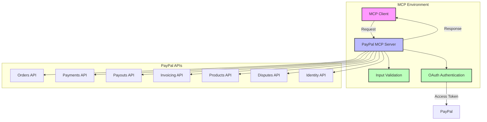

# PayPal MCP Server

[](https://github.com/DynamicEndpoints/Paypal-MCP/actions/workflows/ci.yml)
[](https://opensource.org/licenses/MIT)
[](https://www.typescriptlang.org/)
[](https://smithery.ai/server/@DynamicEndpoints/Paypal-MCP)

> Maintained by [DynamicEndpoints](https://github.com/DynamicEndpoints) - Contact: kameron@dynamicendpoints.com

A Model Context Protocol (MCP) server that provides integration with PayPal's APIs. This server enables seamless interaction with PayPal's payment processing, invoicing, and business management features through a standardized interface.

<a href="https://glama.ai/mcp/servers/6op9uaqyev">
  
</a>

## Architecture



## Features

- **Payment Processing**
  - Create and manage orders
  - Process payments
  - Handle payment tokens
  - Manage disputes

- **Business Operations**
  - Create and manage products
  - Generate invoices
  - Process payouts
  - Handle partner referrals

- **User Management**
  - Identity verification
  - User information retrieval
  - Web profile management

## Installation

### Installing via Smithery

To install PayPal MCP Server for Claude Desktop automatically via [Smithery](https://smithery.ai/server/@DynamicEndpoints/Paypal-MCP):

```bash
npx -y @smithery/cli install @DynamicEndpoints/Paypal-MCP --client claude
```

### Manual Installation
1. Clone the repository
2. Install dependencies:
   ```bash
   npm install
   ```
3. Build the project:
   ```bash
   npm run build
   ```
4. Configure PayPal credentials in the MCP settings file:
   ```json
   {
     "mcpServers": {
       "paypal": {
         "command": "node",
         "args": ["path/to/paypal-server/build/index.js"],
         "env": {
           "PAYPAL_CLIENT_ID": "your_client_id",
           "PAYPAL_CLIENT_SECRET": "your_client_secret"
         },
         "disabled": false,
         "autoApprove": []
       }
     }
   }
   ```

## Available Tools

### Payment Operations

#### create_payment_token
Create a payment token for future use.
```typescript
{
  customer: {
    id: string;
    email_address?: string;
  };
  payment_source: {
    card?: {
      name: string;
      number: string;
      expiry: string;
      security_code: string;
    };
    paypal?: {
      email_address: string;
    };
  };
}
```

#### create_order
Create a new order in PayPal.
```typescript
{
  intent: 'CAPTURE' | 'AUTHORIZE';
  purchase_units: Array<{
    amount: {
      currency_code: string;
      value: string;
    };
    description?: string;
    reference_id?: string;
  }>;
}
```

#### create_payment
Create a direct payment.
```typescript
{
  intent: string;
  payer: {
    payment_method: string;
    funding_instruments?: Array<{
      credit_card?: {
        number: string;
        type: string;
        expire_month: number;
        expire_year: number;
        cvv2: string;
        first_name: string;
        last_name: string;
      };
    }>;
  };
  transactions: Array<{
    amount: {
      total: string;
      currency: string;
    };
    description?: string;
  }>;
}
```

### Business Operations

#### create_product
Create a new product in the catalog.
```typescript
{
  name: string;
  description: string;
  type: 'PHYSICAL' | 'DIGITAL' | 'SERVICE';
  category: string;
  image_url?: string;
  home_url?: string;
}
```

#### create_invoice
Generate a new invoice.
```typescript
{
  invoice_number: string;
  reference: string;
  currency_code: string;
  recipient_email: string;
  items: Array<{
    name: string;
    quantity: string;
    unit_amount: {
      currency_code: string;
      value: string;
    };
  }>;
}
```

#### create_payout
Process a batch payout.
```typescript
{
  sender_batch_header: {
    sender_batch_id: string;
    email_subject?: string;
    recipient_type?: string;
  };
  items: Array<{
    recipient_type: string;
    amount: {
      value: string;
      currency: string;
    };
    receiver: string;
    note?: string;
  }>;
}
```

### User & Profile Management

#### get_userinfo
Retrieve user information.
```typescript
{
  access_token: string;
}
```

#### create_web_profile
Create a web experience profile.
```typescript
{
  name: string;
  presentation?: {
    brand_name?: string;
    logo_image?: string;
    locale_code?: string;
  };
  input_fields?: {
    no_shipping?: number;
    address_override?: number;
  };
  flow_config?: {
    landing_page_type?: string;
    bank_txn_pending_url?: string;
  };
}
```

## Usage Examples

### Creating an Order

```typescript
const result = await mcpClient.useTool('paypal', 'create_order', {
  intent: 'CAPTURE',
  purchase_units: [{
    amount: {
      currency_code: 'USD',
      value: '100.00'
    },
    description: 'Premium Subscription'
  }]
});
```

### Generating an Invoice

```typescript
const result = await mcpClient.useTool('paypal', 'create_invoice', {
  invoice_number: 'INV-2024-001',
  reference: 'REF-2024-001',
  currency_code: 'USD',
  recipient_email: 'customer@example.com',
  items: [{
    name: 'Consulting Services',
    quantity: '1',
    unit_amount: {
      currency_code: 'USD',
      value: '500.00'
    }
  }]
});
```

### Processing a Payout

```typescript
const result = await mcpClient.useTool('paypal', 'create_payout', {
  sender_batch_header: {
    sender_batch_id: 'Payroll_2024_001',
    email_subject: 'You have received a payment'
  },
  items: [{
    recipient_type: 'EMAIL',
    amount: {
      value: '1000.00',
      currency: 'USD'
    },
    receiver: 'employee@example.com',
    note: 'Monthly salary payment'
  }]
});
```

## Error Handling

The server implements comprehensive error handling:

- Input validation errors with detailed messages
- PayPal API errors with response details
- Network and authentication errors
- Rate limiting and timeout handling

## Security Considerations

- All sensitive data is validated and sanitized
- OAuth 2.0 authentication with PayPal
- Secure credential management through environment variables
- Input validation for all API parameters
- Error messages don't expose sensitive information

## Development

### Building
```bash
npm run build
```

### Testing
```bash
npm test
```

### Debugging
The server outputs detailed logs to help with debugging:
- Authentication issues
- API call failures
- Validation errors
- Request/response details

## Contributing

1. Fork the repository
2. Create a feature branch
3. Commit your changes
4. Push to the branch
5. Create a Pull Request

## License

MIT License