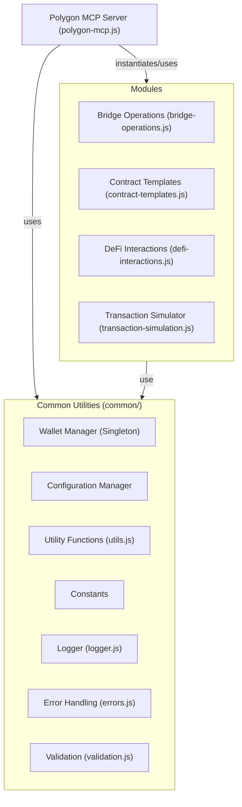

# Polygon MCP Server

[](https://opensource.org/licenses/MIT)
[](https://nodejs.org/)

A Model Context Protocol (MCP) server that provides seamless integration with the Polygon blockchain network. This server enables AI assistants to interact with Polygon through a standardized interface, offering comprehensive tools for wallet operations, smart contract deployment, L2 bridging, DeFi interactions, and transaction simulations.

## Table of Contents

- [Introduction](#introduction)
- [Quick Start](#quick-start)
- [Features](#features)
- [Architecture](#architecture)
- [API Reference](#api-reference)
- [Advanced Usage](#advanced-usage)
- [Troubleshooting](#troubleshooting)
- [Contributing](#contributing)
- [Security Considerations](#security-considerations)
- [License](#license)

## Introduction

Polygon is a Layer 2 scaling solution for Ethereum that provides faster and cheaper transactions while maintaining Ethereum's security. This MCP server allows AI assistants to interact with the Polygon network, enabling a wide range of blockchain operations through a simple, standardized interface.

The server acts as a bridge between AI systems and the Polygon blockchain, handling the complexities of blockchain interactions and providing a clean, easy-to-use API for common operations.

```
┌─────────────┐     ┌───────────────┐     ┌─────────────────┐
│             │     │               │     │                 │
│  AI System  ├─────┤  Polygon MCP  ├─────┤  Polygon Chain  │
│             │     │    Server     │     │                 │
└─────────────┘     └───────────────┘     └─────────────────┘
```

## Quick Start

### Prerequisites

- Node.js (v18 or higher)
- npm or yarn
- A Polygon wallet private key (for signing transactions)
- RPC endpoints for Polygon Mainnet and Amoy Testnet

### Installation

1. Clone the repository or download the source code
2. Install dependencies:

```bash
cd polygonmcp
npm install
```

3. Create a `.env` file with the following variables:

```env
# Network RPC endpoints
POLYGON_MAINNET_RPC=https://polygon-rpc.com
POLYGON_AMOY_RPC=https://rpc-amoy.polygon.technology
ETHEREUM_RPC_URL=https://eth-sepolia.g.alchemy.com/v2/YOUR_ALCHEMY_KEY  # Sepolia for Amoy's L1

# API Keys
POLYGONSCAN_API_KEY=YOUR_EXPLORER_API_KEY  # Use OKLink API key for Amoy

# Wallet (IMPORTANT: Use secure key management in production)
PRIVATE_KEY=your_private_key_here
DEFAULT_NETWORK=amoy  # Use 'amoy' for testnet

# DeFi Configuration (Optional)
DEFAULT_SLIPPAGE=0.5
DEFAULT_DEADLINE_MINUTES=20
```

### Running the Server

Start the server:

```bash
npm start
```

For development with auto-restart:

```bash
npm run dev
```

### First Steps

1. **Check your wallet balance**:
   ```javascript
   import { PolygonMCPServer } from './polygon-mcp.js';
   const server = new PolygonMCPServer();

   async function checkBalance() {
     // Wallet is connected automatically on server start if PRIVATE_KEY is in .env
     // await server.connectWallet(process.env.PRIVATE_KEY);
     const balances = await server.listBalances();
     console.log('Wallet balances:', balances);
   }

   checkBalance().catch(console.error);
   ```

2. **Get testnet POL** (Amoy testnet only):
   ```javascript
   async function getTestPol() {
     // Wallet is connected automatically on server start if PRIVATE_KEY is in .env
     // await server.connectWallet(process.env.PRIVATE_KEY);
     const result = await server.getTestnetPol();
     console.log('Faucet result:', result);
   }
   ```

3. **Simulate a transaction**:
   ```javascript
   // Wallet is connected automatically on server start if PRIVATE_KEY is in .env

   async function simulateTransaction() {
     const result = await server.simulateTransaction({
       to: '0x1234...', // Recipient address
       value: '0.01',    // Amount in MATIC (or native token)
     });
     console.log('Simulation result:', result);
   }
   ```

## Features

### Wallet Operations

| Tool | Description | Example |
|------|-------------|---------|
| `get-address` | Retrieve the current wallet address | `const address = await server.getAddress()` |
| `get-testnet-pol` | Request testnet POL from a faucet (Amoy testnet only) | `await server.getTestnetPol()` |
| `list-balances` | List token balances for the connected wallet | `const balances = await server.listBalances()` |
| `transfer-funds` | Transfer POL or ERC20 tokens to another address | `await server.transferFunds('0x1234...', '0.1', 'MATIC')` |

The wallet manager provides:
- Enhanced wallet connection validation
- Support for multiple networks
- Improved error handling with detailed messages
- Secure private key management

### Smart Contract Operations

| Tool | Description | Example |
|------|-------------|---------|
| `deploy-contract` | Deploy a smart contract to Polygon | `await server.deployContract(name, code, args)` |
| `verify-contract` | Verify a deployed contract on Polygonscan | `await server.verifyContract(address, name, code, args)` |
| `list-contract-templates` | List available contract templates | `const templates = await server.listContractTemplates()` |

Supported contract types:
- ERC20 tokens
- ERC721 NFT collections
- ERC1155 multi-tokens
- Staking contracts
- Multisig wallets

### L2 Bridge Operations

| Tool | Description | Example |
|------|-------------|---------|
| `deposit-eth` | Deposit ETH from Ethereum to Polygon | `await server.mcpServer.callTool('deposit-eth', { amount: '0.1' })` |
| `withdraw-eth` | Withdraw ETH/POL from Polygon to Ethereum | `await server.mcpServer.callTool('withdraw-eth', { amount: '0.1' })` |
| `deposit-token` | Deposit ERC20 from Ethereum to Polygon | `await server.mcpServer.callTool('deposit-token', { token: 'USDC', amount: '100' })` |
| `withdraw-token` | Withdraw ERC20 from Polygon to Ethereum | `await server.mcpServer.callTool('withdraw-token', { token: 'USDC', amount: '100' })` |
| `check-bridge-status` | Check the status of a bridge transaction (Not yet implemented as tool) | `N/A` |

Features:
- Support for both ETH and ERC20 token bridging via `PolygonBridge` class.
- Encapsulated `MaticPOSClient` usage within `bridge-operations.js`.
- Enhanced error handling for bridge operations.
- Checkpoint awareness (inherent in `MaticPOSClient`).

**Note:** The current implementation uses a mock version of MaticPOSClient due to ESM compatibility issues. Bridge operations may not function correctly until a proper ESM-compatible implementation is created.

### DeFi Interactions

#### QuickSwap DEX

| Tool | Description | Example |
|------|-------------|---------|
| `swap-tokens` | Swap tokens using QuickSwap | `await server.swapTokens('MATIC', 'USDC', '10')` |
| `get-swap-quote` | Get a price quote for a token swap | `const quote = await server.getSwapQuote('MATIC', 'USDC', '10')` |
| `add-liquidity` | Add liquidity to a QuickSwap pool | `await server.addLiquidity('MATIC', 'USDC', '10', '20')` |

#### Uniswap V3

| Tool | Description | Example |
|------|-------------|---------|
| `uniswapV3SwapSingle` | Execute single-hop swaps | `await server.uniswapV3SwapSingle(tokenIn, tokenOut, amount, fee)` |
| `uniswapV3SwapMulti` | Execute multi-hop swaps | `await server.uniswapV3SwapMulti(path, amounts)` |
| `getUniswapV3QuoteSingle` | Get quotes for single-hop swaps | `const quote = await server.getUniswapV3QuoteSingle(tokenIn, tokenOut, amount, fee)` |
| `getUniswapV3QuoteMulti` | Get quotes for multi-hop swaps | `const quote = await server.getUniswapV3QuoteMulti(path, amount)` |

#### Polymarket Prediction Markets

| Tool | Description | Example |
|------|-------------|---------|
| `getPolymarketInfo` | Get market information | `const info = await server.getPolymarketInfo(marketId)` |
| `placePolymarketBet` | Place bets by buying position tokens | `await server.placePolymarketBet(marketId, outcome, amount)` |
| `getPolymarketPositions` | Get user positions for a market | `const positions = await server.getPolymarketPositions(marketId)` |

### Transaction Simulation

| Tool | Description | Example |
|------|-------------|---------|
| `simulate-transaction` | Simulate a transaction to preview its effects | `const result = await server.simulateTransaction(txParams)` |
| `estimate-gas` | Estimate gas for a transaction | `const gas = await server.estimateGas(txParams)` |

Features:
- Gas estimation with EIP-1559 support
- Token transfer detection and analysis
- Contract interaction simulation
- Enhanced BigInt handling
- Improved error context

### Network Tools

| Tool | Description | Example |
|------|-------------|---------|
| `get-gas-price` | Get current gas prices on Polygon | `const price = await server.getGasPrice()` |
| `switch-network` | Switch between Polygon Mainnet and Amoy Testnet | `await server.switchNetwork('mainnet')` |

## Architecture

The Polygon MCP Server is built with a modular architecture that separates concerns and promotes maintainability:



### Key Components

1.  **Polygon MCP Server (`polygon-mcp.js`)**: Main entry point, handles MCP communication, instantiates modules, registers tools, delegates calls.
2.  **Common Utilities (`common/`)**:
    *   **Wallet Manager**: Singleton for centralized wallet state and access.
    *   **Configuration Manager**: Singleton for centralized configuration loading (`getConfig`).
    *   **Utility Functions**: Shared helpers like `resolveTokenAddress`.
    *   **Constants**: Shared ABIs, addresses.
    *   **Logger, Errors, Validation**: Support components.
3.  **Functional Modules**:
    *   **Bridge Operations (`bridge-operations.js`)**: Encapsulates `MaticPOSClient` and bridge logic.
    *   **Contract Templates (`contract-templates.js`)**: Handles contract compilation, deployment from templates.
    *   **DeFi Interactions (`defi-interactions.js`)**: Interfaces with DEXs (QuickSwap, Uniswap), Polymarket.
    *   **Transaction Simulator (`transaction-simulation.js`)**: Simulates transactions using `eth_call`.

### Data Flow

1. Client requests are received by the MCP server
2. Requests are validated and parameters are checked
3. The appropriate module handles the request
4. Blockchain interactions are performed via ethers.js
5. Results are formatted and returned to the client

## API Reference

### Wallet Operations (via MCP Tools)

#### `get-address`
Gets the address of the connected wallet.

**Returns:** JSON string `{ "address": "0x..." }`

#### `list-balances`
Lists native and known token balances for the connected wallet (or specified address).

**Parameters (Optional):**
- `address` (string): Address to check (defaults to connected wallet)

**Returns:** JSON string `{ "address": "...", "nativeBalance": "...", "tokens": { "USDC": "...", ... } }`

#### `transfer-funds`
Transfers native token (POL) or ERC20 tokens to another address.

**Parameters:**
- `to` (string): Recipient address
- `amount` (string): Amount to transfer
- `token` (string, optional): Token symbol or address (omit for native POL)

**Returns:** JSON string `{ "success": true, "txHash": "0x...", ... }`

### Contract Operations (via MCP Tools)

#### `list-contract-templates`
Lists available contract templates.

**Returns:** JSON string `[{ "id": "erc20", "name": "...", ... }, ...]`

#### `deploy-contract`
Deploys a contract from a template.

**Parameters:**
- `templateId` (string): ID of the template (e.g., 'erc20', 'nft')
- `params` (object): Parameters specific to the template (e.g., `{ "name": "MyToken", ... }`)
- `constructorArgs` (Array, optional): Arguments for the contract constructor

**Returns:** JSON string `{ "address": "0x...", "transactionHash": "0x...", ... }`

#### `verify-contract` (Not currently exposed as an MCP tool)
Verifies a contract on Polygonscan.

**Parameters:**
- `address` (string): Contract address
- `name` (string): Contract name
- `code` (string): Contract source code
- `constructorArgs` (Array): Constructor arguments

**Returns:** Object - Verification result (if implemented as tool)

### Bridge Operations (via MCP Tools)

#### `deposit-eth`
Deposits ETH from Ethereum to Polygon.

**Parameters:**
- `amount` (string): Amount of ETH to deposit

**Returns:** JSON string `{ "txHash": "0x...", "status": "pending" }`

#### `withdraw-eth`
Withdraws the native token (POL) from Polygon to Ethereum. Note: Polygon has rebranded from MATIC to POL on both mainnet and testnet.

**Parameters:**
- `amount` (string): Amount of native token (POL) to withdraw

**Returns:** JSON string `{ "txHash": "0x...", "status": "pending" }`

#### `deposit-token`
Deposits an ERC20 token from Ethereum to Polygon.

**Parameters:**
- `token` (string): Token symbol or address
- `amount` (string): Amount to deposit

**Returns:** JSON string `{ "txHash": "0x...", "status": "pending" }`

#### `withdraw-token`
Withdraws an ERC20 token from Polygon to Ethereum.

**Parameters:**
- `token` (string): Token symbol or address
- `amount` (string): Amount to withdraw

**Returns:** JSON string `{ "txHash": "0x...", "status": "pending" }`

*(Note: `check-bridge-status` is implemented in `PolygonBridge` but not exposed as an MCP tool yet)*

## Advanced Usage

### Combining Multiple Operations

```javascript
// Example: Swap tokens and then bridge to Ethereum (Conceptual using MCP tools)
async function swapAndBridge() {
  // Assume server is running and wallet connected via env/config

  // Swap MATIC to USDC (using a hypothetical swap tool - needs implementation)
  // const swapResult = await server.mcpServer.callTool('swap-tokens', { fromToken: 'MATIC', toToken: 'USDC', amount: '10' });
  // console.log('Swap result:', swapResult);
  // await server.provider.waitForTransaction(swapResult.content[0].text.txHash); // Wait for swap tx

  // Bridge USDC to Ethereum
  const bridgeResult = await server.mcpServer.callTool('withdraw-token', { token: 'USDC', amount: '10' });
  console.log('Bridge result:', bridgeResult);
}
```

### Custom Contract Deployment

```javascript
// Deploy a custom ERC20 token using templates (Conceptual using MCP tools)
async function deployCustomToken() {
  // Assume server is running and wallet connected via env/config

  // Get the ERC20 template info (optional step)
  // const templates = await server.mcpServer.callTool('list-contract-templates', {});
  // console.log(templates);

  // Define parameters
  const templateId = 'erc20';
  const params = { name: 'MyCustomToken' }; // Name is used in template processing
  const constructorArgs = ['MyCustomToken', 'MCT', '1000000000000000000000000']; // Name, Symbol, InitialSupply (in wei)

  // Deploy the contract
  const deployResult = await server.mcpServer.callTool('deploy-contract', {
    templateId,
    params,
    constructorArgs
  });
  const deployData = JSON.parse(deployResult.content[0].text);
  console.log('Contract deployed at:', deployData.address);

  // Verification would need the source code, which isn't directly returned by deploy-contract
  // Verification might need a separate tool or manual process.
}
  const customizedCode = erc20Template.code
    .replace('{{name}}', 'MyCustomToken')
    .replace('initialSupply * 10 ** decimals()', '1000000 * 10 ** 18');

  // Deploy the contract
  const result = await server.deployContract(
    'MyCustomToken',
    customizedCode,
    ['MyCustomToken', 'MCT', 1000000]
  );
```

### Transaction Simulation for Security

```javascript
// Simulate a transaction before executing it (Conceptual using MCP tools)
async function safeTransfer() {
  // Assume server is running and wallet connected via env/config

  const txParams = {
    to: '0x1234...',
    value: '1000000000000000000', // 1 POL in wei
    // data: '0x' // Optional data
  };

  // Simulate first
  const simResult = await server.mcpServer.callTool('simulate-transaction', { transaction: txParams });
  const simulation = JSON.parse(simResult.content[0].text);

  // Check for issues
  if (!simulation.success) {
    console.error('Transaction would fail:', simulation.errorMessage);
    return;
  }

  // Check gas costs
  console.log('Estimated gas cost:', simulation.gasCost.ether, 'MATIC');
  // Execute if simulation was successful (using transfer-funds tool)
  const transferResult = await server.mcpServer.callTool('transfer-funds', {
    to: txParams.to,
    amount: '1.0' // Amount in POL for the tool
  });
  console.log('Transaction sent:', transferResult);
}
```

## Troubleshooting

### Current Status and Known Issues

**Important:** The current implementation uses a mock version of MaticPOSClient due to ESM compatibility issues. Bridge operations (deposit/withdraw) may not function correctly until a proper ESM-compatible implementation is created.

### Common Issues

#### "Wallet not connected" Error
Ensure the `PRIVATE_KEY` is correctly set in the `.env` file or MCP server configuration, as the wallet connects automatically on server start if the key is provided. Manual `connectWallet` calls are no longer the primary mechanism.

#### RPC Connection Issues
If you're experiencing RPC connection issues, try:
1. Checking your internet connection
2. Verifying your RPC endpoint URLs in the `.env` file
3. Using a different RPC provider

#### Insufficient Funds
For operations that require gas fees, ensure your wallet has enough of the native token (POL):

```javascript
const balances = await server.listBalances();
// Check native token balance (POL)
const nativeToken = 'POL';
console.log(`${nativeToken} balance:`, balances.nativeBalance);
```

#### Transaction Failures
Use the transaction simulator to diagnose issues before sending:

```javascript
const simulation = await server.simulateTransaction(tx);
if (!simulation.success) {
  console.error('Transaction would fail:', simulation.errorMessage);
}
```

### Debugging

Enable debug logging by setting the environment variable:

```
DEBUG=polygon-mcp:*
```

## Contributing

Contributions are welcome! Here's how you can contribute:

1. Fork the repository
2. Create a feature branch: `git checkout -b feature/my-feature`
3. Commit your changes: `git commit -am 'Add my feature'`
4. Push to the branch: `git push origin feature/my-feature`
5. Submit a pull request

### Development Setup

1. Clone the repository
2. Install dependencies: `npm install`
3. Create a `.env.test` file with test credentials
4. Run tests: `npm test`
5. Run linting: `npm run lint`

## Security Considerations

This server handles private keys and sensitive blockchain operations. For production use:

1. Never store private keys in code or environment variables
2. Use a secure key management system or hardware wallet integration
3. Implement proper authentication and authorization
4. Add rate limiting to prevent abuse
5. Add comprehensive logging and monitoring
6. Validate all input parameters
7. Implement proper error handling
8. Use secure configuration management

## MCP Integration

### Adding to MCP Settings

To use this server with Claude or other MCP-compatible systems, add it to your MCP settings configuration file:

For Cursor/Claude Dev:
```json
{
  "mcpServers": {
    "polygon": {
      "command": "node",
      "args": ["path/to/polygon-mcp.js"],
      "env": {
        "POLYGON_MAINNET_RPC": "https://polygon-rpc.com",
        "POLYGON_AMOY_RPC": "https://rpc-amoy.polygon.technology",
        "ETHEREUM_RPC_URL": "https://eth-sepolia.g.alchemy.com/v2/YOUR_ALCHEMY_KEY",
        "POLYGONSCAN_API_KEY": "YOUR_EXPLORER_API_KEY",
        "PRIVATE_KEY": "your_private_key_here",
        "DEFAULT_NETWORK": "amoy",
        "DEFAULT_SLIPPAGE": "0.5",
        "DEFAULT_DEADLINE_MINUTES": "20"
      },
      "disabled": false,
      "autoApprove": []
    }
  }
}
```

## Project Structure

- `polygon-mcp.js` - Main server implementation
- `bridge-operations.js` - L2 bridge operations
- `contract-templates.js` - Contract deployment templates
- `defi-interactions.js` - DeFi protocol interactions
- `transaction-simulation.js` - Transaction simulation logic.
- `logger.js` - Structured logging utility.
- `errors.js` - Custom error classes and helpers.
- `validation.js` - Input validation helpers (potentially underutilized).
- `common/` - Shared utilities and constants:
  - `config-manager.js` - Centralized configuration loading (`getConfig`).
  - `constants.js` - Shared ABIs, addresses.
  - `wallet-manager.js` - Singleton wallet manager.
  - `utils.js` - Centralized utility functions (e.g., `resolveTokenAddress`).

## License

This project is licensed under the MIT License - see the LICENSE file for details.
