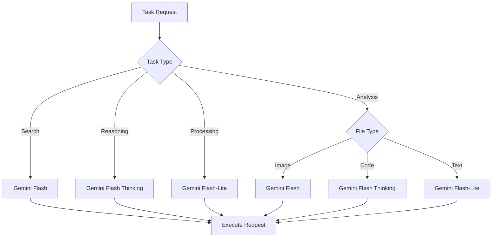

# GemSuite MCP: The Most Comprehensive Gemini API Integration for Model Context Protocol
#### The ultimate open-source server for advanced Gemini API interaction with Model Context Protocol (MCP), intelligently selecting models for optimal performance, minimal token cost, and seamless integration.
<div align="center">


<br><br/>
[](https://opensource.org/licenses/MIT)
[](https://www.typescriptlang.org/)
[](https://modelcontextprotocol.ai/)
[](https://smithery.ai/server/@PV-Bhat/gemsuite-mcp)
[](https://nodejs.org/)
<br><br/><a href="https://glama.ai/mcp/servers/m2ljvlatlu">
  
</a><br><br/>
**Professional Gemini API integration for Claude and all MCP-compatible hosts with intelligent model selection and advanced file handling**

*Evolved from the [geminiserchMCP](https://github.com/Lorhlona/geminiserchMCP) project with enhanced capabilities*

[Installation](#installation) • [Features](#key-features) • [Usage](#usage) • [Examples](#usage-examples) • [Models](#model-characteristics) • [Contributing](#contributing)

</div>

## 🌟 What is GemSuite MCP?

GemSuite (Model Context Protoco) MCP is the ultimate Gemini API integration interface for MCP hosts, intelligently selecting models for the task at hand—delivering optimal performance, minimal token cost, and seamless integration. It enables any MCP-compatible host (Claude, Cursor, Replit, etc.) to seamlessly leverage Gemini's capabilities with a focus on:

1. **Intelligence**: Automatically selects the optimal Gemini model based on task and content
2. **Efficiency**: Optimizes token usage and performance across different workloads
3. **Simplicity**: Provides a clean, consistent API for complex AI operations
4. **Versatility**: Advanced file handling; Handles multiple file types, operations, and use cases

Whether you're analyzing documents, solving complex problems, processing large text files, or searching for information, GemSuite MCP provides the right tools with the right models for the job.

## Why GemSuite MCP?

Unlike other Gemini MCP servers that offer limited functionality, GemSuite MCP provides:

✅ **Intelligent Model Selection**: Automatically selects the optimal Gemini model based on task
✅ **Unified File Handling**: Seamlessly processes various file types with automatic format detection
✅ **Comprehensive Tool Suite**: Four specialized tools covering search, reasoning, processing, and analysis
✅ **Production-Ready**: Deployed and validated on Smithery.ai, MCP.so, and Glama.io

## 🚀 Installation

### Option 1: Smithery.ai (Recommended)

```bash
# Install directly via Smithery CLI
npx -y @smithery/cli@latest install @PV-Bhat/gemsuite-mcp --client claude
```

### Option 2: Manual Installation

```bash
# Clone the repository
git clone https://github.com/PV-Bhat/gemsuite-mcp.git
cd gemsuite-mcp

# Install dependencies
npm install

# Set your Gemini API key
echo "GEMINI_API_KEY=your_api_key_here" > .env

# Build the project
npm run build

# Start the server
npm start
```

## 🔑 API Key Setup

1. Obtain a Gemini API key from [Google AI Studio](https://ai.google.dev/)
2. Set it as an environment variable:
   ```bash
   export GEMINI_API_KEY=your_api_key_here
   ```
   or create a `.env` file in the project root:
   ```
   GEMINI_API_KEY=your_api_key_here
   ```

## 💎 Key Features

### Unified File Handling

- **Seamless File Processing**: All tools support file inputs via the `file_path` parameter
- **Automatic Format Detection**: Correct handling of various file types with appropriate MIME types
- **Multimodal Support**: Process images, documents, code files, and more
- **Batch Processing**: Support for processing multiple files in a single operation

### Intelligent Model Selection

<table>
<tr>
<td width="50%">

GemSuite MCP automatically selects the most appropriate Gemini model based on:

- **Task Type**: Search, reasoning, processing, or analysis
- **Content Type**: Text, code, images, or documents
- **Complexity**: Simple queries vs. complex reasoning
- **User Preferences**: Optional manual overrides

This intelligence ensures optimal performance while minimizing token usage.

</td>
<td>



</td>
</tr>
</table>

### Specialized Tools

| Tool | Purpose | Model | Use Cases |
|------|---------|-------|-----------|
| **`gem_search`** | Information retrieval with search integration | Gemini Flash | Factual questions, current information, grounded responses |
| **`gem_reason`** | Complex reasoning with step-by-step analysis | Gemini Flash Thinking | Math, science, coding problems, logical analysis |
| **`gem_process`** | Fast, efficient content processing | Gemini Flash-Lite | Summarization, extraction, high-volume operations |
| **`gem_analyze`** | Intelligent file analysis with auto-model selection | Auto-selected | Document analysis, code review, image understanding |

### Robust Error Handling

- **Exponential Backoff**: Graceful handling of API rate limits
- **Comprehensive Error Detection**: Clear identification of error sources
- **Actionable Messages**: Detailed error information for troubleshooting
- **Recovery Mechanisms**: Intelligent fallbacks when primary approaches fail

## 🖥️ Usage

### In Claude or Other MCP-Compatible Hosts

When using GemSuite MCP with Claude or other MCP-compatible hosts, the tools will be available directly in the assistant's toolkit. Simply call the appropriate tool for your needs:

#### Tool Selection Guide

- **`gem_search`**: For factual questions requiring search integration
- **`gem_reason`**: For complex problems requiring step-by-step reasoning
- **`gem_process`**: For efficient processing of text or files (most token-efficient)
- **`gem_analyze`**: For detailed analysis of files with automatic model selection

## 📚 Usage Examples


#### Claude Desktop Using GemSuite Gemini Search to access Google Search

### Processing Files (Most Token-Efficient)

```javascript
// Summarize a large document
const response = await gem_process({
  file_path: "/path/to/your/large_document.pdf",
  operation: "summarize"
});

// Extract specific information
const response = await gem_process({
  file_path: "/path/to/your/report.docx",
  operation: "extract",
  content: "Extract all financial data and metrics from this document."
});
```

### Analyzing Files

```javascript
// Analyze an image
const response = await gem_analyze({
  file_path: "/path/to/your/image.jpg",
  instruction: "Describe what you see in this image in detail."
});

// Analyze code
const response = await gem_analyze({
  file_path: "/path/to/your/code.py",
  instruction: "Identify potential bugs and suggest optimizations."
});
```

### Complex Reasoning

```javascript
// Solve a complex problem with step-by-step reasoning
const response = await gem_reason({
  problem: "Analyze this code and suggest improvements:",
  file_path: "/path/to/your/code.js",
  show_steps: true
});

// Mathematical problem solving
const response = await gem_reason({
  problem: "Solve this differential equation: dy/dx = 2xy with y(0) = 1",
  show_steps: true
});
```

### Searching with Files

```javascript
// Answer questions about a document with search integration
const response = await gem_search({
  query: "What companies are mentioned in this document?",
  file_path: "/path/to/your/document.pdf"
});

// Factual questions with search
const response = await gem_search({
  query: "What are the latest developments in quantum computing?",
  enable_thinking: true
});
```

## 🧠 Model Characteristics

GemSuite MCP leverages three primary Gemini models, intelligently selecting the optimal model for each task:

### Gemini 2.0 Flash
- **1M token context window**: Process extensive content
- **Search integration**: Ground responses in current information
- **Multimodal capabilities**: Handle text, images, and more
- **Balanced performance**: Good mix of quality and speed

### Gemini 2.0 Flash-Lite
- **Most cost-efficient**: Minimize token usage
- **Fastest response times**: Ideal for high-volume operations
- **Text-focused**: Optimized for text processing
- **Optimal for efficiency**: When search and reasoning aren't needed

### Gemini 2.0 Flash Thinking
- **Enhanced reasoning**: Logical analysis and problem-solving
- **Step-by-step analysis**: Shows reasoning process
- **Specialized capabilities**: Excels at complex calculations
- **Best for depth**: When thorough analysis is necessary

## 🔄 Workflow Examples

### Document Analysis Workflow

```javascript
// 1. Get a high-level summary (most efficient)
const summary = await gem_process({
  file_path: "/path/to/large_document.pdf",
  operation: "summarize"
});

// 2. Extract specific information
const keyPoints = await gem_process({
  file_path: "/path/to/large_document.pdf",
  operation: "extract",
  content: "Extract the key findings and recommendations"
});

// 3. Answer specific questions with search integration
const answers = await gem_search({
  query: "Based on this document, what are the implications for market growth?",
  file_path: "/path/to/large_document.pdf"
});

// 4. Claude synthesizes the processed information
// This approach is dramatically more token-efficient than having
// Claude process the entire document directly
```

### Code Review Workflow

```javascript
// 1. Get code overview
const overview = await gem_analyze({
  file_path: "/path/to/code.js",
  instruction: "Provide an overview of this code's structure and purpose"
});

// 2. Identify potential issues
const issues = await gem_reason({
  problem: "Analyze this code for bugs, security vulnerabilities, and performance issues",
  file_path: "/path/to/code.js",
  show_steps: true
});

// 3. Generate improvements
const improvements = await gem_reason({
  problem: "Suggest specific improvements to make this code more efficient and maintainable",
  file_path: "/path/to/code.js",
  show_steps: true
});

// 4. Claude provides a comprehensive code review synthesis
```

## 🧩 Integration with Other MCP Hosts

GemSuite MCP works with any MCP-compatible host:

- **Claude Desktop**: Seamless integration with Claude's powerful reasoning capabilities
- **Cursor IDE**: Enhanced coding assistance with Gemini's capabilities
- **Replit**: Code generation and analysis directly in your development environment
- **Other MCP Hosts**: Compatible with any platform implementing the MCP standard

## 🛠️ Advanced Configuration

### Custom Model Selection

You can override the automatic model selection by specifying the `model_id` parameter:

```javascript
// Force the use of Gemini Flash Thinking for a processing task
const response = await gem_process({
  file_path: "/path/to/document.pdf",
  operation: "analyze",
  model_id: "models/gemini-2.0-flash-thinking"
});
```

### Available Operations for `gem_process`

- `summarize`: Create a concise summary
- `extract`: Extract specific information
- `restructure`: Reorganize content into a more useful format
- `simplify`: Make complex content easier to understand
- `expand`: Add detail or context to content
- `critique`: Provide critical analysis
- `feedback`: Offer constructive feedback
- `analyze`: General analysis of content

## 🔧 Contributing

Contributions are welcome! Here's how to get started:

1. Fork the repository
2. Create a feature branch: `git checkout -b feature/my-new-feature`
3. Make your changes
4. Run tests: `npm test`
5. Commit your changes: `git commit -m 'Add my new feature'`
6. Push to your branch: `git push origin feature/my-new-feature`
7. Submit a pull request

For major changes, please open an issue first to discuss what you'd like to change.

## 📜 License

This project is licensed under the MIT License - see the [LICENSE](LICENSE) file for details.

## 🙏 Acknowledgements

- [Lorhlona/geminiserchMCP](https://github.com/Lorhlona/geminiserchMCP) - The original project that inspired this enhanced version
- [Model Context Protocol](https://modelcontextprotocol.ai) - For developing the MCP standard
- [Google Gemini](https://ai.google.dev) - For the powerful AI models that power this server

## 🔗 Links

- [GitHub Repository](https://github.com/PV-Bhat/gemsuite-mcp)
- [Smithery.ai](https://smithery.ai/server/@PV-Bhat/gemsuite-mcp)
- [Mcp.so](https://mcp.so/server/gemsuite-mcp)
- [Glama](https://glama.ai/mcp/servers/m2ljvlatlu)
- [Issue Tracker](https://github.com/PV-Bhat/gemsuite-mcp/issues)
- [Model Context Protocol](https://modelcontextprotocol.ai/)

---

<p align="center">
  <sub>Made with ❤️ by <a href="https://github.com/PV-Bhat">PV-Bhat</a></sub>
</p>

<!-- 
Keywords: Best Gemini MCP server, Model Context Protocol integration, Gemini API tools, intelligent model selection, advanced file handling, Claude MCP integration, Gemini search MCP, Gemini reasoning, MCP file processing, Smithery.ai MCP server, MCP.so integration, Glama.io verified, production-ready MCP
-->
