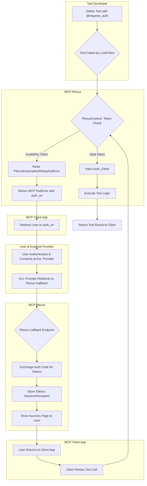
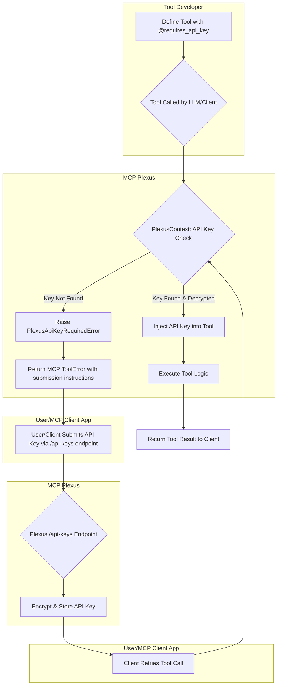

# MCP Plexus: Secure, Multi-Tenant MCP Server Framework for Modern AI

Build powerful, scalable, and secure Model Context Protocol (MCP) applications with ease. MCP Plexus is a Python framework built on the robust `jlowin/fastmcp` (FastMCP 2.7) library, designed to empower developers to deploy multi-tenant MCP servers that seamlessly integrate with external services via OAuth 2.1 and manage API key access for tools.

---

## Introduction

### What is MCP Plexus?

MCP Plexus extends the capabilities of FastMCP 2.7, providing a structured environment for creating sophisticated, multi-tenant AI backend systems. It allows you to define distinct, isolated environments (tenants) that can expose customized sets of tools, resources, and prompts to Large Language Models (LLMs) and AI agents.

**Key differentiating features include:**

- **Robust Multi-Tenancy:** Host multiple clients or organizations on a single deployment, each with their own data and tool access.
- **Simplified External Service Integration:** Securely connect your MCP tools to external OAuth 2.1 protected services (like GitHub, Google APIs, etc.) with built-in flow management.
- **User-Specific Persistent Access:** Enable host applications to register their users with Plexus, allowing for persistent storage of external OAuth tokens, reducing re-authentication friction.
- **API Key Management for Tools:** Securely store and inject API keys for tools that require direct key-based authentication to external services.
- **Standardized and Extensible:** Leverages the full power of FastMCP's Pythonic decorators for defining MCP components, while providing a clear structure for extension.

### Why MCP Plexus?

As AI applications grow in complexity, the need to securely provide LLMs with relevant context and executable capabilities becomes paramount. MCP Plexus addresses this by:

- **Simplifying Multi-Tenant Deployments:** Reduces the boilerplate and complexity of managing multiple, isolated MCP environments.
- **Standardizing External API Access:** Provides a consistent and secure mechanism for tools to interact with OAuth-protected and API key-gated services.
- **Enhancing User Experience:** Through persistent user authentication and token storage, it minimizes repeated login prompts to external services.
- **Promoting Secure Practices:** Manages sensitive credentials (OAuth tokens, API keys) outside of your core tool logic.
- **Leveraging FastMCP Power:** Builds upon the proven, high-performance FastMCP 2.7 library for core MCP protocol handling and its developer-friendly interface.

### Core Philosophy

- **Security First:** Designed with OAuth 2.1 and secure credential management at its core.
- **Developer Experience:** Aims for an intuitive API for defining tenants, tools, and secure integrations.
- **Scalability & Isolation:** Built for multi-tenant architectures with clear separation of concerns.
- **Extensibility:** Provides a foundation that can be extended with custom authentication providers and services.

---

## Key Features

- **Multi-Tenancy:**
  - Support for multiple isolated tenants identified via URL paths (e.g., `/{entity_id}/mcp/`).
  - Tenant-specific MCP session management (currently using Redis by default).
  - (Planned) Tenant-specific configuration for tool visibility and provider settings.

- **Plexus User Authentication:**
  - Host applications can register their users with MCP Plexus via a secure endpoint (`/{entity_id}/plexus-auth/register-user`).
  - Obtain a `plexus_user_auth_token` that links the host application's user to a persistent identity within Plexus.
  - Enables persistent storage of external OAuth tokens and API keys scoped to the user.

- **External OAuth 2.1 Flow Facilitation for Tools:**
  - The `@requires_auth(provider_name, scopes)` decorator for MCP tools triggers an OAuth 2.1 Authorization Code Grant with PKCE flow for external providers (e.g., GitHub).
  - Manages OAuth callbacks, token exchange, and secure token storage (session-bound for guest users, persistently against `persistent_user_id` for authenticated Plexus users).
  - Tools receive an authenticated `httpx.AsyncClient` via the `PlexusContext` for interacting with the external provider.
  - Administrative CLI/API for managing tenant-specific configurations of external OAuth providers (e.g., client ID/secret for GitHub).

- **API Key Management for Tools:**
  - The `@requires_api_key(provider_name, key_name_display, instructions)` decorator for MCP tools.
  - Prompts users (via a structured MCP error) to submit their API key if not already stored.
  - Securely stores API keys (encrypted at rest using `PLEXUS_ENCRYPTION_KEY`) persistently against the `persistent_user_id`.
  - Injects the decrypted API key into the tool function at runtime.
  - Endpoint (`/{entity_id}/plexus-services/api-keys`) for users to submit their API keys.

- **Standard MCP Server Capabilities (via FastMCP 2.7):**
  - Full support for defining MCP Tools, Resources, and Prompts using FastMCP's Pythonic decorators and classes (e.g., `PLEXUS_SERVER_INSTANCE.tool()`).
  - Native Streamable HTTP transport for MCP communication.
  - Access to `PlexusContext` (which extends `fastmcp.Context`) within tools/resources/prompts for logging, session data, and accessing authenticated clients or API keys.

- **Configurable Storage:**
  - Utilizes SQLite by default for persistent storage of Plexus User Auth tokens, user-specific external OAuth tokens, API keys, external OAuth provider configurations, tenant configurations, and user-submitted API keys.
  - Currently requires Redis for MCP session management (enhancement planned for SQLite session store).

- **(Work in Progress) Internal OAuth 2.1 Provider:**
  - Foundational elements for MCP Plexus to act as its own OAuth 2.1 Authorization Server.
  - Includes basic models and stubbed endpoints. Full implementation (dynamic client registration, user consent for internal clients, complete token management) is a future goal.

---

## Architecture Overview

MCP Plexus sits as an ASGI application (typically run with Uvicorn) and acts as a sophisticated intermediary between MCP clients and the underlying FastMCP server instance.

- **FastAPI:** Used for the main web application routing, handling HTTP requests, and providing administrative API endpoints.
- **FastMCP (`jlowin/fastmcp`):** A shared instance of `FastMCP` is used as the core engine for processing MCP protocol messages (tools, resources, prompts) via Streamable HTTP.
- **Plexus Core:**
  - **Tenant Management:** Identifies tenants from URL paths (`/{entity_id}/...`) and ensures tenant configurations are respected (work in progress for full config, currently DB-backed validation).
  - **Session Management (`PlexusSessionManager`):** Manages MCP session data (e.g., `Mcp-Session-Id`), currently using Redis for session state. It associates MCP sessions with `entity_id` and, if available, a `persistent_user_id`.
  - **Plexus User Authentication:** Handles registration of host application users and manages `plexus_user_auth_token` values for linking to a `persistent_user_id`.
  - **OAuth Flow Orchestration:** Manages the OAuth 2.1 Authorization Code grant flow for tools requiring access to external services, including secure token storage and refresh (refresh WIP).
  - **API Key Service:** Manages the secure storage and retrieval of user-provided API keys for tools.
  - **`PlexusContext`:** An enhanced context object injected into MCP tools, providing access to `entity_id`, `persistent_user_id`, session data, and helper methods to get authenticated HTTP clients or API keys.
- **Storage:**
  - **Redis (Required for Sessions):** Currently used for ephemeral MCP session data.
  - **SQLite (Default for Persistent Data):** Used for storing Plexus user auth tokens, user-specific external OAuth tokens, API keys, external OAuth provider configurations, and tenant metadata.

---

## Getting Started

### Prerequisites

- Python 3.10+
- Redis (Currently required for MCP session management)
- Access to a command line / terminal.

### Installation / Setup

1. **Clone the Repository:**
   ```bash
   git clone https://github.com/Super-I-Tech/mcp_plexus mcp-plexus
   cd mcp-plexus
   ```

2. **Create and Activate a Virtual Environment:**
   ```bash
   python -m venv venv
    ```
    On Windows
    ```bash
   .\venv\Scripts\activate
   ```
   On macOS/Linux
   ```bash
   source venv/bin/activate
   ```

3. **Install Dependencies:**
   ```bash
   pip install -r requirements.txt
   ```

4. **Configure Environment Variables (`.env` file):** 
   Create a `.env` file in the project root (`mcp-plexus/.env`). You can copy from `.env.example` if provided, or create it manually.
   
   **Key Variables:**
   
   - `HOST_APP_REGISTRATION_SECRET`: **CRITICAL.** A strong, unique secret that host applications must provide to register their users with Plexus (via the `X-Host-App-Secret` header). **Change the default generated value for any production or shared deployment.**
   - `PLEXUS_ENCRYPTION_KEY`: **CRITICAL.** A Fernet encryption key used for encrypting sensitive data like API keys and external OAuth tokens stored in the database. Generate one using:
     ```bash
     python -c "from mcp_plexus.utils import generate_fernet_key; print(generate_fernet_key())"
     ```
     Place the output in your `.env`. **Keep this key secret and back it up.** Losing it means losing access to encrypted data.
   - `STORAGE_BACKEND`: Set to `"sqlite"` (default) or `"redis"` for most persistent stores (e.g., Plexus user auth tokens, external OAuth provider configs).
     - **IMPORTANT:** MCP Session Management currently **REQUIRES Redis** and uses `RedisPlexusSessionStore` regardless of this setting. Future updates may enable SQLite for session storage.
   - `SQLITE_DB_PATH`: Path to the SQLite database file (e.g., `./mcp_plexus_data.sqlite3`).
   - `REDIS_HOST`, `REDIS_PORT`, `REDIS_DB`, `REDIS_PASSWORD` (optional), `REDIS_SSL` (optional): Connection details for your Redis instance (REQUIRED FOR MCP SESSIONS; also used if `STORAGE_BACKEND=redis` for other data).
   - `DEBUG_MODE`: Set to `True` for development (more verbose logging, Uvicorn reload).
   - `PLEXUS_FASTMCP_LOG_LEVEL`: Logging level for the FastMCP component (e.g., `DEBUG`, `INFO`).
   - `ADMIN_API_KEY`: A secret API key for accessing administrative endpoints (e.g., managing tenants, external OAuth providers). **Set a strong value.**
   
   **Example `.env`:**
   ```env
    # Uvicorn Development Server
    DEV_SERVER_HOST=127.0.0.1
    DEV_SERVER_PORT=8000
    DEV_SERVER_LOG_LEVEL=info
    DEV_SERVER_RELOAD=True
  
    # Application Settings
    APP_NAME=MCP Plexus Server
    DEBUG_MODE=True
  
    REDIS_HOST=localhost
    REDIS_PORT=6379
    REDIS_DB=0
    # REDIS_PASSWORD=
    # REDIS_SSL=False
  
    PLEXUS_FASTMCP_LOG_LEVEL="DEBUG"
  
    STORAGE_BACKEND=sqlite
    SQLITE_DB_PATH=./mcp_plexus_data.sqlite3
  
    HOST_APP_REGISTRATION_SECRET=host_app_secre
  
    ADMIN_API_KEY=your_super_secret_admin_api_key_here_12345
  
    PLEXUS_CLI_API_BASE_URL=http://127.0.0.1:8080
  
    PLEXUS_ENCRYPTION_KEY=your_generated_fernet_key_here # see mcp_plexus/utils/generate_key.py
   ```

5. **Initialize Database (if using SQLite):** 
   The SQLite database and tables are typically created automatically on first run if they don't exist.

### Running the Server (Development)

Use the `run_dev.py` script:

```bash
python run_dev.py
```

This starts the Uvicorn server, usually on `http://127.0.0.1:8000` (host/port can be configured via `DEV_SERVER_HOST`/`DEV_SERVER_PORT` in `.env`).

---

## Using MCP Plexus (Developer Guide)

MCP Plexus acts as a framework or SDK for building your custom multi-tenant MCP server. Here's how you typically use it:

### 1. Defining Tenants

Tenants (entities) are the top-level organizational units.

- **Management:** Tenants are currently managed via administrative CLI commands (or direct API calls if you build an admin interface).
  - Example CLI: 
    ```bash
    plexus admin tenant create --entity-id "mycompany" --name "My Company Inc."
    ```

- **Access:** Each tenant has its own MCP endpoint: `http://<server>/{entity_id}/mcp/`

### 2. Registering Host Application Users

To enable persistent storage of external OAuth tokens across sessions for a specific user of your main application (the "host application"), you first need to register that user identity with MCP Plexus for a given tenant.

- **Endpoint:** `POST /{entity_id}/plexus-auth/register-user`
- **Request Header:** `X-Host-App-Secret: <your_HOST_APP_REGISTRATION_SECRET_value>`
- **Request Body (JSON):**
  ```json
  {
      "user_id_from_host_app": "unique_stable_user_id_from_your_main_app"
  }
  ```

- **Response Body (JSON):**
  ```json
  {
      "plexus_user_auth_token": "a_long_secure_token_string_for_this_user",
      "persistent_user_id": "unique_stable_user_id_from_your_main_app", 
      "message": "User token processed successfully."
  }
  ```

- Your host application should securely store the returned `plexus_user_auth_token` and use it to authenticate subsequent MCP requests for this user.

### 3. Initializing MCP Sessions

MCP clients interact with a specific tenant's MCP endpoint.

- **Endpoint:** `/{entity_id}/mcp/`
- **Authentication:**
  - **For Authenticated Plexus Users:** Include the `plexus_user_auth_token` obtained in step 2 via the `Authorization: Bearer <token>` HTTP header for ALL MCP requests, including the initial `initialize` call.
- **Standard MCP Initialize:**
  ```json
  {
      "jsonrpc": "2.0",
      "method": "initialize",
      "id": "client-init-123",
      "params": {
          "protocolVersion": "2025-03-26",
          "capabilities": {},
          "clientInfo": {
              "name": "MyHostApplicationClientName",
              "version": "1.0.0"
          }
      }
  }
  ```

- The server will respond with an `Mcp-Session-Id` header, which the client must include in subsequent requests for that session.

### 4. Creating MCP Tools, Resources, & Prompts

You define tools, resources, and prompts in Python modules located within the `mcp_plexus/tool_modules/` directory. These modules use the globally available `PLEXUS_SERVER_INSTANCE` (which is an instance of `MCPPlexusServer`) to register their components.

**`mcp_plexus/core/global_registry.py`:**

```python
# This instance is populated at server startup
PLEXUS_SERVER_INSTANCE: Optional[MCPPlexusServer] = None
```

**Example Tool Module (`mcp_plexus/tool_modules/my_custom_tools.py`):**

```python
import logging
from typing import Dict, Any, Optional, List
import httpx # Required for @requires_auth example
from fastmcp import Context as FastMCPBaseContext # For type hinting standard ctx
from mcp_plexus.core.global_registry import PLEXUS_SERVER_INSTANCE
from mcp_plexus.plexus_context import PlexusContext # For specific Plexus context features
from mcp_plexus.oauth.decorators import requires_auth
from mcp_plexus.services.decorators import requires_api_key

logger = logging.getLogger(__name__)

if PLEXUS_SERVER_INSTANCE is None:
    # This check helps catch issues if tool modules are imported before PLEXUS_SERVER_INSTANCE is set
    raise RuntimeError("PLEXUS_SERVER_INSTANCE not initialized when my_custom_tools.py was imported.")

@PLEXUS_SERVER_INSTANCE.tool(
    name="get_tenant_specific_greeting",
    description="Returns a greeting specific to the current tenant.",
    allowed_tenant_ids=["mycompany", "another_tenant"] # Tool only visible to these tenants
)
async def get_greeting(ctx: FastMCPBaseContext) -> Dict[str, str]:
    plexus_ctx: PlexusContext = PlexusContext(ctx.fastmcp) # Create PlexusContext from base
    
    entity_id = plexus_ctx.entity_id
    user_id = plexus_ctx.persistent_user_id # Will be None for guest users
    session_val = await plexus_ctx.get_session_value("my_key")

    greeting = f"Hello from entity '{entity_id}'!"
    if user_id:
        greeting += f" Authenticated user: {user_id}."
    if session_val:
        greeting += f" Session value for 'my_key': {session_val}."
        
    return {"greeting": greeting}

# Example: Tool requiring external GitHub OAuth
@PLEXUS_SERVER_INSTANCE.tool(
    name="get_my_github_repos",
    description="Fetches the user's GitHub repositories.",
    tool_sets=["developer_tools"], # Categorize tool
    allowed_tenant_ids=["mycompany"] 
)
@requires_auth(provider_name="github", scopes=["repo", "read:user"])
async def get_my_github_repos(
    ctx: FastMCPBaseContext, 
    *,  # This enforces subsequent arguments as keyword-only
    _authenticated_client: httpx.AsyncClient
) -> List[Dict[str, Any]]:
    plexus_ctx = PlexusContext(ctx.fastmcp)
    logger.info(f"Fetching GitHub repos for user '{plexus_ctx.persistent_user_id}' in entity '{plexus_ctx.entity_id}'")
    response = await _authenticated_client.get("https://api.github.com/user/repos")
    response.raise_for_status()
    return response.json()

# Example: Tool requiring an API key
WEATHER_API_PROVIDER_NAME = "openweathermap"
@PLEXUS_SERVER_INSTANCE.tool(
    name="get_weather_forecast",
    description=f"Gets weather forecast using {WEATHER_API_PROVIDER_NAME}.",
    allowed_tenant_ids=["mycompany", "another_tenant"]
)
@requires_api_key(
    provider_name=WEATHER_API_PROVIDER_NAME,
    key_name_display="OpenWeatherMap API Key",
    instructions="Please provide an API key for OpenWeatherMap."
)
async def get_weather(
    ctx: FastMCPBaseContext, 
    city: str,
    *,
    openweathermap_api_key: str # Injected by @requires_api_key
) -> Dict[str, Any]:
    plexus_ctx = PlexusContext(ctx.fastmcp)
    logger.info(f"Fetching weather for {city} for user '{plexus_ctx.persistent_user_id}' in entity '{plexus_ctx.entity_id}' using provided API key.")
    # Use openweathermap_api_key to call the external weather API
    # Example: weather_data = await httpx.get(f"api.openweathermap.org/data/2.5/weather?q={city}&appid={openweathermap_api_key}")
    return {"city": city, "temperature": "20C", "condition": "Sunny (mock data)"}

logger.info("my_custom_tools.py - Tools registered with PLEXUS_SERVER_INSTANCE.")
```

- **Tool Scoping:**
  - `allowed_tenant_ids`: A list of `entity_id` strings. If provided, the tool is only discoverable and callable by those tenants. If `None` or empty, the tool is global (visible to all tenants, subject to `tool_set` filtering).
  - `tool_sets`: A list of strings. Clients can request tools belonging to a specific set by passing `tool_set_filter` to the `tools/list` MCP call.
- **`PlexusContext`:**
  - Your tools will typically receive a `fastmcp.Context` (aliased as `FastMCPBaseContext` in the example).
  - Create an instance of `mcp_plexus.plexus_context.PlexusContext(base_ctx.fastmcp)` to access Plexus-specific features:
    - `plexus_ctx.entity_id`: The ID of the current tenant.
    - `plexus_ctx.persistent_user_id`: The stable ID of the authenticated Plexus user (if any).
    - `plexus_ctx.mcp_session_id`: The current MCP session ID.
    - `await plexus_ctx.get_session_value(key)` / `await plexus_ctx.set_session_value(key, value)`: Tenant and session-scoped key-value store (using Redis).
    - `await plexus_ctx.get_authenticated_external_client(provider_name, required_scopes)`: Used by `@requires_auth` or can be called directly.
    - `await plexus_ctx.get_api_key(provider_name)`: Used by `@requires_api_key` or can be called directly.

### 5. Securing Tools

#### a. External OAuth (`@requires_auth`)

Used when a tool needs to access a third-party service (e.g., GitHub, Google) on behalf of the user.

**Flow:**

1. **Admin Configures Provider:** An administrator uses the CLI (or Admin API) to register the external OAuth provider details (client ID, secret, URLs, default scopes) for a specific tenant.
   - Example CLI: 
     ```bash
     plexus admin ext-oauth create --entity-id "mycompany" --provider-name "github" --client-id "YOUR_GITHUB_CLIENT_ID" --client-secret "YOUR_GITHUB_CLIENT_SECRET" --authorization-url "https://github.com/login/oauth/authorize" --token-url "https://github.com/login/oauth/access_token" --scopes "repo,user:email" --userinfo-url "https://api.github.com/user"
     ```
2. **Tool Decoration:** Decorate your tool function with `@requires_auth(provider_name="github", scopes=["repo", "read:user"])`.
3. **Tool Call:**
   - When an MCP client calls the tool, the decorator (via `PlexusContext`) checks for a valid, stored OAuth token for the current user (persistent if Plexus user, session if guest) and the requested provider/scopes.
   - **Token Valid:** The decorator injects an authenticated `httpx.AsyncClient` (named `authenticated_client`) into your tool's kwargs.
   - **Token Invalid/Missing:** The decorator raises a `PlexusExternalAuthRequiredError`. This is caught by FastMCP and converted into a structured MCP `ToolError`. The error payload includes an `authorization_url`.
4. **Client Handles Redirect:** The MCP client application is responsible for redirecting the user to this `authorization_url`.
5. **User Authentication & Consent:** The user authenticates with the external provider and grants consent.
6. **Callback to Plexus:** The external provider redirects the user back to `/{entity_id}/oauth/external_callback/{provider_name}`.
7. **Token Exchange & Storage:** MCP Plexus exchanges the authorization code for tokens, stores them securely (session and/or persistent user store), and displays a success page.
8. **Client Retries Tool:** The user returns to the MCP client, which should then retry the original tool call. This time, `PlexusContext` will find the valid token.



#### b. API Key Access (`@requires_api_key`)

Used when a tool needs a direct API key from the user to interact with an external service.

**Flow:**

1. **Tool Decoration:** Decorate tool with `@requires_api_key(provider_name="my_service", key_name_display="My Service API Key", instructions="Get your key from ...")`.
2. **Tool Call:**
   - The decorator (via `PlexusContext`) checks if an API key for the current user (persistent if Plexus user) and provider is stored.
   - **Key Found:** The decrypted API key is injected into the tool's kwargs as `{provider_name}_api_key` (e.g., `my_service_api_key`).
   - **Key Not Found:** Raises `PlexusApiKeyRequiredError`. FastMCP converts this to a structured MCP `ToolError` instructing the client/user on how to submit the key.
3. **User Submits API Key:** The user (via the MCP client or another interface) calls the `POST /{entity_id}/plexus-services/api-keys` endpoint.
   - **Request Header:** `Authorization: Bearer <plexus_user_auth_token>` (required for persistent storage).
   - **Request Body (JSON):**
     ```json
     {
         "provider_name": "my_service",
         "api_key_value": "users_actual_api_key_value"
     }
     ```
4. **Key Storage:** MCP Plexus encrypts and stores the API key associated with the user's `persistent_user_id`.
5. **Client Retries Tool:** The tool call is retried, and the key is now found and injected.



---

## Project Status & Roadmap

This section outlines the current implementation status and planned features.

### Implemented

- [x] **Core Multi-Tenancy:** Basic tenant identification via URL (`/{entity_id}/mcp/`) and DB-backed validation.
- [x] **FastMCP 2.7 Integration:** Uses `jlowin/fastmcp` for core MCP protocol (Streamable HTTP), tool/resource/prompt definitions.
- [x] **Session Management:** Redis-backed MCP session store (`PlexusSessionManager`, `SessionData`).
- [x] **Plexus User Authentication:** Host app user registration (`/{entity_id}/plexus-auth/register-user`) to get `plexus_user_auth_token` for linking to a `persistent_user_id`. MCP requests authenticated via Bearer token or URL token path.
- [x] **External OAuth 2.1 Flow Facilitation:**
  - `@requires_auth` decorator for tools.
  - OAuth callback handling (`/{entity_id}/oauth/external_callback/{provider_name}`).
  - Persistent storage of external OAuth tokens (SQLite by default) for authenticated Plexus users.
  - Session-scoped storage of external OAuth tokens for guest users.
  - Admin API/CLI for managing External OAuth Provider configurations per tenant.
- [x] **API Key Management for Tools:**
  - `@requires_api_key` decorator.
  - Secure (encrypted) persistent storage of user-submitted API keys (SQLite by default) linked to `persistent_user_id`.
  - Endpoint for API key submission (`/{entity_id}/plexus-services/api-keys`).
- [x] **`PlexusContext`:** Provides `entity_id`, `persistent_user_id`, `mcp_session_id`, and methods for OAuth/API key access.
- [x] **Admin Endpoints & Basic CLI:** For managing tenants and external OAuth provider configurations.
- [x] **SQLite Persistent Storage:** Default backend for user auth tokens, external tokens/API keys, provider configs, tenant data.
- [x] **Tool Scoping & Sets:** Basic implementation for tool visibility based on `allowed_tenant_ids` and filtering by `tool_sets` via `tools/list` param.

### Planned / Work In Progress

- [ ] **Full Internal OAuth 2.1 Provider:**
  - [ ] Dynamic client registration for internal OAuth clients.
  - [ ] User-facing consent screen for internal OAuth clients.
  - [ ] Complete token revocation and introspection endpoints.
  - [ ] More robust security and grant type support.
- [ ] **SQLite Session Store:** Implement `SQLitePlexusSessionStore` to make Redis fully optional.
- [ ] **Granular Storage Backend Configuration:** Allow separate backend choices (Redis/SQLite) for different data types (sessions, persistent tokens, etc.).
- [ ] **Plexus User Auth Token Lifecycle:** Implement robust expiry and revocation for `plexus_user_auth_token`.
- [ ] **Comprehensive Tenant Configuration:** Allow tenants to customize more aspects of their environment (e.g., default tool sets, UI themes if applicable).
- [ ] **Advanced Tool Scoping:** More sophisticated rules for tool visibility and access control.
- [ ] **Enhanced CLI:** More commands, improved usability for admin and user tasks.
- [ ] **Full Asynchronous Support in All Storage Backends:** Ensure all database operations are fully async if not already.
- [ ] **More Robust Error Handling & Observability:** Standardized error responses across all APIs, improved structured logging, and potential metrics.
- [ ] **Production Deployment Guidelines:** Documentation for Docker, reverse proxies, scaling.
- [ ] **Comprehensive Test Suite:** Expand unit, integration, and end-to-end tests for all features.
- [ ] **Detailed User & Developer Documentation:** Expand beyond this README into structured documentation site.

---

## Contributing

Details on contributing to MCP Plexus will be added soon. We welcome contributions for bug fixes, feature enhancements, and documentation improvements.

---

## License

This project is licensed under the same licensed as FastMCP.
