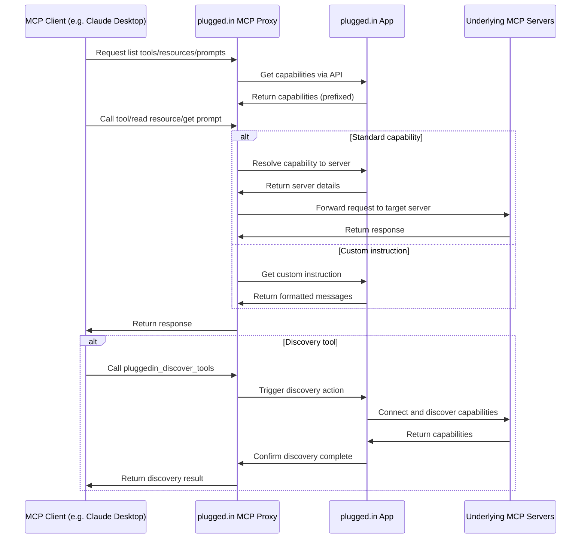

# plugged.in MCP Proxy Server

<div align="center">
  
  <h3>The Crossroads for AI Data Exchanges</h3>
  <p>A unified interface for managing all your MCP servers with real-time notifications</p>

  [](https://github.com/VeriTeknik/pluggedin-mcp/releases)
  [](https://github.com/VeriTeknik/pluggedin-mcp-proxy/stargazers)
  [](LICENSE)
  [](https://www.typescriptlang.org/)
  [](https://modelcontextprotocol.io/)
</div>

## 📋 Overview

The plugged.in MCP Proxy Server is a powerful middleware that aggregates multiple Model Context Protocol (MCP) servers into a single unified interface. It fetches tool, prompt, and resource configurations from the [plugged.in App](https://github.com/VeriTeknik/pluggedin-app) and intelligently routes requests to the appropriate underlying MCP servers.

This proxy enables seamless integration with any MCP client (Claude, Cline, Cursor, etc.) while providing advanced management capabilities through the plugged.in ecosystem.

## ✨ Key Features

### 🚀 Core Capabilities
- **Universal MCP Compatibility**: Works with any MCP client including Claude Desktop, Cline, and Cursor
- **Multi-Server Support**: Connect to STDIO, SSE, and Streamable HTTP MCP servers
- **Dual Transport Modes**: Run proxy as STDIO (default) or Streamable HTTP server
- **Namespace Isolation**: Keep joined MCPs separate and organized with proper prefixing
- **Multi-Workspace Layer**: Switch between different sets of MCP configurations with one click
- **API-Driven Proxy**: Fetches capabilities from plugged.in App APIs rather than direct discovery
- **Full MCP Support**: Handles tools, resources, resource templates, and prompts
- **Custom Instructions**: Supports server-specific instructions formatted as MCP prompts

### 🔔 New in v1.2.0

- **Enhanced Security Validations**: Comprehensive URL validation with SSRF protection, command allowlisting, and header sanitization
- **Lazy Authentication**: Tool discovery without API keys for better Smithery compatibility
- **Improved Session Management**: Better handling of session lifecycle in Streamable HTTP mode
- **Production Optimizations**: Lightweight Docker builds optimized for resource-constrained environments

### 📦 Features from v1.1.0

- **Streamable HTTP Support**: Full support for downstream MCP servers using Streamable HTTP transport
- **HTTP Server Mode**: Run the proxy as an HTTP server with configurable ports
- **Flexible Authentication**: Optional Bearer token authentication for HTTP endpoints
- **Session Management**: Choose between stateful (session-based) or stateless operation modes

### 🎯 Core Features from v1.0.0

- **Real-Time Notifications**: Track all MCP activities with comprehensive notification support
- **RAG Integration**: Support for document-enhanced queries through the plugged.in App
- **Inspector Scripts**: Automated testing tools for debugging and development
- **Health Monitoring**: Built-in ping endpoint for connection monitoring

## 🚀 Quick Start

### Prerequisites

- Node.js 18+ (recommended v20+)
- An API key from the plugged.in App (get one at [plugged.in/api-keys](https://plugged.in/api-keys))

### Installation

```bash
# Install and run with npx (latest v1.0.0)
npx -y @pluggedin/mcp-proxy@latest --pluggedin-api-key YOUR_API_KEY
```

### 🔄 Upgrading to v1.0.0

For existing installations, see our [Migration Guide](./MIGRATION_GUIDE_v1.0.0.md) for detailed upgrade instructions.

```bash
# Quick upgrade
npx -y @pluggedin/mcp-proxy@1.0.0 --pluggedin-api-key YOUR_API_KEY
```

### Configuration for MCP Clients

#### Claude Desktop

Add the following to your Claude Desktop configuration:

```json
{
  "mcpServers": {
    "pluggedin": {
      "command": "npx",
      "args": ["-y", "@pluggedin/mcp-proxy@latest"],
      "env": {
        "PLUGGEDIN_API_KEY": "YOUR_API_KEY"
      }
    }
  }
}
```

#### Cline

Add the following to your Cline configuration:

```json
{
  "mcpServers": {
    "pluggedin": {
      "command": "npx",
      "args": ["-y", "@pluggedin/mcp-proxy@latest"],
      "env": {
        "PLUGGEDIN_API_KEY": "YOUR_API_KEY"
      }
    }
  }
}
```

#### Cursor

For Cursor, you can use command-line arguments instead of environment variables:

```bash
npx -y @pluggedin/mcp-proxy@latest --pluggedin-api-key YOUR_API_KEY
```

## ⚙️ Configuration Options

### Environment Variables

| Variable | Description | Required | Default |
|----------|-------------|----------|---------|
| `PLUGGEDIN_API_KEY` | API key from plugged.in App | Yes | - |
| `PLUGGEDIN_API_BASE_URL` | Base URL for plugged.in App | No | `https://plugged.in` |

### Command Line Arguments

Command line arguments take precedence over environment variables:

```bash
npx -y @pluggedin/mcp-proxy@latest --pluggedin-api-key YOUR_API_KEY --pluggedin-api-base-url https://your-custom-url.com
```

#### Transport Options

| Option | Description | Default |
|--------|-------------|---------|
| `--transport <type>` | Transport type: `stdio` or `streamable-http` | `stdio` |
| `--port <number>` | Port for Streamable HTTP server | `12006` |
| `--stateless` | Enable stateless mode for Streamable HTTP | `false` |
| `--require-api-auth` | Require API key for Streamable HTTP requests | `false` |

For a complete list of options:

```bash
npx -y @pluggedin/mcp-proxy@latest --help
```

## 🌐 Streamable HTTP Mode

The proxy can run as an HTTP server instead of STDIO, enabling web-based access and remote connections.

### Basic Usage

```bash
# Run as HTTP server on default port (12006)
npx -y @pluggedin/mcp-proxy@latest --transport streamable-http --pluggedin-api-key YOUR_API_KEY

# Custom port
npx -y @pluggedin/mcp-proxy@latest --transport streamable-http --port 8080 --pluggedin-api-key YOUR_API_KEY

# With authentication required
npx -y @pluggedin/mcp-proxy@latest --transport streamable-http --require-api-auth --pluggedin-api-key YOUR_API_KEY

# Stateless mode (new session per request)
npx -y @pluggedin/mcp-proxy@latest --transport streamable-http --stateless --pluggedin-api-key YOUR_API_KEY
```

### HTTP Endpoints

- `POST /mcp` - Send MCP messages
- `GET /mcp` - Server-sent events stream (optional)
- `DELETE /mcp` - Terminate session
- `GET /health` - Health check endpoint

### Session Management

In stateful mode (default), use the `mcp-session-id` header to maintain sessions:

```bash
# First request creates a session
curl -X POST http://localhost:12006/mcp \
  -H "Content-Type: application/json" \
  -H "Accept: application/json, text/event-stream" \
  -d '{"jsonrpc":"2.0","method":"tools/list","id":1}'

# Subsequent requests use the same session
curl -X POST http://localhost:12006/mcp \
  -H "Content-Type: application/json" \
  -H "Accept: application/json, text/event-stream" \
  -H "mcp-session-id: YOUR_SESSION_ID" \
  -d '{"jsonrpc":"2.0","method":"tools/call","params":{"name":"tool_name"},"id":2}'
```

### Authentication

When using `--require-api-auth`, include your API key as a Bearer token:

```bash
curl -X POST http://localhost:12006/mcp \
  -H "Authorization: Bearer YOUR_API_KEY" \
  -H "Content-Type: application/json" \
  -H "Accept: application/json, text/event-stream" \
  -d '{"jsonrpc":"2.0","method":"ping","id":1}'
```

## 🐳 Docker Usage

You can also build and run the proxy server using Docker.

### Building the Image

Ensure you have Docker installed and running. Navigate to the `pluggedin-mcp` directory and run:

```bash
docker build -t pluggedin-mcp-proxy:latest .
```

A `.dockerignore` file is included to optimize the build context.

### Running the Container

#### STDIO Mode (Default)

Run the container in STDIO mode for MCP Inspector testing:

```bash
docker run -it --rm \
  -e PLUGGEDIN_API_KEY="YOUR_API_KEY" \
  -e PLUGGEDIN_API_BASE_URL="YOUR_API_BASE_URL" \
  --name pluggedin-mcp-container \
  pluggedin-mcp-proxy:latest
```

#### Streamable HTTP Mode

Run the container as an HTTP server:

```bash
docker run -d --rm \
  -e PLUGGEDIN_API_KEY="YOUR_API_KEY" \
  -e PLUGGEDIN_API_BASE_URL="YOUR_API_BASE_URL" \
  -p 12006:12006 \
  --name pluggedin-mcp-http \
  pluggedin-mcp-proxy:latest \
  --transport streamable-http --port 12006
```

Replace `YOUR_API_KEY` and `YOUR_API_BASE_URL` (if not using the default `https://plugged.in`).

### Testing with MCP Inspector

While the container is running, you can connect to it using the MCP Inspector:

```bash
npx @modelcontextprotocol/inspector docker://pluggedin-mcp-container
```

This will connect to the standard input/output of the running container.

### Stopping the Container

Press `Ctrl+C` in the terminal where `docker run` is executing. The `--rm` flag ensures the container is removed automatically upon stopping.

## 🏗️ System Architecture

The plugged.in MCP Proxy Server acts as a bridge between MCP clients and multiple underlying MCP servers:



## 🔄 Workflow

1. **Configuration**: The proxy fetches server configurations from the plugged.in App
2. **Capability Listing**: The proxy fetches discovered capabilities from plugged.in App APIs
   - `tools/list`: Fetches from `/api/tools` (returns prefixed names)
   - `resources/list`: Fetches from `/api/resources`
   - `resource-templates/list`: Fetches from `/api/resource-templates`
   - `prompts/list`: Fetches from `/api/prompts` and `/api/custom-instructions`, merges results
3. **Capability Resolution**: The proxy resolves capabilities to target servers
   - `tools/call`: Parses prefix from tool name, looks up server in internal map
   - `resources/read`: Calls `/api/resolve/resource?uri=...` to get server details
   - `prompts/get`: Checks for custom instruction prefix or calls `/api/resolve/prompt?name=...`
4. **Request Routing**: Requests are routed to the appropriate underlying MCP server
5. **Response Handling**: Responses from the underlying servers are returned to the client

## 🔒 Security Features

The plugged.in MCP Proxy implements comprehensive security measures to protect your system and data:

### Input Validation & Sanitization

- **Command Injection Prevention**: All commands and arguments are validated against allowlists before execution
- **Environment Variable Security**: Secure parsing of `.env` files with proper handling of quotes and multiline values
- **Token Validation**: Strong regex patterns for API keys and authentication tokens (32-64 hex characters)

### Network Security

- **SSRF Protection**: URL validation blocks access to:
  - Localhost and loopback addresses (127.0.0.1, ::1)
  - Private IP ranges (10.x, 172.16-31.x, 192.168.x)
  - Link-local addresses (169.254.x)
  - Multicast and reserved ranges
  - Common internal service ports (SSH, databases, etc.)
- **Header Validation**: Protection against header injection with:
  - Dangerous header blocking
  - RFC 7230 compliant header name validation
  - Control character detection
  - Header size limits (8KB max)
- **Rate Limiting**: 
  - Tool calls: 60 requests per minute
  - API calls: 100 requests per minute
- **Error Sanitization**: Prevents information disclosure by sanitizing error messages

### Process Security

- **Safe Command Execution**: Uses `execFile()` instead of `exec()` to prevent shell injection
- **Command Allowlist**: Only permits execution of:
  - `node`, `npx` - Node.js commands
  - `python`, `python3` - Python commands
  - `uv`, `uvx`, `uvenv` - UV Python tools
- **Argument Sanitization**: Removes shell metacharacters and control characters from all arguments
- **Environment Variable Validation**: Only allows alphanumeric keys with underscores

### Streamable HTTP Security

- **Lazy Authentication**: Tool discovery doesn't require authentication, improving compatibility
- **Session Security**: Cryptographically secure session ID generation
- **CORS Protection**: Configurable CORS headers for web access
- **Request Size Limits**: Prevents DoS through large payloads

### Security Utilities

A dedicated `security-utils.ts` module provides:
- Bearer token validation
- URL validation with SSRF protection
- Command argument sanitization
- Environment variable validation
- Rate limiting implementation
- Error message sanitization

For detailed security implementation, see [SECURITY.md](SECURITY.md).

## 🧩 Integration with plugged.in App

The plugged.in MCP Proxy Server is designed to work seamlessly with the [plugged.in App](https://github.com/VeriTeknik/pluggedin-app), which provides:

- A web-based interface for managing MCP server configurations
- Centralized capability discovery (Tools, Resources, Templates, Prompts)
- Custom instructions management
- Multi-workspace support for different configuration sets
- An interactive playground for testing MCP tools
- User authentication and API key management

## 📚 Related Resources

- [plugged.in App Repository](https://github.com/VeriTeknik/pluggedin-app)
- [Model Context Protocol (MCP) Specification](https://modelcontextprotocol.io/)
- [Claude Desktop Documentation](https://docs.anthropic.com/claude/docs/claude-desktop)
- [Cline Documentation](https://docs.cline.bot/)

## 🤝 Contributing

Contributions are welcome! Please feel free to submit a Pull Request.

## 📝 Recent Updates

### Version 1.2.0 (January 2025)

#### 🔒 Security Enhancements

- **URL Validation**: Comprehensive SSRF protection blocking private IPs, localhost, and dangerous ports
- **Command Allowlisting**: Only approved commands (node, npx, python, etc.) can be executed
- **Header Sanitization**: Protection against header injection attacks
- **Lazy Authentication**: Improved Smithery compatibility with auth-free tool discovery

#### 🚀 Performance Improvements

- **Optimized Docker Builds**: Multi-stage builds for minimal container footprint
- **Production Dependencies Only**: Test files and dev dependencies excluded from Docker images
- **Resource Efficiency**: Designed for deployment in resource-constrained environments

#### 🔧 Technical Improvements

- Enhanced error handling in Streamable HTTP transport
- Better session cleanup and memory management
- Improved TypeScript types and code organization

### Version 1.1.0 (December 2024)

#### 🚀 New Features

- **Streamable HTTP Support**: Connect to downstream MCP servers using the modern Streamable HTTP transport
- **HTTP Server Mode**: Run the proxy as an HTTP server for web-based access
- **Flexible Session Management**: Choose between stateless or stateful modes
- **Authentication Options**: Optional Bearer token authentication for HTTP endpoints
- **Health Monitoring**: `/health` endpoint for service monitoring

#### 🔧 Technical Improvements

- Updated MCP SDK to v1.13.1 for latest protocol support
- Added Express.js integration for HTTP server functionality
- Enhanced TypeScript types for better developer experience

### Version 1.0.0 (June 2025)

#### 🎯 Major Features
- **Real-Time Notification System**: Track all MCP activities with comprehensive notification support
- **RAG Integration**: Support for document-enhanced queries through the plugged.in App
- **Inspector Scripts**: New automated testing tools for debugging and development
- **Health Monitoring**: Built-in ping endpoint for connection monitoring

#### 🔒 Security Enhancements
- **Input Validation**: Industry-standard validation and sanitization for all inputs
- **URL Security**: Enhanced URL validation with SSRF protection
- **Environment Security**: Secure parsing of environment variables with dotenv
- **Error Sanitization**: Prevents information disclosure in error responses

#### 🐛 Bug Fixes
- Fixed JSON-RPC protocol interference (stdout vs stderr separation)
- Resolved localhost URL validation for development environments
- Fixed API key handling in inspector scripts
- Improved connection stability and memory management

#### 🔧 Developer Tools
- New inspector scripts for automated testing
- Improved error messages and debugging capabilities
- Structured logging with proper stderr usage
- Enhanced TypeScript type safety

See [Release Notes](./RELEASE_NOTES_v1.0.0.md) for complete details.

## 🧪 Testing and Development

### Local Development
Tests are included for development purposes but are excluded from Docker builds to minimize the container footprint.

```bash
# Run tests locally
npm test
# or
./scripts/test-local.sh

# Run tests in watch mode
npm run test:watch

# Run tests with UI
npm run test:ui
```

### Lightweight Docker Builds
The Docker image is optimized for minimal footprint:
- Multi-stage build process
- Only production dependencies in final image
- Test files and dev dependencies excluded
- Optimized for resource-constrained environments

```bash
# Build optimized Docker image
docker build -t pluggedin-mcp .

# Check image size
docker images pluggedin-mcp
```

## 📄 License

This project is licensed under the MIT License - see the [LICENSE](LICENSE) file for details.

## 🙏 Acknowledgements

- Initial fork from [MetaMCP](https://github.com/metatool-ai/mcp-server-metamcp/)
- Inspired by the [MCP Proxy Server](https://github.com/adamwattis/mcp-proxy-server/)
- Built on the [Model Context Protocol](https://modelcontextprotocol.io/)
