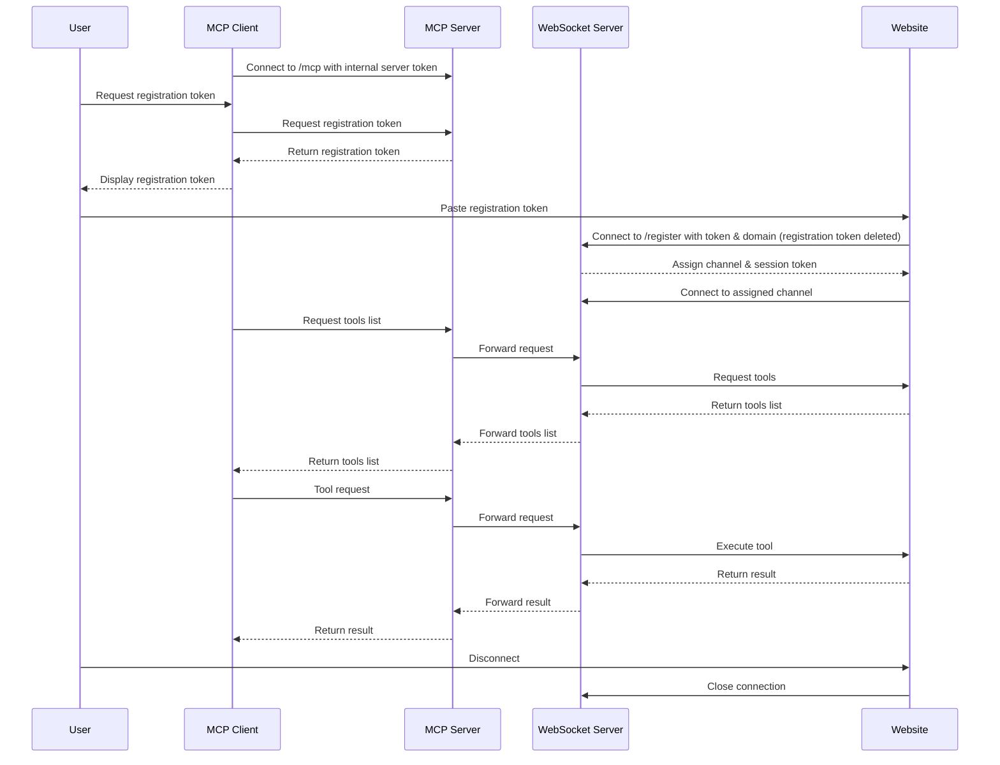

# WebMCP

A proposal and code for websites to support client side LLMs

[](https://www.npmjs.com/package/@jason.today/webmcp) [](./LICENSE)

WebMCP allows websites to share tools, resources, prompts, etc. to LLMs. In other words, WebMCP allows a website to be an MCP server. No sharing API Keys. Use any model you want.

[Here's a simple website I built that is WebMCP-enabled](https://webmcp.dev)

It comes in the form of a widget that a website owner can put on their site and expose tools to give client-side LLMs what they need to provide a great UX for the user or agent.

_The look, feel, how it's used, and security are all absolutely open for contribution / constructive criticism. MCP Clients directly building WebMCP functionality seems like an ideal outcome._

An end-user can connect to any number of websites at a time - and tools are "scoped" (by name) based on the domain to simplify organization.

### Super Quick Demo (20 seconds, Sound on 🔊)

https://github.com/user-attachments/assets/61229470-1242-401e-a7d9-c0d762d7b519

## Getting started (using your LLM with websites using WebMCP)

#### Installation

Just specify your MCP client (`claude`, `cursor`, `cline`, `windsurf`, or a path to json)

```bash
npx -y @jason.today/webmcp@latest --config claude
```

_If you're interested in setting it up manually, use the command `npx -y @jason.today/webmcp@latest --mcp`._

_Auto-install was inspired by Smithery, but their code is AGPL so I wrote this myself. If it doesn't work for you or you don't see your mcp client, please file an issue._

#### Using WebMCP

When you're ready to connect to a website, you can ask your model to generate you an mcp token.

Copy the token and paste it to the website's input. As soon as the website registers with it, it's thrown away and cannot be used for subsequent registrations or anything else. The website will receive its own session token for making requests.

If you'd rather your model / service never see the token, you can manually execute `npx @jason.today/webmcp --new` instead.

Some MCP clients, including Claude Desktop, need to be restarted to get access to new tools. (at least at time of writing)

To disconnect, you can close the browser tab, click "disconnect", or shut down the server with `npx @jason.today/webmcp -q`.

All configuration files are stored in `~/.webmcp` directory.

## Getting started (adding WebMCP to your website)

To use WebMCP, simply include [`webmcp.js`](https://github.com/jasonjmcghee/WebMCP/releases) on your page (via src or directly):

```
<script src="webmcp.js"></script>
```

The WebMCP widget will automatically initialize and appear in the bottom right corner of your page. Clicking on it will ask for a webmcp token which the end-user will generate.

### Full Demo (3 minutes)

https://github.com/user-attachments/assets/43ad160a-846d-48ad-9af9-f6d537e78473

## More Info About How It Works

The bridge between the MCP client and the website is a localhost-only (not accessible to requests outside your computer) websocket server. Because it is configured to allow requests from your local web browser, authentication / token exchange is required, in case you visit a website attempting to abuse this.

_Ideally the web browser itself would have an explicit permission for this, like webcam or microphone use._

1. The MCP client connects to the `/mcp` path using the server token from `.env` (auto-generated)
2. The server generates a registration token (instigated via the built-in mcp tool by a model or the `--new` command)
3. Web clients connect to the `/register` endpoint with this token and its domain.
4. Web pages connect to their assigned channel based on their domain.
5. When an LLM wants to use a tool / resource / prompt, the request flows from:
   - MCP Client → MCP Server → WebSocket Server → Web Page with the tool / resource / prompt
   - (similar for requesting a list of tools / resources / prompts)
6. The web page performs the request (e.g. call tool) and sends the result back through the same path
7. Multiple web pages can be connected simultaneously, each with their own set of tools and tokens
8. The MCP client sees all tools as a unified list, with channel prefixes to avoid name collisions



## Security

This is a super early project. I'm very interested in hardening security to prevent malicious extensions etc. from being
able to perform prompt injection attacks and similar. If you have constructive ideas, please reach out or open an issue.

## Built in tools

- Token generator (for connecting to WebMCP websites)
- MCP Tool Definer (to simplify building the schema of a tool for use with MCP)
  - You can ask for the javascript (if relevant) in a follow-up message for use with WebMCP

## Docker

There is a `Dockerfile` specifically for Smithery deployment.

If you'd like to use docker to run the websocket server, I've added a `docker-compose.yml` for demonstration purposes.

If `--docker` is provided to the mcp client config alongside `--mcp`, it will assume the server is running. This will allow you to dockerize the main process (websocket server), and your mcp client will connect to your docker container via websocket. Similarly, websites will communicate with your docker container.
