# AI Coder Tools MCP Servers

This repository contains Model Context Protocol (MCP) server implementations that extend Roo Code capabilities with various tools. For detailed documentation of each tool's usage and examples, please visit our [tools documentation](../wiki/README.md).

## Quick Navigation

```mermaid
flowchart LR
    Installation["📦 Installation<br><font size=2>Get started with Windows/Mac Installations</font>"] --- Docs["📄 Docs<br><font size=2>Explore docs, demos, and best practices</font>"] --- Teams["👥 Teams Channel<br><font size=2>Join discussions and get support</font>"] --- BugReport["🐛 Bug Report<br><font size=2>Report issues or suggest improvements</font>"]
    
    click Installation "https://github.com/ai-microsoft/ai-coder-tools/blob/main/ts-server/README.md#installation-options-overview" "View installation options"
    click Docs "https://github.com/ai-microsoft/ai-coder-tools/blob/main/wiki/README.md" "Read documentation"
    click Teams "https://teams.microsoft.com/l/team/19%3A_xydaMH0gjMpJALaw6mV1F_t9GLE-ojvKxlRFL27hNk1%40thread.tacv2/conversations?groupId=8f030644-3a69-4f8a-8517-3e88214487b8&tenantId=72f988bf-86f1-41af-91ab-2d7cd011db47" "Join Teams channel"
    click BugReport "https://github.com/ai-microsoft/ai-coder-tools/issues" "Submit a bug report"
    
    style Installation fill:#e6f7ff,stroke:#0078d4,stroke-width:2px
    style Docs fill:#e6ffe6,stroke:#107c10,stroke-width:2px
    style Teams fill:#e8d6ff,stroke:#5c2d91,stroke-width:2px
    style BugReport fill:#fff0e6,stroke:#d83b01,stroke-width:2px
    
    linkStyle 0,1,2 stroke-width:0px
```



## Installation Options Overview

**Note**: Access [Installation Issues](https://github.com/ai-microsoft/ai-coder-tools/issues?q=is%3Aissue%20label%3Ainstallation) for known installation issues.


## For Windows Users

#### System Prerequisites
- Install PowerShell 7 or later - One-line silent install:
```powershell
winget install --id Microsoft.PowerShell --silent
```
- In Windows Search Toolbar, input `pwsh` to open **PowerShell 7** 

#### All-In-One Installation
1. Watch the video for installation with AllInOne script: [AllInOne Installation](https://microsoft.sharepoint-df.com/:v:/t/CodeAgent/EWkoDx_tApZMjkqj3jTSAocBo9-Rz4UJlxJff5U7tMAl8g?e=rrhBgB)

2. Get AllInOne.ps1 in assets from latest [release](https://github.com/ai-microsoft/ai-coder-tools/releases)
>**NOTE:** Just AllInOne.ps1 is enough and no need to download all assets

3. Run **PowerShell 7** as Administrator and execute following command(aka: pwsh)
```powershell
pwsh -ExecutionPolicy Bypass -File .\AllInOne.ps1
```
* **Support paramters:**
  * For experimental tools, please enable with parameter `-enableExperimentalTool`.

* **TroubleShooting**
  * Refer to [System Prerequisites](#System-Prerequisites) if you don't have **powershell 7**
  * Refer to [Installation Issues](https://github.com/ai-microsoft/ai-coder-tools/issues?q=is%3Aissue%20label%3Ainstallation) for known installation issues.
  * If no similar issue found, **Welcome to open New issues** !

4. Refer to section [MCP Server Configuration](#mcp-server-configuration) to customize your mcpserver Env setting
5. Restart vs code to apply the changes

## For MacOS Users

#### System Prerequisites
- Terminal access (built into MacOS)
- Homebrew (optional, but recommended for easier Node.js installation):
```bash
/bin/bash -c "$(curl -fsSL https://raw.githubusercontent.com/Homebrew/install/HEAD/install.sh)"
```

#### All-In-One Installation

1. Get `AllInOne.sh` in assets from latest [release](https://github.com/ai-microsoft/ai-coder-tools/releases). Just download the script, no need to download all assets. You can also download it from source code if it's absent in the release package.

2. Run the script in Terminal:

```bash
chmod +x AllInOne.sh
./AllInOne.sh
```

3. Restart VS Code to apply the changes.

4. There is an issue enabling `Github Copilot Claude 3.7` so this part is disabled in the script. Should be fixed soon.

5. Troubleshooting guide

   - AllInOne script - Failed to get latest Roo Cline release info

      - It's usually an auth issue. Please logout in your terminal with `gh auth logout` and rerun the script. When logging in, make sure to choose your microsoft account and authorize `Microsoft AI` org.


#### Manual Installation
1. Download latest vsix of `MS Roo Code` from [release page](https://github.com/ai-microsoft/Roo-Cline/releases) and install it in VS Code.
2. Download the latest ai-coder-tools package from the [releases page](https://github.com/ai-microsoft/ai-coder-tools/releases)
3. Unzip the release package, inside the unzipped folder, also unzip the `ai-coder-tools-{version}.tgz`, find the `setup.sh` inside.
   - Make sure the line endings is LF instead of CRLF, you can open `setup.sh` with VSCode and save it with LF line endings.
4. Open Terminal and navigate to the unzipped folder
5. Make the setup script executable and run it:
```bash
chmod +x setup.sh
./setup.sh
```

The setup script will:
- Install Node.js v20.18.3 if needed
- Install the package globally
- Configure MCP settings automatically

## MCP Server Configuration

When installation finished, the MCP settings file is located at:

Windows:

```
%APPDATA%\Code\User\globalStorage\microsoftai.ms-roo-cline\settings\cline_mcp_settings.json
```
you can put this path directly to Windows search toolbar to & edit it.


MacOS:
```
~/Library/Application Support/Code/User/globalStorage/microsoftai.ms-roo-cline/settings/cline_mcp_settings.json
```

The content would be like below. And please note the envs are optional. If not provided, you will need to provide the full ado urls for tool's input parameter.
```
        "AZURE_DEVOPS_ORG_URL": "https://dev.azure.com/your-org",
        "AZURE_DEVOPS_DEFAULT_PROJECT_NAME": "your-project",
        "AZURE_DEVOPS_DEFAULT_REPO_NAME": "your-repo"
```
> **NOTE:** If you're using nvm to manage node package, please update %NPM_PREFIX% to the value as the below command output
```powershell
$nvmCurrentVersion = node -v
Join-Path $env:NVM_HOME $nvmCurrentVersion
```

```json
{
  "mcpServers": {
    "ado-tools": {
      "command": "node",
      "args": [
        "%NPM_PREFIX%/node_modules/ai-coder-tools/build/servers/ado_tools_server.js"
      ],
      "env": {
        "AZURE_DEVOPS_ORG_URL": "https://dev.azure.com/your-org",
        "AZURE_DEVOPS_DEFAULT_PROJECT_NAME": "your-project",
        "AZURE_DEVOPS_DEFAULT_REPO_NAME": "your-repo"
      },
      "disabled": false,
      "alwaysAllow": [],
      "autoApprove": []
    },
    "git-tools": {
      "command": "node",
      "args": [
        "%NPM_PREFIX%/node_modules/ai-coder-tools/build/servers/git_tools_server.js"
      ],
      "disabled": false,
      "alwaysAllow": [],
      "autoApprove": []
    },
    "kusto-tools": {
      "command": "node",
      "args": [
        "%NPM_PREFIX%/node_modules/ai-coder-tools/build/servers/kusto_tools_server.js"
      ],
      "env": {
        "KUSTO_DEFAULT_CLUSTER": "https://your-cluster.kusto.windows.net",
        "KUSTO_DEFAULT_DATABASE": "your-database"
      },
      "disabled": false,
      "alwaysAllow": [],
      "autoApprove": []
    },
    "search-tools": {
      "command": "node",
      "args": [
        "%NPM_PREFIX%/node_modules/ai-coder-tools/build/servers/search_tools_server.js"
      ],
      "disabled": false,
      "alwaysAllow": ["search_bing"],
      "autoApprove": []
    }
  }
}
```
## Startup Setting

- In VS Code's left panel, you can find the tab to MS ROO Code startup page

- In MS ROO CODE startup page, select API Provider `VS Code LM API`


- If the `Language Model` list is unavailable, please log in to `GitHub Copilot`, switch to another provider, then switch back to `VS Code LM API`.


## For Contributors

### Prerequisites

- Node.js >= 20.18.1
  > **NOTE:** Latest Node.js version (v22.14.0) may not work. Use v20.18.3.
- TypeScript
- Azure DevOps account (for ADO-related tools)

### Development Setup

1. Clone the repository:
```bash
git clone https://github.com/ai-microsoft/ai-coder-tools.git
cd ai-coder-tools/ts-server
```

2. Install dependencies:
```bash
npm install
```

3. Build the server:
```bash
npm run build
```

### Development Installation Options

#### Debug Mode Installation
For development and testing:

Windows:
```powershell
pwsh -ExecutionPolicy Bypass -File .\setup.ps1 -debug on
```

MacOS:
```bash
./setup.sh --debug on
```

Debug mode features:
- Requires package.json in the repository root or user-specified path
- Creates automatic backup of existing MCP settings
- Installs from source instead of global package
- Uses local build for server paths

To disable debug mode and restore original configuration:

Windows:
```powershell
pwsh -ExecutionPolicy Bypass -File .\setup.ps1 -debug off
```

MacOS:
```bash
./setup.sh --debug off
```

#### Enable Experimental Tools
To enable experimental features like context-entity-tools:

Windows:
```powershell
pwsh -ExecutionPolicy Bypass -File .\setup.ps1 -enableExperimentalTools
```

MacOS:
```bash
./setup.sh --enableExperimentalTools
```

Prerequisites for experimental tools:
- Ollama installation:
  - Windows: Visit https://ollama.ai/download
  - MacOS: `brew install ollama`
- Running Ollama service (starts automatically on macOS after installation)
- 'all-minilm' model installed (`ollama pull all-minilm`)

You can combine both options:

Windows:
```powershell
pwsh -ExecutionPolicy Bypass -File .\setup.ps1 -debug on -enableExperimentalTools
```

MacOS:
```bash
./setup.sh --debug on --enableExperimentalTools
```

### Configuration Fields

- `command`: The command to run the server (usually "node")
- `args`: Array containing the path to the specific server implementation file
- `env`: Environment variables required by the server (varies by server type)
- `disabled`: Whether the server is disabled (default: false)
- `alwaysAllow`: Array of tool names that are always allowed without approval
- `autoApprove`: Array of tool names that can be auto-approved (default: empty)

For detailed instructions on creating new tools and contributing to the project, please see [README_CONTRIBUTING.md](README_CONTRIBUTING.md).
